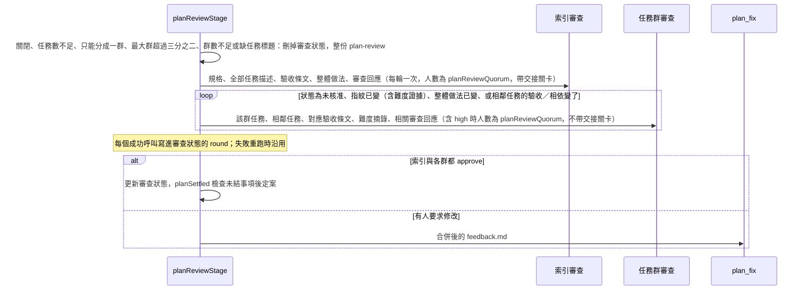

# Plan Review Layers Implementation Plan

> **For agentic workers:** REQUIRED SUB-SKILL: Use superpowers:subagent-driven-development (recommended) or superpowers:executing-plans to implement this plan task-by-task. Steps use checkbox (`- [ ]`) syntax for tracking.

**Goal:** 任務夠多、能分成至少兩群且 `plan.md` 每個任務都有標題時，計畫審查改為每輪一次索引審查，加上只重跑有變動的任務群；其餘情況維持現在的整份審查。

**Architecture:** 分群、是否分層、髒任務、索引文字、計畫摘錄、相鄰任務與本輪進度都是純函式，放在 `src/planReview.ts`，引擎只負責呼叫 agent 與沿用現有的通過／退回／仲裁。計畫檔仍是一份 `plan.md` 與一份 `tasks.json`。索引審查沿用 `planReviewQuorum` 與步驟名 `plan-review`，讀規格全文與全部任務描述，負責需求覆蓋、驗收條件品質、順序、整體做法與跨任務一致性。任務群審查的步驟名是 `plan-review-group`，模型階段仍是既有的 `planReview`；一般群一位審查者，含 `high` 任務的群由 `planReviewQuorum` 位審查。審查狀態與本輪進度放在 run 目錄（worktree 外）的同一份檔，agent 碰不到。審查回應改寫到 `.flow/plan-replies.md`，每輪覆寫，避免 `plan.md` 一輪輪變長後被整份重讀。

**Tech Stack:** Node.js >=22、TypeScript、Zod、Vitest、pnpm。不新增依賴。

## Global Constraints

- 程式碼、註解、prompt、commit 訊息與使用者看到的輸出都用繁體中文。
- 關卡仍由檔案、git diff、測試結果與 zod 決定，不依 agent 回覆的 `<result>` 判斷。
- 不新增 `FlowRun` 欄位。審查狀態與本輪進度放在同一份 `runDir(id)/plan-review-state.json`，路徑由 `paths.ts` 的 `planReviewStatePath` 提供。不放 `.flow/`：它是關卡輸入，plan-fix 成功時不會被快照還原，放在 worktree 內等於讓 agent 能把任務標成已核准。舊 run 沒有這份檔就當成第一次分層審查。
- 不新增 `ModelStage`。`plan-review-group` 對應既有的 `planReview`。`effectiveStageStrengths` 的鍵數量維持 11。
- 新增一個 `flow.config.json` 欄位 `planReviewLayers`：`{ enabled: true, minTasks: 7, maxGroups: 5, tasksPerGroup: 3 }`，四個子欄位都有預設值，未知子欄位驗證失敗。不新增其他設定欄位。
- 不走分層時仍用 `prompts/plan-review.md` 整份審查，不讀審查狀態，而且一開始就刪掉審查狀態：之後若又切回分層，不能沿用整份審查之前的 approve。仲裁判 `revise` 時同樣刪掉審查狀態。已達 `minTasks` 卻沒走分層時，終端機印出原因。
- 索引讀 `.flow/spec.md` 全文，prompt 內嵌全部任務的標題、描述、驗收 id 與相依，驗收條件全文（`acceptance.json`），以及 `plan.md` 的整體做法段落（第一個 `## T-<數字>` 標題之前）。索引負責整份審查的第 1、2、4 項，加上跨任務一致性（重複負責、介面假設矛盾、漏寫相依）。群審查負責第 3 項（任務拆解與難度），並拿到與該群直接相依、但不在群內的任務供對照。
- 審查回應只寫在 `.flow/plan-replies.md`，plan-fix 每次覆寫成這一輪的回應，不累積舊輪。`prompts/plan-fix.md`、`prompts/plan-review.md`、`prompts/plan-arbiter.md` 與 `prompts/plan.md`（整體做法在前、難度證據改成 `## T-<數字>` 標題、description 寫含目錄的路徑）要一起改。索引 prompt 帶整份回應內文；群 prompt 只帶標題剛好是該群任務 id 的節（`## T-1` 不得命中 `## T-10`）。
- 使用者可見行為要在同一個 commit 更新 `README.md` 與 `docs/reference.md`。Task 4 的 commit 寫分層審查與 `planReviewLayers`；Task 5 的 commit 寫審查回應改檔。兩個 commit 都要含 `README.md`。
- 審查者與仲裁者仍不得改規格、計畫與審查回應；改了就還原。整份審查、分層審查、plan-fix 與仲裁的快照都是 `PLAN_REPLY_FILES = [...PLAN_FILES, "plan-replies.md"]`。不要加進 `PLAN_FILES` 或 `LOCKED_FILES`。
- 索引與各群依序執行，不平行（理由見「取捨」）。每一呼叫都走 `finishHandoff`。只有索引呼叫帶交接關卡（核准卻有未結 `action` 是 `handoff_invalid`，停在 `plan_review`）；群呼叫不帶關卡，否則索引要求修改並新增事項後，後面每一群的核准都會被判矛盾。群都核准後若仍有未結事項，由既有 `planSettled` 退回 `plan_fix`（`open_handoff`）。
- 索引可以讀 `.flow/spec.md` 與交接事項 `evidence` 點名的檔案；群可以讀 description 點名的檔案與交接事項 `evidence` 點名的檔案。除此之外不讀其他程式。
- 某一呼叫失敗時退回 `plan_review` 重跑同一輪，但這一輪已成功的呼叫不重跑：成功的結果寫進審查狀態的 `round`，以輪次與計畫內容雜湊比對，對得上就沿用。這樣不會重複付費，也不會讓已套用的交接事項被重新提出。整輪都成功後才更新 `reviewed` 並拿掉 `round`。
- 僵持指紋仍是這一輪全部未通過意見排序後的文字（含沿用的呼叫）。仲裁的裁決規則不變；`prompts/plan-arbiter.md` 改讀 `plan-replies.md`，不再假設回應在 `plan.md` 文末。

## 取捨

- **第一輪不會比較省。** 第一輪所有群都髒，呼叫數是 `planReviewQuorum` 次索引加上群數。索引讀規格與任務描述、不讀程式，群合起來大約讀一次全部程式，所以 `planReviewQuorum` 為 1 時總量和整份審查相近，多出的是每次呼叫的固定成本；`planReviewQuorum` 大於 1 時，程式只被讀一次，反而比較省。群數受 `maxGroups` 與「任務數 ÷ `tasksPerGroup`」兩個上限約束，避免拆出很多一兩個任務的小群。省下的主要是修正後的輪次：只重審有變動的群。
- **不平行。** 所有 agent 共用 `.flow/handoff-context.md`、`.flow/handoff-response.json` 與 worktree，`discardChanges` 會清掉整個 worktree 的變更。要平行得先把交接檔與還原改成每次呼叫各自一份，不在這份計畫的範圍。
- **重審範圍偏向保守。** 整體做法段落一變，所有群都重審；某任務的難度證據變了，它所在的群重審。這會讓 plan-fix 改到整體做法的輪次省不到，換來的是舊的 approve 不會在前提改變後繼續沿用。
- **分群仍靠 description 裡的路徑。** 描述沒寫路徑、或最大一群超過三分之二時退回整份審查；不同群之間的介面衝突交給讀得到全部描述的索引審查。



## 檔案職責

| 檔案 | 職責 |
|---|---|
| `src/planReview.ts` | 分群、是否分層、索引、整體做法與難度摘錄、相鄰任務、群審查人數、髒任務、審查狀態、本輪進度、意見指紋 |
| `src/planReview.test.ts` | 上列純函式 |
| `src/schemas.ts` | `RepoConfig.planReviewLayers` |
| `src/schemas.test.ts` | `planReviewLayers` 的預設與驗證 |
| `src/paths.ts` | `planReviewStatePath` |
| `src/modelSelection.ts` | `plan-review-group` 用 `planReview` 的強度；整輪結束時一併清掉群審查的失敗次數 |
| `src/cli.ts` | `doctor` 印出分層審查設定 |
| `prompts/plan-review-index.md` | 索引審查。要讀 `.flow/spec.md`；正文不得出現 `.flow/tasks.json` |
| `prompts/plan-review-group.md` | 單群審查。正文不得出現 `.flow/spec.md` |
| `prompts/plan.md` | 整體做法寫在最前面；難度證據用 `## T-<數字>` 標題；description 寫含目錄的路徑 |
| `prompts/plan-review.md` | 整份審查補上要讀 `plan-replies.md` |
| `prompts/plan-arbiter.md` | 仲裁改讀 `plan-replies.md` |
| `prompts/plan-fix.md` | 審查回應覆寫 `.flow/plan-replies.md`，正文不得再出現「## 審查回應」；只在必要時改整體做法；保留每個任務標題 |
| `src/engine.ts` | 符合條件時改走分層；否則刪掉審查狀態後呼叫原本的整份審查；仲裁 revise 時刪掉審查狀態；快照改用 `PLAN_REPLY_FILES` |
| `README.md`、`docs/reference.md`、`docs/engine-stage-files.md`、`AGENTS.md`、`examples/flow.config.json` | 說明條件、兩種審查、設定與新檔案 |

## 行為契約

設定 `planReviewLayers`（`RepoConfig`，strict object）：

| 子欄位 | 預設 | 限制 | 意義 |
|---|---|---|---|
| `enabled` | `true` | boolean | `false` 時一律整份審查 |
| `minTasks` | `7` | 整數 `>= 2` | 任務數達到這個值才考慮分層 |
| `maxGroups` | `5` | 整數 `>= 2` | 每輪最多幾群 |
| `tasksPerGroup` | `3` | 整數 `>= 1` | 群數也不超過 `floor(任務數 / tasksPerGroup)` |

分層條件，依序檢查，第一個不成立的就是原因（`layeredReview` 回傳）：

1. `enabled` 為 `true`，且 `tasks.json` 與 `acceptance.json` 都通過既有 zod。不成立時不印原因。
2. 任務數 `>= minTasks`。不成立時不印原因。
3. 自然分群（`taskClusters`）至少 2 群。原因：`任務要改的檔案互相重疊，只能分成一群`。
4. 自然分群最大的一群任務數 `* 3 <= 任務數 * 2`。原因：`最大的一群有 <k> 個任務，超過總數 <n> 的三分之二`。
5. 合併後（`planReviewGroups`）至少 2 群。原因：`任務數 <n> 不足以讓每群平均至少 <tasksPerGroup> 個`。
6. `plan.md` 對每個任務 id 都有一行 `^#{2,6} T-<數字>(?:\s|$)` 標題。原因：`plan.md 缺少 <id, id> 的「## T-<數字>」標題`。

不成立時維持現有 `plan-review` 整份審查，刪掉審查狀態；有原因時印 `📋 這次計畫審查讀整份計畫：<原因>`。

自然分群（`taskClusters`）：

- 從 `description` 抽出含目錄的路徑。正則是 `(?<![A-Za-z0-9_.@\/-])((?:[A-Za-z0-9_.@-]+\/)+[A-Za-z0-9_.@-]+\.[A-Za-z0-9]+)`：用 lookbehind 排除前面緊接路徑字元的情況，所以 `、`、`：`、`「`、中文字後面的路徑都抓得到，URL 裡的片段抓不到。略過 `.flow/` 開頭。沒有斜線的檔名不算。
- 共用至少一個路徑的任務併成一群（傳遞：`a.ts` 與 `a.ts+b.ts`、`b.ts` 是同一群）。
- 抽不到路徑的任務，只有在某個直接 `dependsOn` 目標自己抽得到路徑時，才併入那個目標的群。其餘抽不到路徑的任務全部併成同一群（`files` 為空），不各自成群。
- 兩群都抽得到路徑時，只因 `dependsOn` 不合併。
- 群依群內最小的 `T-<數字>` 排序，編成 `G-1`、`G-2`。

合併（`planReviewGroups`）：上限 `limit = max(1, min(maxGroups, floor(任務數 / tasksPerGroup)))`。自然群數不超過上限就原樣使用；超過時依順序把相鄰的群合併，第 `i` 群（0 起算，共 `n` 群）放進 `floor(i * limit / n)` 號桶，再重新編號。

索引每個任務兩行：`- T-1 標題 | AC-1, AC-2 | depends：（無）`，下一行是兩個空白加上 `description`（換行與前後空白換成一個空白）。有相依時把 id 用 `, ` 接上。

相鄰任務（`neighborTasks`）：不在群內、且是群內任務的直接 `dependsOn`，或直接 `dependsOn` 群內任務的任務，依 `tasks.json` 順序。群 prompt 只帶它們的 `id`、`title`、`description`、`dependsOn`；沒有時寫「（沒有跨群的直接相依）」。

群審查人數（`groupReviewerCount`）：群內有任何 `complexity: "high"` 的任務時是 `planReviewQuorum`，否則是 1。同一群的每位審查者都要 `approve`；任一位 `changes_requested`，該群任務就記成 `changes_requested`。

任務指紋是這個 JSON 字串：`id`、`title`、`description`、`complexity`（沒有則 `null`）、`dependsOn`、這些 id 在 `acceptance.json` 裡的 `{ id, description }`（找不到則 `description: ""`），以及 `evidence`：`extractPlanEvidence(planMd, [id])`。

整體做法指紋（`overviewKey`）：`planContentKey([planOverview(planMd)])`。

`runDir(id)/plan-review-state.json`：

```json
{
  "version": 1,
  "reviewed": {
    "overview": "<overviewKey>",
    "tasks": {
      "T-1": {
        "fingerprint": "<taskFingerprint>",
        "acceptance": ["AC-1"],
        "dependsOn": [],
        "verdict": "approve"
      }
    }
  },
  "round": {
    "round": 2,
    "planKey": "<sha256>",
    "calls": [
      { "key": "index:b", "reviewer": "b", "verdict": "approve", "issueLines": [] },
      { "key": "group:G-1:T-1,T-2:c", "reviewer": "c", "verdict": "changes_requested", "issueLines": ["<issue …>"], "taskIds": ["T-1", "T-2"] }
    ]
  }
}
```

- `reviewed` 是上一次整輪完成時的結果；`round` 是本輪進行中已成功的呼叫。兩者都可以不存在。
- 沒有檔案、JSON 壞掉、或 zod 失敗：當成沒有前次結果也沒有進度，全部任務都髒。
- `planKey` 是 `tasks.json`、`acceptance.json`、`plan.md`、`plan-replies.md` 內文以 `\0` 串接後的 sha256（沒有檔就當空字串）。`round.round` 或 `round.planKey` 不符時當成沒有進度。
- 索引呼叫的鍵是 `index:<審查者>`；群呼叫是 `group:<群 id>:<任務 id 以 , 串接>:<審查者>`。鍵已在進度裡就沿用，不呼叫 agent。
- 每個呼叫成功（審查 JSON 合法且交接通過）就立刻寫回：`reviewed` 保持原樣，`round` 換成最新進度。
- 一輪裡索引與所有髒群都成功產出合法審查後，寫入 `{ version: 1, reviewed: <新結果> }`（沒有 `round`）。被審到的任務寫上該群的 verdict 與目前指紋。沒被審到的任務沿用前次 verdict。已從 `tasks.json` 消失的 id 不留。`overview` 寫目前的整體做法指紋。

任務判為髒：

- 沒有 `reviewed`，或 `reviewed.overview` 與目前的整體做法指紋不同：全部任務都髒。
- 沒有前次紀錄、前次 `verdict` 不是 `approve`、或指紋不同（含難度證據）。
- 前次與這次的 `acceptance` 或 `dependsOn` 陣列內容不同（用 `\0` 連接後比較）：這個任務，以及直接上游（它的 `dependsOn`）與直接下游（`dependsOn` 含它的任務），都標髒。只共用驗收 id、沒有直接相依的任務不標髒。只改 `description`、`title` 或難度證據不牽動鄰居；跨群的一致性由每輪都跑、讀得到全部描述的索引負責。

群是髒的：群內任一任務髒。乾淨的群這輪不呼叫 agent。索引每輪都呼叫。

索引與群都 `approve`，且沒有未結的計畫交接，才定案。任一方 `changes_requested` 就合併進現有的 `feedback.md` 格式，進入 `plan_fix`。`planReviewer` 仍是第一個反對者（先索引、後群）。

整體做法：`plan.md` 第一個 `## T-<數字>` 標題（`^#{2,6} T-\d+(?:\s|$)`）之前的內容，最多 120 行。沒有任務標題就取整份的前 120 行（分層條件 6 保證分層時一定有任務標題）。

難度摘錄：只認 `^(#{2,6}) (T-\d+)(?:\s|$)` 這種標題行當作某一任務的起點，收到下一個同級或更高級的標題之前（更低級的子標題算在裡面）。清單行、內文提到其他任務 id 都不切段。同一任務有多段時依出現順序接起來，每個任務合計最多 40 行。依傳入的任務 id 順序輸出。沒有摘錄就給空字串。

審查回應：`plan-fix` 覆寫 `.flow/plan-replies.md`，每個相關任務一節，標題是 `## T-1` 這種；不屬於單一任務的回應放在 `## 整體` 一節。比對標題行，用 `^## T-1(?:\s|$)`，不用 `includes`。索引 prompt 帶整份檔案內文。群 prompt 只帶自己的節。

---

### Task 1: 分群、分層條件、髒任務與本輪進度

**Files:**

- Create: `src/planReview.ts`
- Test: `src/planReview.test.ts`

**Interfaces:**

- Consumes: `TaskItem`、`AcceptanceItem`（`src/schemas.ts`）
- Produces:
  - 型別 `PlanReviewLayerOptions = { enabled: boolean; minTasks: number; maxGroups: number; tasksPerGroup: number }`（和 Task 4 的 `RepoConfig["planReviewLayers"]` 結構相同）
  - `extractFiles(description: string): string[]`
  - `taskClusters(tasks: TaskItem[]): PlanReviewGroup[]`
  - `planReviewGroups(tasks: TaskItem[], opts: PlanReviewLayerOptions): PlanReviewGroup[]`
  - `missingTaskHeadings(planMd: string, taskIds: string[]): string[]`
  - `layeredReview(tasks: TaskItem[], planMd: string, opts: PlanReviewLayerOptions): LayeredDecision`，`LayeredDecision = { layered: true; groups: PlanReviewGroup[] } | { layered: false; reason?: string }`
  - `planReviewIndex(tasks: TaskItem[]): string`
  - `neighborTasks(tasks: TaskItem[], taskIds: string[]): TaskItem[]`
  - `groupReviewerCount(groupTasks: TaskItem[], quorum: number): number`
  - `taskFingerprint(task: TaskItem, acceptance: AcceptanceItem[], planMd: string): string`
  - `overviewKey(planMd: string): string`
  - `readPlanReviewState(raw: string): PlanReviewState | undefined`
  - `dirtyTaskIds(prev: PlanReviewed | undefined, tasks: TaskItem[], acceptance: AcceptanceItem[], planMd: string): string[]`
  - `dirtyGroups(groups: PlanReviewGroup[], dirtyIds: string[]): PlanReviewGroup[]`
  - `planOverview(planMd: string): string`
  - `extractPlanEvidence(planMd: string, taskIds: string[]): string`
  - `repliesForTasks(replies: string, taskIds: string[]): string`
  - `applyReviewVerdicts(prev: PlanReviewed | undefined, tasks: TaskItem[], acceptance: AcceptanceItem[], planMd: string, groupVerdicts: { taskIds: string[]; verdict: "approve" | "changes_requested" }[]): PlanReviewed`
  - `reviewFingerprint(issueLines: string[]): string`
  - `planContentKey(texts: string[]): string`
  - `roundProgress(state: PlanReviewState | undefined, round: number, planKey: string): PlanReviewRound | undefined`
  - 型別 `PlanReviewGroup`、`PlanReviewed`、`PlanReviewState`、`PlanReviewCall`、`PlanReviewRound`，格式如上節 JSON

- [ ] **Step 1: Write the failing test**

建立 `src/planReview.test.ts`：

```ts
import { describe, expect, it } from "vitest";
import type { AcceptanceItem, TaskItem } from "./schemas.js";
import {
  applyReviewVerdicts,
  dirtyGroups,
  dirtyTaskIds,
  extractFiles,
  extractPlanEvidence,
  groupReviewerCount,
  layeredReview,
  neighborTasks,
  planContentKey,
  planOverview,
  planReviewGroups,
  planReviewIndex,
  readPlanReviewState,
  repliesForTasks,
  reviewFingerprint,
  roundProgress,
  taskClusters,
  taskFingerprint,
} from "./planReview.js";

function task(partial: Partial<TaskItem> & Pick<TaskItem, "id" | "acceptance">): TaskItem {
  return {
    title: partial.id,
    description: partial.description ?? "不做檔案",
    dependsOn: [],
    ...partial,
  };
}

const ac = (ids: string[]): AcceptanceItem[] => ids.map((id) => ({ id, description: `${id} 行為` }));
const layers = { enabled: true, minTasks: 7, maxGroups: 5, tasksPerGroup: 3 };
const headings = (tasks: TaskItem[]) => ["# 計畫", "整體做法", ...tasks.flatMap((item) => [`## ${item.id} 難度`, "低"])].join("\n");
const split = (count: number, inA: number) => Array.from({ length: count }, (_, i) => task({
  id: `T-${i + 1}`, acceptance: [`AC-${i + 1}`], description: i < inA ? "改 src/a.ts" : "改 src/b.ts",
}));

describe("計畫審查分群", () => {
  it("共用路徑的任務併成一群，檔名任務只依附抽得到路徑的直接上游", () => {
    const tasks = [
      task({ id: "T-1", acceptance: ["AC-1"], description: "改 src/a.ts" }),
      task({ id: "T-2", acceptance: ["AC-2"], description: "改 src/a.ts 與 src/b.ts", dependsOn: ["T-1"] }),
      task({ id: "T-3", acceptance: ["AC-3"], description: "改 src/b.ts" }),
      task({ id: "T-4", acceptance: ["AC-4"], description: "沒有路徑", dependsOn: ["T-3"] }),
      task({ id: "T-5", acceptance: ["AC-5"], description: "也沒有路徑", dependsOn: ["T-4"] }),
      task({ id: "T-6", acceptance: ["AC-6"], description: "改 src/c.ts", dependsOn: ["T-1"] }),
    ];
    expect(taskClusters(tasks)).toEqual([
      { id: "G-1", taskIds: ["T-1", "T-2", "T-3", "T-4"], files: ["src/a.ts", "src/b.ts"] },
      { id: "G-2", taskIds: ["T-5"], files: [] },
      { id: "G-3", taskIds: ["T-6"], files: ["src/c.ts"] },
    ]);
  });

  it("沒依附到路徑的檔名任務全部併成同一群", () => {
    const tasks = [
      task({ id: "T-1", acceptance: ["AC-1"], description: "改 src/a.ts" }),
      task({ id: "T-2", acceptance: ["AC-2"], description: "沒有路徑" }),
      task({ id: "T-3", acceptance: ["AC-3"], description: "也沒有路徑" }),
      task({ id: "T-4", acceptance: ["AC-4"], description: "改 src/b.ts" }),
    ];
    expect(taskClusters(tasks).map((group) => group.taskIds)).toEqual([["T-1"], ["T-2", "T-3"], ["T-4"]]);
  });

  it("群數同時受 maxGroups 與任務數除以 tasksPerGroup 限制，超過時合併相鄰的群", () => {
    const tasks = Array.from({ length: 7 }, (_, i) => task({
      id: `T-${i + 1}`, acceptance: [`AC-${i + 1}`], description: `改 src/f${i + 1}.ts`,
    }));
    expect(planReviewGroups(tasks, { ...layers, tasksPerGroup: 1 }).map((group) => group.taskIds)).toEqual([
      ["T-1", "T-2"], ["T-3"], ["T-4", "T-5"], ["T-6"], ["T-7"],
    ]);
    const packed = planReviewGroups(tasks, layers);
    expect(packed.map((group) => group.taskIds)).toEqual([["T-1", "T-2", "T-3", "T-4"], ["T-5", "T-6", "T-7"]]);
    expect(packed.map((group) => group.id)).toEqual(["G-1", "G-2"]);
    expect(packed[1]!.files).toEqual(["src/f5.ts", "src/f6.ts", "src/f7.ts"]);
  });

  it("略過 .flow 與沒有斜線的檔名", () => {
    expect(extractFiles("看 .flow/tasks.json 與 feature.ts 與 src/feature.ts")).toEqual(["src/feature.ts"]);
  });

  it("中文標點後面的路徑也抓得到，URL 片段不算", () => {
    expect(extractFiles("改 src/a.ts、src/b.ts，檔案：src/c.ts 與「src/d.ts」")).toEqual(["src/a.ts", "src/b.ts", "src/c.ts", "src/d.ts"]);
    expect(extractFiles("參考 https://example.com/x/y.js")).toEqual([]);
  });

  it("相鄰任務是跨群的直接上下游，依任務順序", () => {
    const tasks = [
      task({ id: "T-1", acceptance: ["AC-1"], description: "改 src/a.ts" }),
      task({ id: "T-2", acceptance: ["AC-2"], description: "改 src/a.ts", dependsOn: ["T-1"] }),
      task({ id: "T-3", acceptance: ["AC-3"], description: "改 src/b.ts", dependsOn: ["T-2"] }),
      task({ id: "T-4", acceptance: ["AC-4"], description: "改 src/b.ts" }),
      task({ id: "T-5", acceptance: ["AC-5"], description: "改 src/c.ts", dependsOn: ["T-4"] }),
    ];
    expect(neighborTasks(tasks, ["T-3", "T-4"]).map((item) => item.id)).toEqual(["T-2", "T-5"]);
    expect(neighborTasks(tasks, ["T-1", "T-2", "T-3", "T-4", "T-5"])).toEqual([]);
  });

  it("含 high 任務的群由 quorum 位審查，其餘一位", () => {
    const low = task({ id: "T-1", acceptance: ["AC-1"], complexity: "low" });
    const high = task({ id: "T-2", acceptance: ["AC-2"], complexity: "high" });
    expect(groupReviewerCount([low, high], 2)).toBe(2);
    expect(groupReviewerCount([low], 2)).toBe(1);
  });

  it("索引有 id、標題、驗收 id、相依與一行描述", () => {
    const tasks = [
      task({ id: "T-1", title: "建立表單", acceptance: ["AC-1"], description: "改 src/form.ts 的欄位" }),
      task({ id: "T-2", title: "送出", acceptance: ["AC-2", "AC-3"], dependsOn: ["T-1"], description: "呼叫 API\n  失敗時顯示錯誤" }),
    ];
    expect(planReviewIndex(tasks)).toBe([
      "- T-1 建立表單 | AC-1 | depends：（無）",
      "  改 src/form.ts 的欄位",
      "- T-2 送出 | AC-2, AC-3 | depends：T-1",
      "  呼叫 API 失敗時顯示錯誤",
    ].join("\n"));
  });
});

describe("是否分層", () => {
  it("關閉或任務數未達門檻時不分層，也不給原因", () => {
    const six = split(6, 3);
    expect(layeredReview(six, headings(six), layers)).toEqual({ layered: false });
    const seven = split(7, 3);
    expect(layeredReview(seven, headings(seven), { ...layers, enabled: false })).toEqual({ layered: false });
  });

  it("只能分成一群時說明原因", () => {
    const same = split(7, 7);
    expect(layeredReview(same, headings(same), layers)).toEqual({ layered: false, reason: "任務要改的檔案互相重疊，只能分成一群" });
  });

  it("最大一群超過三分之二時說明原因，沒寫路徑的任務占多數也算", () => {
    const lopsided = split(7, 5);
    expect(layeredReview(lopsided, headings(lopsided), layers)).toEqual({ layered: false, reason: "最大的一群有 5 個任務，超過總數 7 的三分之二" });
    const loose = Array.from({ length: 8 }, (_, i) => task({
      id: `T-${i + 1}`, acceptance: [`AC-${i + 1}`], description: i === 0 ? "改 src/a.ts" : i === 1 ? "改 src/b.ts" : "沒有路徑",
    }));
    expect(layeredReview(loose, headings(loose), layers)).toEqual({ layered: false, reason: "最大的一群有 6 個任務，超過總數 8 的三分之二" });
  });

  it("群數不足時說明原因", () => {
    const seven = split(7, 3);
    expect(layeredReview(seven, headings(seven), { ...layers, tasksPerGroup: 4 })).toEqual({ layered: false, reason: "任務數 7 不足以讓每群平均至少 4 個" });
  });

  it("plan.md 缺任務標題時說明缺哪些", () => {
    const seven = split(7, 3);
    expect(layeredReview(seven, headings(seven.slice(0, 5)), layers)).toEqual({ layered: false, reason: "plan.md 缺少 T-6, T-7 的「## T-<數字>」標題" });
  });

  it("條件都符合時分層並回傳群", () => {
    const seven = split(7, 3);
    const decision = layeredReview(seven, headings(seven), layers);
    expect(decision.layered).toBe(true);
    expect(decision.layered && decision.groups.map((group) => group.taskIds)).toEqual([["T-1", "T-2", "T-3"], ["T-4", "T-5", "T-6", "T-7"]]);
  });
});

describe("髒任務", () => {
  const tasks = [
    task({ id: "T-1", acceptance: ["AC-1"], description: "改 src/a.ts" }),
    task({ id: "T-2", acceptance: ["AC-2"], description: "改 src/b.ts", dependsOn: ["T-1"] }),
  ];
  const acceptance = ac(["AC-1", "AC-2"]);
  const plan = headings(tasks);
  const approveAll = () => applyReviewVerdicts(undefined, tasks, acceptance, plan, [{ taskIds: ["T-1", "T-2"], verdict: "approve" }]);

  it("沒有前次結果時全部髒；壞掉的狀態檔讀不到", () => {
    expect(dirtyTaskIds(undefined, tasks, acceptance, plan)).toEqual(["T-1", "T-2"]);
    expect(readPlanReviewState("{")).toBeUndefined();
    expect(readPlanReviewState("null")).toBeUndefined();
    expect(readPlanReviewState(JSON.stringify({ version: 1 }))).toEqual({ version: 1 });
  });

  it("只改描述時不牽動相依的另一群", () => {
    const edited = [{ ...tasks[0]!, description: "改 src/a.ts 的錯誤訊息" }, tasks[1]!];
    expect(dirtyTaskIds(approveAll(), edited, acceptance, plan)).toEqual(["T-1"]);
  });

  it("只改某任務的難度證據時只有那個任務髒", () => {
    const edited = plan.replace("## T-2 難度\n低", "## T-2 難度\n中：要協調兩個模組");
    expect(dirtyTaskIds(approveAll(), tasks, acceptance, edited)).toEqual(["T-2"]);
  });

  it("整體做法變了時全部髒", () => {
    expect(dirtyTaskIds(approveAll(), tasks, acceptance, plan.replace("整體做法", "改用另一種做法"))).toEqual(["T-1", "T-2"]);
  });

  it("前次要求修改且內容沒變時，該任務仍要重審", () => {
    const prev = applyReviewVerdicts(undefined, tasks, acceptance, plan, [
      { taskIds: ["T-1"], verdict: "changes_requested" },
      { taskIds: ["T-2"], verdict: "approve" },
    ]);
    expect(dirtyTaskIds(prev, tasks, acceptance, plan)).toEqual(["T-1"]);
  });

  it("同一群有一位要求修改就記成要求修改，不論順序", () => {
    const prev = applyReviewVerdicts(undefined, tasks, acceptance, plan, [
      { taskIds: ["T-1", "T-2"], verdict: "changes_requested" },
      { taskIds: ["T-1", "T-2"], verdict: "approve" },
    ]);
    expect(prev.tasks["T-1"]?.verdict).toBe("changes_requested");
    expect(prev.tasks["T-2"]?.verdict).toBe("changes_requested");
  });

  it("改了驗收條件時只標髒自己與直接上下游", () => {
    const extra = [
      task({ id: "T-1", acceptance: ["AC-1"], description: "改 src/a.ts" }),
      task({ id: "T-2", acceptance: ["AC-2"], description: "改 src/b.ts", dependsOn: ["T-1"] }),
      task({ id: "T-3", acceptance: ["AC-1"], description: "改 src/c.ts" }),
    ];
    const extraPlan = headings(extra);
    const prev = applyReviewVerdicts(undefined, extra, acceptance, extraPlan, [
      { taskIds: ["T-1", "T-2", "T-3"], verdict: "approve" },
    ]);
    const edited = [{ ...extra[0]!, acceptance: ["AC-1", "AC-2"] }, extra[1]!, extra[2]!];
    expect(dirtyTaskIds(prev, edited, acceptance, extraPlan).sort()).toEqual(["T-1", "T-2"]);
  });

  it("改了相依就把直接上下游標髒", () => {
    const edited = [tasks[0]!, { ...tasks[1]!, dependsOn: [] }];
    expect(dirtyTaskIds(approveAll(), edited, acceptance, plan).sort()).toEqual(["T-1", "T-2"]);
  });

  it("意見指紋排序後串接，空意見得到空字串", () => {
    expect(reviewFingerprint(["b", "a"])).toBe("a\nb");
    expect(reviewFingerprint([])).toBe("");
  });
});

describe("摘錄與審查回應", () => {
  it("整體做法取第一個任務標題之前的內容", () => {
    expect(planOverview(["# 計畫", "整體做法", "## T-1 難度", "證據"].join("\n"))).toBe(["# 計畫", "整體做法"].join("\n"));
    expect(planOverview(["# 計畫", "沒有任務標題"].join("\n"))).toBe(["# 計畫", "沒有任務標題"].join("\n"));
  });

  it("只認任務標題切段，內文提到其他任務不切，每個任務最多 40 行", () => {
    const body = [
      "# 計畫", "整體做法",
      "## T-1 難度", "- 需要 T-2 先完成", ...Array.from({ length: 50 }, (_, i) => `行 ${i}`),
      "## T-2 難度", "只有這行",
      "## T-10 難度", "別管",
      "## 仲裁紀錄", "不屬於任務",
    ].join("\n");
    const excerpt = extractPlanEvidence(body, ["T-1"]);
    expect(excerpt.startsWith("## T-1 難度")).toBe(true);
    expect(excerpt).toContain("- 需要 T-2 先完成");
    expect(excerpt).not.toContain("## T-2");
    expect(excerpt.split("\n")).toHaveLength(40);
    expect(extractPlanEvidence(body, ["T-2"])).toBe(["## T-2 難度", "只有這行"].join("\n"));
    expect(extractPlanEvidence(body, ["T-10"])).toBe(["## T-10 難度", "別管"].join("\n"));
    expect(extractPlanEvidence(body, ["T-3"])).toBe("");
  });

  it("審查回應只比對標題上的任務 id，T-1 不帶走 T-10", () => {
    const replies = ["## T-10", "別管", "## T-1", "要留", "## 整體", "沒有任務 id"].join("\n");
    expect(repliesForTasks(replies, ["T-1"])).toBe(["## T-1", "要留"].join("\n"));
    expect(repliesForTasks(["## T-2", "拆開"].join("\n"), ["T-2"])).toBe(["## T-2", "拆開"].join("\n"));
  });

  it("指紋含驗收條文與該任務的難度證據，不含其他任務", () => {
    const item = task({ id: "T-1", acceptance: ["AC-1"], description: "改 src/a.ts", complexity: "low" });
    const plan = ["# 計畫", "## T-1 難度", "只動一個檔案", "## T-2 難度", "別的任務"].join("\n");
    const print = taskFingerprint(item, ac(["AC-1", "AC-9"]), plan);
    expect(print).toContain("AC-1 行為");
    expect(print).toContain("只動一個檔案");
    expect(print).not.toContain("AC-9");
    expect(print).not.toContain("別的任務");
  });
});

describe("審查狀態與本輪進度", () => {
  it("沒審到的任務保留前次 verdict，消失的任務不留", () => {
    const acceptance = ac(["AC-1", "AC-2"]);
    const first = [
      task({ id: "T-1", acceptance: ["AC-1"], description: "改 src/a.ts" }),
      task({ id: "T-2", acceptance: ["AC-2"], description: "改 src/b.ts" }),
    ];
    const plan = headings(first);
    const prev = applyReviewVerdicts(undefined, first, acceptance, plan, [
      { taskIds: ["T-1"], verdict: "approve" },
      { taskIds: ["T-2"], verdict: "approve" },
    ]);
    const next = applyReviewVerdicts(prev, [first[0]!], acceptance, plan, []);
    expect(next.tasks["T-1"]?.verdict).toBe("approve");
    expect(next.tasks["T-2"]).toBeUndefined();
    expect(next.overview).toBe(prev.overview);
    expect(dirtyGroups(taskClusters(first), ["T-1"]).map((group) => group.id)).toEqual(["G-1"]);
  });

  it("本輪進度只在輪次與計畫內容都相同時沿用", () => {
    const key = planContentKey(["tasks", "acceptance", "plan", ""]);
    expect(key).toMatch(/^[0-9a-f]{64}$/);
    expect(planContentKey(["tasks", "acceptance", "plan", "回應"])).not.toBe(key);
    const state = readPlanReviewState(JSON.stringify({
      version: 1,
      round: { round: 2, planKey: key, calls: [{ key: "index:b", reviewer: "b", verdict: "approve", issueLines: [] }] },
    }));
    expect(roundProgress(state, 2, key)?.calls.map((call) => call.key)).toEqual(["index:b"]);
    expect(roundProgress(state, 3, key)).toBeUndefined();
    expect(roundProgress(state, 2, "other")).toBeUndefined();
    expect(roundProgress(undefined, 2, key)).toBeUndefined();
  });
});
```

- [ ] **Step 2: Run test to verify it fails**

Run: `npx vitest run src/planReview.test.ts`

Expected: FAIL，找不到 `./planReview.js`。

- [ ] **Step 3: Write minimal implementation**

建立 `src/planReview.ts`：

```ts
import { createHash } from "node:crypto";
import { z } from "zod";
import type { AcceptanceItem, TaskItem } from "./schemas.js";

/** 對應 flow.config.json 的 planReviewLayers */
export interface PlanReviewLayerOptions {
  enabled: boolean;
  minTasks: number;
  maxGroups: number;
  tasksPerGroup: number;
}

// 前面不能緊接路徑字元，中文標點與中文字後面的路徑才抓得到，URL 片段則不會被當成路徑
const FILE_TOKEN = /(?<![A-Za-z0-9_.@/-])((?:[A-Za-z0-9_.@-]+\/)+[A-Za-z0-9_.@-]+\.[A-Za-z0-9]+)/g;
const TASK_HEADING = /^(#{2,6}) (T-\d+)(?:\s|$)/;
const OVERVIEW_MAX_LINES = 120;
const EVIDENCE_MAX_LINES = 40;

export interface PlanReviewGroup {
  id: string;
  taskIds: string[];
  files: string[];
}

export type LayeredDecision = { layered: true; groups: PlanReviewGroup[] } | { layered: false; reason?: string };

const Verdict = z.enum(["approve", "changes_requested"]);

const ReviewedTask = z.object({
  fingerprint: z.string(),
  acceptance: z.array(z.string()),
  dependsOn: z.array(z.string()),
  verdict: Verdict,
});

export const PlanReviewed = z.object({
  overview: z.string(),
  tasks: z.record(z.string(), ReviewedTask),
});
export type PlanReviewed = z.infer<typeof PlanReviewed>;

export const PlanReviewCall = z.object({
  key: z.string(),
  reviewer: z.string(),
  verdict: Verdict,
  issueLines: z.array(z.string()),
  taskIds: z.array(z.string()).optional(),
});
export type PlanReviewCall = z.infer<typeof PlanReviewCall>;

export const PlanReviewRound = z.object({
  round: z.number().int(),
  planKey: z.string(),
  calls: z.array(PlanReviewCall),
});
export type PlanReviewRound = z.infer<typeof PlanReviewRound>;

/** reviewed 是上一次整輪完成的結果；round 是本輪進行中已成功的呼叫 */
export const PlanReviewState = z.object({
  version: z.literal(1),
  reviewed: PlanReviewed.optional(),
  round: PlanReviewRound.optional(),
});
export type PlanReviewState = z.infer<typeof PlanReviewState>;

function taskNum(id: string): number {
  return Number(id.slice(2));
}

export function extractFiles(description: string): string[] {
  const found = new Set<string>();
  for (const match of description.matchAll(FILE_TOKEN)) {
    const path = match[1];
    if (!path || path.startsWith(".flow/")) continue;
    found.add(path);
  }
  return [...found].sort();
}

function toGroup(members: TaskItem[], index: number): PlanReviewGroup {
  return {
    id: `G-${index + 1}`,
    taskIds: members.map((task) => task.id).sort((a, b) => taskNum(a) - taskNum(b)),
    files: [...new Set(members.flatMap((task) => extractFiles(task.description)))].sort(),
  };
}

export function taskClusters(tasks: TaskItem[]): PlanReviewGroup[] {
  const parent = new Map(tasks.map((task) => [task.id, task.id]));
  const find = (id: string): string => {
    const next = parent.get(id) ?? id;
    if (next === id) return id;
    const root = find(next);
    parent.set(id, root);
    return root;
  };
  const unite = (a: string, b: string) => {
    const ra = find(a);
    const rb = find(b);
    if (ra !== rb) parent.set(rb, ra);
  };
  const filesOf = new Map(tasks.map((task) => [task.id, extractFiles(task.description)]));
  const hasFiles = (id: string) => (filesOf.get(id) ?? []).length > 0;
  const owners = new Map<string, string>();
  for (const task of tasks) {
    for (const file of filesOf.get(task.id) ?? []) {
      const owner = owners.get(file);
      if (owner) unite(owner, task.id);
      else owners.set(file, task.id);
    }
  }
  for (const task of tasks) {
    if (hasFiles(task.id)) continue;
    for (const dep of task.dependsOn) {
      if (hasFiles(dep)) unite(dep, task.id);
    }
  }
  // 沒依附到路徑的檔名任務併成同一群，避免每個都自成一群、每輪多出一次呼叫
  const loose = tasks.filter((task) => !hasFiles(task.id) && find(task.id) === task.id);
  for (const task of loose.slice(1)) unite(loose[0]!.id, task.id);
  const buckets = new Map<string, TaskItem[]>();
  for (const task of tasks) {
    const root = find(task.id);
    buckets.set(root, [...(buckets.get(root) ?? []), task]);
  }
  return [...buckets.values()]
    .map((members) => ({ members, order: Math.min(...members.map((task) => taskNum(task.id))) }))
    .sort((a, b) => a.order - b.order)
    .map((cluster, index) => toGroup(cluster.members, index));
}

export function planReviewGroups(tasks: TaskItem[], opts: PlanReviewLayerOptions): PlanReviewGroup[] {
  const clusters = taskClusters(tasks);
  // 群數不超過上限，也不讓每群平均少於 tasksPerGroup 個任務，避免拆出很多只有一兩個任務的呼叫
  const limit = Math.max(1, Math.min(opts.maxGroups, Math.floor(tasks.length / opts.tasksPerGroup)));
  if (clusters.length <= limit) return clusters;
  const packed: string[][] = [];
  clusters.forEach((cluster, index) => {
    const slot = Math.floor((index * limit) / clusters.length);
    packed[slot] = [...(packed[slot] ?? []), ...cluster.taskIds];
  });
  return packed.map((ids, index) => toGroup(tasks.filter((task) => ids.includes(task.id)), index));
}

export function missingTaskHeadings(planMd: string, taskIds: string[]): string[] {
  const found = new Set(planMd.split("\n").flatMap((line) => {
    const match = TASK_HEADING.exec(line);
    return match ? [match[2]!] : [];
  }));
  return taskIds.filter((id) => !found.has(id));
}

export function layeredReview(tasks: TaskItem[], planMd: string, opts: PlanReviewLayerOptions): LayeredDecision {
  if (!opts.enabled || tasks.length < opts.minTasks) return { layered: false };
  const clusters = taskClusters(tasks);
  if (clusters.length < 2) return { layered: false, reason: "任務要改的檔案互相重疊，只能分成一群" };
  const largest = Math.max(...clusters.map((cluster) => cluster.taskIds.length));
  // 一群占了大半時，分層只是多一次索引呼叫，也最容易漏掉那一群內部的問題
  if (largest * 3 > tasks.length * 2) {
    return { layered: false, reason: `最大的一群有 ${largest} 個任務，超過總數 ${tasks.length} 的三分之二` };
  }
  const groups = planReviewGroups(tasks, opts);
  if (groups.length < 2) return { layered: false, reason: `任務數 ${tasks.length} 不足以讓每群平均至少 ${opts.tasksPerGroup} 個` };
  // 沒有任務標題就切不出難度證據，群審查者會缺資料
  const missing = missingTaskHeadings(planMd, tasks.map((task) => task.id));
  if (missing.length) return { layered: false, reason: `plan.md 缺少 ${missing.join(", ")} 的「## T-<數字>」標題` };
  return { layered: true, groups };
}

export function planReviewIndex(tasks: TaskItem[]): string {
  return tasks.map((task) => {
    const deps = task.dependsOn.length ? task.dependsOn.join(", ") : "（無）";
    const description = task.description.trim().replace(/\s*\n\s*/g, " ");
    return `- ${task.id} ${task.title} | ${task.acceptance.join(", ")} | depends：${deps}\n  ${description}`;
  }).join("\n");
}

export function neighborTasks(tasks: TaskItem[], taskIds: string[]): TaskItem[] {
  const inGroup = new Set(taskIds);
  const linked = new Set<string>();
  for (const task of tasks) {
    if (inGroup.has(task.id)) for (const dep of task.dependsOn) linked.add(dep);
    else if (task.dependsOn.some((dep) => inGroup.has(dep))) linked.add(task.id);
  }
  return tasks.filter((task) => linked.has(task.id) && !inGroup.has(task.id));
}

export function groupReviewerCount(groupTasks: TaskItem[], quorum: number): number {
  return groupTasks.some((task) => task.complexity === "high") ? quorum : 1;
}

export function taskFingerprint(task: TaskItem, acceptance: AcceptanceItem[], planMd: string): string {
  const byId = new Map(acceptance.map((item) => [item.id, item.description]));
  return JSON.stringify({
    id: task.id,
    title: task.title,
    description: task.description,
    complexity: task.complexity ?? null,
    dependsOn: task.dependsOn,
    acceptance: task.acceptance.map((id) => ({ id, description: byId.get(id) ?? "" })),
    evidence: extractPlanEvidence(planMd, [task.id]),
  });
}

export function overviewKey(planMd: string): string {
  return planContentKey([planOverview(planMd)]);
}

export function readPlanReviewState(raw: string): PlanReviewState | undefined {
  try {
    const parsed = PlanReviewState.safeParse(JSON.parse(raw));
    return parsed.success ? parsed.data : undefined;
  } catch {
    return undefined;
  }
}

export function applyReviewVerdicts(
  prev: PlanReviewed | undefined,
  tasks: TaskItem[],
  acceptance: AcceptanceItem[],
  planMd: string,
  groupVerdicts: { taskIds: string[]; verdict: "approve" | "changes_requested" }[],
): PlanReviewed {
  const verdictOf = new Map<string, "approve" | "changes_requested">();
  for (const group of groupVerdicts) {
    for (const id of group.taskIds) {
      // 同一群有多位審查者時，任一位要求修改就算要求修改
      if (verdictOf.get(id) !== "changes_requested") verdictOf.set(id, group.verdict);
    }
  }
  const tasksState: PlanReviewed["tasks"] = {};
  for (const task of tasks) {
    const verdict = verdictOf.get(task.id) ?? prev?.tasks[task.id]?.verdict;
    if (!verdict) continue;
    tasksState[task.id] = {
      fingerprint: taskFingerprint(task, acceptance, planMd),
      acceptance: task.acceptance,
      dependsOn: task.dependsOn,
      verdict,
    };
  }
  return { overview: overviewKey(planMd), tasks: tasksState };
}

function sameList(a: string[], b: string[]): boolean {
  return a.join("\0") === b.join("\0");
}

export function dirtyTaskIds(prev: PlanReviewed | undefined, tasks: TaskItem[], acceptance: AcceptanceItem[], planMd: string): string[] {
  // 整體做法是每一群核准的前提，一變就全部重審
  if (!prev || prev.overview !== overviewKey(planMd)) return tasks.map((task) => task.id);
  const dirty = new Set<string>();
  for (const task of tasks) {
    const prior = prev.tasks[task.id];
    if (!prior || prior.verdict !== "approve" || prior.fingerprint !== taskFingerprint(task, acceptance, planMd)) dirty.add(task.id);
  }
  for (const task of tasks) {
    const prior = prev.tasks[task.id];
    if (!prior) continue;
    if (sameList(prior.acceptance, task.acceptance) && sameList(prior.dependsOn, task.dependsOn)) continue;
    dirty.add(task.id);
    for (const id of new Set([...prior.dependsOn, ...task.dependsOn])) dirty.add(id);
    for (const other of tasks) {
      if (other.dependsOn.includes(task.id)) dirty.add(other.id);
    }
  }
  return tasks.map((task) => task.id).filter((id) => dirty.has(id));
}

export function dirtyGroups(groups: PlanReviewGroup[], dirtyIds: string[]): PlanReviewGroup[] {
  const dirty = new Set(dirtyIds);
  return groups.filter((group) => group.taskIds.some((id) => dirty.has(id)));
}

export function planOverview(planMd: string): string {
  const lines = planMd.split("\n");
  const end = lines.findIndex((line) => TASK_HEADING.test(line));
  return (end === -1 ? lines : lines.slice(0, end)).slice(0, OVERVIEW_MAX_LINES).join("\n").trim();
}

export function extractPlanEvidence(planMd: string, taskIds: string[]): string {
  const wanted = new Set(taskIds);
  const byId = new Map<string, string[]>();
  let current: { id: string; level: number } | null = null;
  for (const line of planMd.split("\n")) {
    const heading = /^(#{1,6}) /.exec(line);
    const task = TASK_HEADING.exec(line);
    if (task) current = { id: task[2]!, level: task[1]!.length };
    else if (heading && current && heading[1]!.length <= current.level) current = null;
    if (current && wanted.has(current.id)) byId.set(current.id, [...(byId.get(current.id) ?? []), line]);
  }
  return taskIds
    .filter((id) => byId.has(id))
    .map((id) => byId.get(id)!.slice(0, EVIDENCE_MAX_LINES).join("\n").trimEnd())
    .join("\n\n");
}

export function repliesForTasks(replies: string, taskIds: string[]): string {
  if (!replies.trim()) return "";
  const chunks = replies.split(/(?=^## )/m);
  return chunks.filter((chunk) => {
    const title = chunk.split("\n")[0] ?? "";
    return taskIds.some((id) => new RegExp(`^## ${id}(?:\\s|$)`).test(title));
  }).join("").trim();
}

export function reviewFingerprint(issueLines: string[]): string {
  return [...issueLines].sort().join("\n");
}

export function planContentKey(texts: string[]): string {
  return createHash("sha256").update(texts.join("\0")).digest("hex");
}

export function roundProgress(state: PlanReviewState | undefined, round: number, planKey: string): PlanReviewRound | undefined {
  const progress = state?.round;
  if (!progress || progress.round !== round || progress.planKey !== planKey) return undefined;
  return progress;
}
```

- [ ] **Step 4: Run test to verify it passes**

Run: `npx vitest run src/planReview.test.ts`

Expected: PASS。

- [ ] **Step 5: Commit**

```bash
git add src/planReview.ts src/planReview.test.ts
git commit -m "$(cat <<'EOF'
抽出計畫審查的分群、分層條件、髒任務與本輪進度判斷，讓之後可以只重跑有變動的部分。

EOF
)"
```

---

### Task 2: 計畫、索引與群審查 prompt

**Files:**

- Create: `prompts/plan-review-index.md`
- Create: `prompts/plan-review-group.md`
- Modify: `prompts/plan.md`
- Modify: `src/prompts.test.ts`（`vars` 物件）
- Do not modify: `prompts/plan-review.md`

**Interfaces:**

- Consumes: `renderPrompt`（缺少 `{{變數}}` 會丟錯）
- Produces: prompt 名稱 `plan-review-index`、`plan-review-group`。變數如下，名稱必須一致。索引用 `reviewer`、`author`、`requirement`、`index`、`acceptance`、`overview`、`replies`；群用 `reviewer`、`author`、`groupId`、`files`、`tasks`、`neighbors`、`acceptance`、`evidence`、`replies`。`prompts/plan.md` 要求整體做法在前、每個任務一節 `## T-<數字>`、description 寫含目錄的路徑，Task 1 的分群、分層條件與摘錄才用得上。

- [ ] **Step 1: Write the failing test**

在 `src/prompts.test.ts` 的 `vars` 補上：

```ts
  index: "- T-1 標題 | AC-1 | depends：（無）\n  改 src/form.ts",
  overview: "# 計畫\n整體做法",
  groupId: "G-1",
  files: "src/form.ts",
  tasks: "[]",
  neighbors: "（沒有跨群的直接相依）",
  evidence: "",
  replies: "",
```

`acceptance` 已存在，不要改名。另外加一個測試：

```ts
  it("索引審查讀規格與全部任務描述，群審查帶相鄰任務但不讀規格，計畫要求任務標題與路徑", () => {
    const index = renderPrompt("plan-review-index", vars);
    expect(index).toContain("計畫索引審查者");
    expect(index).toContain(vars.index);
    expect(index).toContain(vars.overview);
    expect(index).toContain("<acceptance>");
    expect(index).toContain("<replies>");
    expect(index).toContain(".flow/spec.md");
    expect(index).toContain("跨任務一致性");
    expect(index).toContain("evidence 點名的檔案");
    expect(index).not.toContain(".flow/tasks.json");
    const group = renderPrompt("plan-review-group", vars);
    expect(group).toContain("計畫群審查者");
    expect(group).toContain("G-1");
    expect(group).toContain("<neighbors>");
    expect(group).toContain(".flow/plan-review-group.json");
    expect(group).not.toContain(".flow/spec.md");
    expect(group).not.toContain("{{");
    const plan = renderPrompt("plan", vars);
    expect(plan).toContain("## T-1");
    expect(plan).toContain("含目錄的路徑");
  });
```

- [ ] **Step 2: Run test to verify it fails**

Run: `npx vitest run src/prompts.test.ts`

Expected: FAIL，`prompt「plan-review-index」` 檔案不存在，或索引測試找不到角色。

- [ ] **Step 3: Write the prompts**

`prompts/plan-review-index.md`：

~~~~md
<role>
你是計畫索引審查者（{{reviewer}}）。你判斷整份計畫的範圍、驗收條件、順序、整體做法，以及任務彼此之間是否一致；不細審單一任務怎麼拆、難度怎麼判。規格與計畫的作者：{{author}}。你和作者來自不同的模型，請不要預設他們的判斷是對的。
</role>

<context>
目前的工作目錄就是專案（agentflowctl 為這次任務建立的專用 git worktree）。
</context>

<handoff>
先閱讀 .flow/handoff-context.md，處理與本階段有關的待辦事項。完成時寫入 .flow/handoff-response.json；即使沒有事項也必須寫出空陣列：

```json
{ "newIssues": [], "dispositions": [] }
```

新增事項格式：{ "kind": "action 或 info", "summary": "具體問題", "evidence": "檔案位置或檢查證據", "targetStage": "plan 或 code" }。
處置格式：{ "id": "既有事項 ID", "status": "proposed_resolved、resolved 或 accepted", "reason": "具體處理理由", "evidence": "檔案、commit 或檢查結果" }。只有「待處理事項」（action）可以處置：撰寫者只能用 proposed_resolved 提出修正；審查者可以用 resolved 或 accepted 結案。「參考資訊」（info）只供參考，不要放進 dispositions。重要疑慮必須放在這份檔案，不能只寫在回覆的 <concerns>。
計畫的待處理事項由你負責結案：還有未結的計畫事項時，不能給 `approve`。核對事項時可以讀它的 evidence 點名的檔案。
</handoff>

<requirement>
{{requirement}}
</requirement>

<inputs>
- 先讀 .flow/spec.md，對照原始需求。
- 下面附上全部任務（每個任務第一行是 id、標題、驗收 id 與相依，第二行是描述）、驗收條文全文、計畫的整體做法，以及上一輪審查意見的處理結果。
</inputs>

<index>
{{index}}
</index>

<acceptance>
{{acceptance}}
</acceptance>

<overview>
{{overview}}
</overview>

<replies>
{{replies}}
</replies>

<review_focus>
看五件事：
1. **需求覆蓋**：規格、驗收條文與任務是否涵蓋需求？有沒有遺漏、誤解，或出現需求沒要求的範圍？
2. **驗收條件**：每一條是否具體、可以用自動化測試驗證，而且只描述一個行為？把多個行為寫在同一條的，要求拆開。有沒有重要的邊界情況或錯誤處理沒被列入？
3. **順序**：depends 是否讓後續任務建立在它需要的前置任務之後？
4. **技術方向**：整體做法是否合理？有沒有更簡單的做法，或明顯的風險？
5. **跨任務一致性**：不同任務是否重複負責同一件事、對同一個介面或資料格式的假設互相矛盾，或實際有先後關係卻沒寫 depends？任務群審查者只看得到自己那一群與直接相依的任務，這類問題只有你看得到。

除了 .flow/spec.md 與交接事項 evidence 點名的檔案，不要另外讀任務清單或程式碼。上一輪怎麼處理寫在 replies；沒有內容表示尚未回應。任務是否小到一次 TDD 做完、難度是否合理，由任務群審查負責。格式、驗收覆蓋與相依循環已由程式檢查。
措辭問題不要求修改。
</review_focus>

<output_format>
寫入 .flow/plan-review.json：

```json
{
  "verdict": "changes_requested",
  "items": [
    { "criterion": "需求覆蓋", "status": "not_met", "note": "需求要求逾時重試，驗收條件與任務裡都沒有對應" }
  ]
}
```

- `verdict`：沒有會影響實作結果的問題時為 `approve`，否則為 `changes_requested`。
- `items` 只列會影響實作結果的問題，每筆 `status` 為 `not_met` 或 `partial`。
- `approve` 時 `items` 為空陣列；`changes_requested` 時至少要有一筆。
- `note` 寫出缺了哪一段需求、哪一條驗收條件要怎麼改、哪幾個任務互相矛盾，或哪個任務 id 的 depends 應該怎麼調整。
</output_format>

<constraints>
- 只能寫入 .flow/plan-review.json 與 .flow/handoff-response.json。
</constraints>

<reply_format>
完成後，回覆的最後必須附上以下 XML 中繼資料（只附一次，標籤名稱不可更改）：

```xml
<result>
  <status>done 或 blocked</status>
  <summary>一兩句說明這次做了什麼；blocked 時說明卡在哪裡</summary>
  <files_changed>
    <file>每個新增或修改的檔案路徑各一行</file>
  </files_changed>
  <concerns>對需求、規格、計畫或測試的疑慮；沒有就留空</concerns>
</result>
```
</reply_format>
~~~~

`prompts/plan-review-group.md`：

~~~~md
<role>
你是計畫群審查者（{{reviewer}}），只審查任務群 {{groupId}}。作者：{{author}}。你和作者來自不同的模型，請不要預設他們的判斷是對的。
</role>

<context>
目前的工作目錄就是專案（agentflowctl 為這次任務建立的專用 git worktree）。
</context>

<handoff>
先閱讀 .flow/handoff-context.md，處理與本階段有關的待辦事項。完成時寫入 .flow/handoff-response.json；即使沒有事項也必須寫出空陣列：

```json
{ "newIssues": [], "dispositions": [] }
```

新增事項格式：{ "kind": "action 或 info", "summary": "具體問題", "evidence": "檔案位置或檢查證據", "targetStage": "plan 或 code" }。
處置格式：{ "id": "既有事項 ID", "status": "proposed_resolved、resolved 或 accepted", "reason": "具體處理理由", "evidence": "檔案、commit 或檢查結果" }。只有「待處理事項」（action）可以處置：撰寫者只能用 proposed_resolved 提出修正；審查者可以用 resolved 或 accepted 結案。「參考資訊」（info）只供參考，不要放進 dispositions。重要疑慮必須放在這份檔案，不能只寫在回覆的 <concerns>。
只處置和這一群任務有關的事項；核對時可以讀它的 evidence 點名的檔案。
</handoff>

<group>
群：{{groupId}}
可讀的既有檔案：{{files}}
</group>

<tasks>
{{tasks}}
</tasks>

<neighbors>
與這一群直接相依、但不在這一群的任務，只供對照介面與順序，不要審查它們：
{{neighbors}}
</neighbors>

<acceptance>
{{acceptance}}
</acceptance>

<evidence>
{{evidence}}
</evidence>

<replies>
{{replies}}
</replies>

<review_focus>
只看這一群：
1. 每個任務是否只做一件事（最多兩件），小到一次 TDD 循環就能完成，而且能寫出實作前會失敗的測試。
2. 任務描述是否對得上上面的驗收條文。
3. 對照「可讀的既有檔案」與難度摘錄，獨立核對 `complexity`。`low` 是沿用既有做法、侷限單一行為且失敗可由局部測試發現；`medium` 包括多模組或介面協調、非典型邊界、相容性或狀態遷移；`high` 包括跨系統契約、架構或資料模型變更、未知的關鍵路徑，或資料遺失、權限、難以回復的風險。摘錄是空的，而且高低估會影響選模時，要求在 .flow/plan.md 該 task 的「## T-<數字>」標題下補上證據。
4. 做法是否符合那些既有檔案的慣例。
5. 這一群和 neighbors 之間的介面、輸入輸出假設是否對得上。

不要讀規格；除了清單上的檔案與交接事項 evidence 點名的檔案，不要讀其他程式。需求覆蓋、驗收條件品質與群之間的整體一致性由索引審查負責。措辭問題不要求修改。
</review_focus>

<output_format>
寫入 .flow/plan-review-group.json：

```json
{
  "verdict": "changes_requested",
  "items": [
    { "criterion": "T-1", "status": "not_met", "note": "同時改驗證與送出，請拆開" }
  ]
}
```

- `verdict`：這一群沒有會影響實作的問題時為 `approve`，否則為 `changes_requested`。
- `approve` 時 `items` 為空陣列；`changes_requested` 時至少要有一筆 `not_met` 或 `partial`。
- `criterion` 用任務 id。`note` 指出要改的檔案與建議。
</output_format>

<constraints>
- 只能寫入 .flow/plan-review-group.json 與 .flow/handoff-response.json。
</constraints>

<reply_format>
完成後，回覆的最後必須附上以下 XML 中繼資料（只附一次，標籤名稱不可更改）：

```xml
<result>
  <status>done 或 blocked</status>
  <summary>一兩句說明這次做了什麼；blocked 時說明卡在哪裡</summary>
  <files_changed>
    <file>每個新增或修改的檔案路徑各一行</file>
  </files_changed>
  <concerns>對需求、規格、計畫或測試的疑慮；沒有就留空</concerns>
</result>
```
</reply_format>
~~~~

`prompts/plan.md` 改三處：

1. 步驟 3 換成：

```md
3. 撰寫 .flow/plan.md：開頭寫整體實作方式、要新增或修改的模組、任務順序的理由；之後每個 task 一節，用「## T-1」這種標題（標題行以 `## T-<數字>` 開頭），逐一列出三個面向的具體證據與最終等級。每個 task 都要有自己的標題。
```

2. guidelines 的 `description` 那條換成：

```md
- `description` 寫清楚要動哪些檔案（寫含目錄的路徑，例如 `src/form.ts`，不要只寫檔名）、測試要驗證哪個行為，以及這個任務不做什麼。計畫審查會依這些路徑把任務分群。
```

3. guidelines 的「在 .flow/plan.md 逐一列出 task ID、三個面向的具體證據與最終等級；…」那條，把「逐一列出 task ID」改成「在該 task 的 `## T-<數字>` 標題下列出」，其餘不變。

- [ ] **Step 4: Run test to verify it passes**

Run: `npx vitest run src/prompts.test.ts`

Expected: PASS。既有「每份 prompt 的角色都不一樣」也必須通過。角色前綴分別是「計畫索引審查者」與「計畫群審查者」，不能跟 `plan-review.md` 的「計畫審查者」相同。

- [ ] **Step 5: Commit**

```bash
git add prompts/plan-review-index.md prompts/plan-review-group.md prompts/plan.md src/prompts.test.ts
git commit -m "$(cat <<'EOF'
加上計畫索引與任務群的審查 prompt，並要求計畫用任務標題寫難度證據、描述寫出檔案路徑，讓分層審查切得出材料。

EOF
)"
```

---

### Task 3: 群審查沿用計畫審查的模型強度

**Files:**

- Modify: `src/modelSelection.ts`（`stageOfStep`、`recordModelReviewFailure`、`clearModelReviewFailure`、`clearModelReviewStage`）
- Test: `src/modelSelection.test.ts`

**Interfaces:**

- Consumes: 既有 `planReview` 階段強度
- Produces: `stageOfStep("plan-review-group") === "planReview"`。`recordModelReviewFailure` / `clearModelReviewFailure` 的 `step` 接受 `"plan-review" | "plan-review-group" | "review"`。`clearModelReviewStage(run, "plan-review")` 同時刪除 `plan-review:` 與 `plan-review-group:` 開頭的鍵。

- [ ] **Step 1: Write the failing test**

在 `src/modelSelection.test.ts` 的 import 補上 `clearModelReviewStage`、`stageOfStep`。加入：

```ts
  it("任務群審查沿用計畫審查強度，整輪結束時清掉群與索引的失敗次數", () => {
    expect(stageOfStep("plan-review-group")).toBe("planReview");
    const failed = recordModelReviewFailure(
      recordModelReviewFailure(run(), "plan-review", "b"),
      "plan-review-group",
      "c",
    );
    expect(failed.modelRetryAttempts).toEqual({ "plan-review:b": 1, "plan-review-group:c": 1 });
    expect(clearModelReviewStage(failed, "plan-review").modelRetryAttempts).toEqual({});
    const low = RepoConfig.parse({ agents: cfg().agents, modelSelection: { stageStrength: { planReview: "low" } } });
    expect(selectModel(run(), low, "a", "plan-review-group", undefined, "a").name).toBe("small");
  });
```

- [ ] **Step 2: Run test to verify it fails**

Run: `npx vitest run src/modelSelection.test.ts -t "任務群審查"`

Expected: FAIL，`stageOfStep` 尚未匯出，或回傳 `undefined`。

- [ ] **Step 3: Write minimal implementation**

在 `stageOfStep` 的對照表加入 `"plan-review-group": "planReview"`。

三個函式的 `step` 用這個聯集。`clearModelReviewStage` 必須用下面的前綴，不能只寫 `startsWith("plan-review:")`，否則清不掉 `plan-review-group:`。不要把 `plan-review-group` 加進 `ModelStage` 或 `DEFAULT_STAGE_STRENGTH`。`Object.keys(all)` 的長度必須仍是 11。

```ts
type ReviewStep = "plan-review" | "plan-review-group" | "review";

export function clearModelReviewStage(run: FlowRun, step: "plan-review" | "review"): FlowRun {
  const prefixes = step === "plan-review" ? ["plan-review:", "plan-review-group:"] : ["review:"];
  const attempts = Object.fromEntries(
    Object.entries(run.modelRetryAttempts ?? {}).filter(([key]) => !prefixes.some((prefix) => key.startsWith(prefix))),
  );
  return { ...run, modelRetryAttempts: attempts };
}
```

`recordModelReviewFailure` 與 `clearModelReviewFailure` 的 `step` 參數改成 `ReviewStep`。函式本體維持用 `` `${step}:${reviewer}` `` 當鍵。

- [ ] **Step 4: Run test to verify it passes**

Run: `npx vitest run src/modelSelection.test.ts`

Expected: PASS。

- [ ] **Step 5: Commit**

```bash
git add src/modelSelection.ts src/modelSelection.test.ts
git commit -m "$(cat <<'EOF'
讓任務群審查沿用計畫審查的模型強度，並在整輪結束時清掉失敗次數。

EOF
)"
```

---

### Task 4: 引擎依條件走分層審查，並加上設定

**Files:**

- Modify: `src/schemas.ts`（`RepoConfig.planReviewLayers`）
- Modify: `src/schemas.test.ts`
- Modify: `src/paths.ts`（`planReviewStatePath`）
- Modify: `src/engine.ts`（`planReviewStage` 抽出 `planReviewFull`，新增分層路徑；`arbitratePlan` 的 revise 分支刪掉審查狀態）
- Modify: `src/engine.test.ts`
- Modify: `src/cli.ts`（`doctor` 印出分層設定）
- Modify: `README.md`、`docs/reference.md`、`docs/engine-stage-files.md`、`AGENTS.md`、`examples/flow.config.json`

**Interfaces:**

- Consumes: Task 1 的純函式與型別、Task 2 的 prompt 名稱、Task 3 的 `plan-review-group` 步驟、既有 `reviewers`、`finishHandoff`、`ConsistentReviewResult`、`opinion`、`reviewIssue`、`planSettled`、`arbitratePlan`
- Produces: `RepoConfig["planReviewLayers"]`（結構同 `PlanReviewLayerOptions`）。符合分層條件的 `plan_review` 會依序呼叫索引（步驟 `plan-review`，輸出 `.flow/plan-review.json`，帶交接關卡）與每個髒群的每位審查者（步驟 `plan-review-group`，輸出 `.flow/plan-review-group.json`，不帶交接關卡）。每個成功呼叫寫進 `planReviewStatePath` 的 `round`；整輪成功後寫入 `reviewed` 並拿掉 `round`。

- [ ] **Step 1: Write the failing tests**

`src/schemas.test.ts` 的 import 改成 `import { ConsistentReviewResult, RepoConfig } from "./schemas.js";`，檔尾加入：

```ts
describe("計畫分層審查設定", () => {
  const defaults = { enabled: true, minTasks: 7, maxGroups: 5, tasksPerGroup: 3 };

  it("沒寫時用預設，只寫一個子欄位時其餘補上預設", () => {
    expect(RepoConfig.parse({}).planReviewLayers).toEqual(defaults);
    expect(RepoConfig.parse({ planReviewLayers: { enabled: false } }).planReviewLayers).toEqual({ ...defaults, enabled: false });
  });

  it("群數上限小於 2 或寫了未知子欄位時拒絕", () => {
    expect(RepoConfig.safeParse({ planReviewLayers: { maxGroups: 1 } }).success).toBe(false);
    expect(RepoConfig.safeParse({ planReviewLayers: { groups: 3 } }).success).toBe(false);
  });
});
```

在 `src/engine.test.ts` 的 `paths.js` 動態 import 補上 `planReviewStatePath`。在檔尾加入。這個檔案已經把工作目錄切到暫存 git repo，沿用既有的 `advance`、`addWorktree`、`flowDir`、`worktreeDir`、`mergeHandoff`、`listRetries`。

```ts
function layeredTasks() {
  return Array.from({ length: 8 }, (_, i) => ({
    id: `T-${i + 1}`,
    title: `任務 ${i + 1}`,
    description: i < 4 ? "改 src/a.ts" : "改 src/b.ts",
    dependsOn: [] as string[],
    acceptance: [`AC-${i + 1}`],
    complexity: "low",
  }));
}

type LayeredTask = ReturnType<typeof layeredTasks>[number];

function writeTasks(id: string, tasks: LayeredTask[]) {
  writeFileSync(join(flowDir(id), "tasks.json"), JSON.stringify(tasks));
  writeFileSync(join(flowDir(id), "tasks.ordered.json"), JSON.stringify(tasks));
  writeFileSync(join(flowDir(id), "acceptance.json"), JSON.stringify(tasks.map((item) => ({ id: item.acceptance[0], description: `${item.id} 行為` }))));
  writeFileSync(join(flowDir(id), "plan.md"), ["# 計畫", "整體做法", "", ...tasks.flatMap((item) => [`## ${item.id} 難度`, "低"])].join("\n") + "\n");
}

/** 準備一個停在 plan_review、有八個任務分成兩群的 run；body 是審查 agent 腳本在讀完 prompt 之後的內容 */
async function layeredRun(
  id: string, body: string,
  opts: { agents?: string[]; quorum?: number; planArbiter?: boolean; layers?: Record<string, unknown> } = {},
) {
  const agents = opts.agents ?? ["a", "b", "c"];
  const script = join(root, `${id}.mjs`);
  writeFileSync(script, `import { appendFileSync, existsSync, readFileSync, writeFileSync } from "node:fs";
const prompt = readFileSync(0, "utf8");
const kind = prompt.includes("計畫索引審查者") ? "index" : prompt.includes("計畫群審查者") ? "group" : prompt.includes("plan-arbiter.json") ? "arbiter" : "other";
appendFileSync(".flow/seen-prompts.txt", kind + "\\n");
const file = kind === "group" ? ".flow/plan-review-group.json" : ".flow/plan-review.json";
${body}
`);
  writeFileSync(join(root, "flow.config.json"), JSON.stringify({
    agents: Object.fromEntries(agents.map((name) => [name, { adapter: "command", command: ["node", script] }])),
    cycle: agents, planReviewQuorum: opts.quorum ?? 1, planArbiter: opts.planArbiter ?? true,
    ...(opts.layers ? { planReviewLayers: opts.layers } : {}),
  }));
  await addWorktree(root, worktreeDir(id), "main", `flow/${id}`);
  mkdirSync(flowDir(id), { recursive: true });
  writeFileSync(join(flowDir(id), "spec.md"), "# 規格\n");
  writeTasks(id, layeredTasks());
}

function planReviewRun(id: string, maxAgentRuns: number, agents = ["a", "b", "c"]) {
  const now = new Date().toISOString();
  return advance({
    id, baseBranch: "main", branch: `flow/${id}`, requirement: "測試功能", stage: "plan_review",
    autopilot: true, maxAgentRuns, cycle: agents, planWriter: "a", attempts: {},
    taskIndex: 0, taskPhase: "tests", createdAt: now, updatedAt: now,
  });
}

const APPROVE = `writeFileSync(file, JSON.stringify({ verdict: "approve", items: [] }));
writeFileSync(".flow/handoff-response.json", JSON.stringify({ newIssues: [], dispositions: [] }));`;

const OBJECT = `if (kind === "arbiter") {
  writeFileSync(".flow/plan-arbiter.json", JSON.stringify({ verdict: "changes_requested", items: [{ criterion: "範圍", status: "not_met", note: "仲裁意見" }] }));
} else {
  writeFileSync(file, JSON.stringify({
    verdict: "changes_requested",
    items: [{ criterion: kind === "index" ? "需求覆蓋" : "任務群", status: "not_met", note: kind === "index" ? "缺逾時" : "太大" }],
  }));
}
writeFileSync(".flow/handoff-response.json", JSON.stringify({ newIssues: [], dispositions: [] }));`;

const seen = (id: string) => readFileSync(join(flowDir(id), "seen-prompts.txt"), "utf8");
const resetSeen = (id: string) => writeFileSync(join(flowDir(id), "seen-prompts.txt"), "");
const reviewState = (id: string) => JSON.parse(readFileSync(planReviewStatePath(id), "utf8"));

describe("分層計畫審查", () => {
  it("八個任務分成兩群時先審索引再審每一群，狀態寫在 run 目錄", async () => {
    const id = "f-plan-layers";
    await layeredRun(id, APPROVE);
    const run = await planReviewRun(id, 3);
    expect(run.failureReason).toMatch(/達到上限/);
    expect(seen(id)).toBe("index\ngroup\ngroup\n");
    const state = reviewState(id);
    expect(state.reviewed.tasks["T-1"].verdict).toBe("approve");
    expect(state.reviewed.tasks["T-8"].verdict).toBe("approve");
    expect(state.round).toBeUndefined();
    expect(existsSync(join(flowDir(id), "plan-review-state.json"))).toBe(false);
  });

  it("索引 prompt 帶全部任務描述、驗收條文與整體做法，並要求讀規格", async () => {
    const id = "f-plan-layers-index";
    await layeredRun(id, `if (kind === "index") writeFileSync(".flow/index-prompt.txt", prompt);
${APPROVE}`);
    await planReviewRun(id, 3);
    const prompt = readFileSync(join(flowDir(id), "index-prompt.txt"), "utf8");
    expect(prompt).toContain("T-8 行為");
    expect(prompt).toContain("改 src/b.ts");
    expect(prompt).toContain("整體做法");
    expect(prompt).toContain(".flow/spec.md");
  });

  it("已核准且內容沒變的群不會重審", async () => {
    const id = "f-plan-layers-skip";
    await layeredRun(id, APPROVE);
    await planReviewRun(id, 3);
    resetSeen(id);
    const run = await planReviewRun(id, 4);
    expect(run.failureReason).toMatch(/達到上限/);
    expect(seen(id)).toBe("index\n");
  });

  it("只改某任務的難度證據時只重審那一群，改了整體做法時所有群都重審", async () => {
    const id = "f-plan-layers-plan-md";
    await layeredRun(id, APPROVE);
    await planReviewRun(id, 3);
    const planPath = join(flowDir(id), "plan.md");
    writeFileSync(planPath, readFileSync(planPath, "utf8").replace("## T-5 難度\n低", "## T-5 難度\n中：要協調兩個模組"));
    resetSeen(id);
    // agent 執行上限依 costs.jsonl 累計，所以每次都要加上前面已用掉的次數
    await planReviewRun(id, 5);
    expect(seen(id)).toBe("index\ngroup\n");
    writeFileSync(planPath, readFileSync(planPath, "utf8").replace("整體做法", "改用另一種做法"));
    resetSeen(id);
    await planReviewRun(id, 8);
    expect(seen(id)).toBe("index\ngroup\ngroup\n");
  });

  it("六個任務仍走整份審查，並刪掉先前的分層狀態", async () => {
    const id = "f-plan-layers-small";
    await layeredRun(id, APPROVE, { agents: ["a", "b"] });
    writeTasks(id, layeredTasks().slice(0, 6).map((item, i) => ({ ...item, description: i < 3 ? "改 src/a.ts" : "改 src/b.ts" })));
    mkdirSync(join(planReviewStatePath(id), ".."), { recursive: true });
    writeFileSync(planReviewStatePath(id), JSON.stringify({ version: 1 }));
    await planReviewRun(id, 1, ["a", "b"]);
    expect(seen(id)).toBe("other\n");
    expect(existsSync(planReviewStatePath(id))).toBe(false);
  });

  it("plan.md 缺任務標題時改走整份審查", async () => {
    const id = "f-plan-layers-headings";
    await layeredRun(id, APPROVE);
    writeFileSync(join(flowDir(id), "plan.md"), "# 計畫\n整體做法\n");
    await planReviewRun(id, 1);
    expect(seen(id)).toBe("other\n");
  });

  it("設定關閉時一律整份審查", async () => {
    const id = "f-plan-layers-off";
    await layeredRun(id, APPROVE, { layers: { enabled: false } });
    await planReviewRun(id, 1);
    expect(seen(id)).toBe("other\n");
  });

  it("索引人數依 planReviewQuorum，只有低難度任務的群仍只有一位", async () => {
    const id = "f-plan-layers-quorum";
    await layeredRun(id, APPROVE, { quorum: 2 });
    const run = await planReviewRun(id, 4);
    expect(run.failureReason).toMatch(/達到上限/);
    expect(seen(id)).toBe("index\nindex\ngroup\ngroup\n");
  });

  it("含高難度任務的群由 planReviewQuorum 位審查", async () => {
    const id = "f-plan-layers-high";
    await layeredRun(id, APPROVE, { quorum: 2 });
    writeTasks(id, layeredTasks().map((item) => item.id === "T-1" ? { ...item, complexity: "high" } : item));
    const run = await planReviewRun(id, 5);
    expect(run.failureReason).toMatch(/達到上限/);
    expect(seen(id)).toBe("index\nindex\ngroup\ngroup\ngroup\n");
  });

  it("索引與群的未通過意見一起寫進指紋", async () => {
    const id = "f-plan-layers-fingerprint";
    await layeredRun(id, OBJECT, { agents: ["a", "b"] });
    const run = await planReviewRun(id, 3, ["a", "b"]);
    expect(run.failureReason).toMatch(/達到上限/);
    expect(readFileSync(join(flowDir(id), "plan-review-last.txt"), "utf8")).toBe([
      '<issue criterion="任務群" status="not_met">太大</issue>',
      '<issue criterion="任務群" status="not_met">太大</issue>',
      '<issue criterion="需求覆蓋" status="not_met">缺逾時</issue>',
    ].join("\n"));
    expect(reviewState(id).reviewed.tasks["T-1"].verdict).toBe("changes_requested");
  });

  it("僵持交付仲裁、仲裁要求修訂時刪掉審查狀態", async () => {
    const id = "f-plan-layers-arbiter";
    await layeredRun(id, OBJECT, { agents: ["a", "b"] });
    writeFileSync(join(flowDir(id), "plan-review-last.txt"), [
      '<issue criterion="任務群" status="not_met">太大</issue>',
      '<issue criterion="任務群" status="not_met">太大</issue>',
      '<issue criterion="需求覆蓋" status="not_met">缺逾時</issue>',
    ].join("\n"));
    const run = await planReviewRun(id, 5, ["a", "b"]);
    expect(run.failureReason).toMatch(/達到上限/);
    expect(listRetries(id).some((item) => item.category === "arbitration_revise")).toBe(true);
    expect(existsSync(planReviewStatePath(id))).toBe(false);
  });

  it("索引核准卻未結案時停在 plan_review，且不寫狀態", async () => {
    const id = "f-plan-layers-handoff";
    await layeredRun(id, APPROVE);
    const source = { stage: "spec" as const, step: "spec", agent: "a", callKey: `${id}:spec` };
    mergeHandoff(id, source.callKey, source, { newIssues: [{ kind: "action", summary: "計畫待核對", evidence: "spec.md:2", targetStage: "plan" }], dispositions: [] }, "writer");
    const run = await planReviewRun(id, 3);
    expect(run.failedStage).toBe("plan_review");
    expect(listRetries(id).some((item) => item.key === "plan-review-run" && item.category === "handoff_invalid")).toBe(true);
    expect(existsSync(planReviewStatePath(id))).toBe(false);
  });

  it("索引要求修改並留下事項時，群核准不算交接矛盾", async () => {
    const id = "f-plan-layers-group-gate";
    await layeredRun(id, `if (kind === "index") {
  writeFileSync(file, JSON.stringify({ verdict: "changes_requested", items: [{ criterion: "需求覆蓋", status: "not_met", note: "缺逾時" }] }));
  writeFileSync(".flow/handoff-response.json", JSON.stringify({ newIssues: [{ kind: "action", summary: "補逾時", evidence: "需求第 1 句", targetStage: "plan" }], dispositions: [] }));
} else {
${APPROVE}
}`);
    const run = await planReviewRun(id, 3);
    expect(seen(id)).toBe("index\ngroup\ngroup\n");
    expect(listRetries(id).map((item) => [item.key, item.category])).toEqual([["plan-review", "review_changes"]]);
    expect(run.failureReason).toMatch(/達到上限/);
  });

  it("某一群格式錯誤時重跑同一輪，已成功的索引與群不重跑", async () => {
    const id = "f-plan-layers-resume";
    await layeredRun(id, `if (kind === "group" && prompt.includes("G-2") && !existsSync(".flow/g2-failed")) {
  writeFileSync(".flow/g2-failed", "");
  writeFileSync(file, "{");
  writeFileSync(".flow/handoff-response.json", JSON.stringify({ newIssues: [], dispositions: [] }));
} else {
${APPROVE}
}`);
    const run = await planReviewRun(id, 4);
    expect(run.failureReason).toMatch(/達到上限/);
    expect(seen(id)).toBe("index\ngroup\ngroup\ngroup\n");
    expect(listRetries(id).map((item) => [item.key, item.category])).toEqual([["plan-review-run", "format_invalid"]]);
    const state = reviewState(id);
    expect(state.reviewed.tasks["T-8"].verdict).toBe("approve");
    expect(state.round).toBeUndefined();
  });
});
```

- [ ] **Step 2: Run tests to verify they fail**

Run: `npx vitest run src/schemas.test.ts src/engine.test.ts -t "計畫分層審查設定|分層計畫審查"`

Expected: FAIL。`planReviewLayers` 不在 `RepoConfig` 裡；`planReviewStatePath` 尚未匯出；現有整份審查的 prompt 沒有「計畫索引審查者」，八任務那筆會記成 `other`。

- [ ] **Step 3: Add the config and the path**

`src/schemas.ts` 的 `RepoConfig`，在 `planArbiter` 下面加入：

```ts
  /** 任務夠多、能依檔案分群時，計畫審查改成每輪一次索引加上只審有變動的任務群 */
  planReviewLayers: z.strictObject({
    enabled: z.boolean().default(true),
    /** 任務數達到這個值才考慮分層 */
    minTasks: z.number().int().min(2).default(7),
    /** 每輪最多幾群 */
    maxGroups: z.number().int().min(2).default(5),
    /** 群數也不超過任務數除以這個值，避免拆出很多只有一兩個任務的呼叫 */
    tasksPerGroup: z.number().int().min(1).default(3),
  }).default({ enabled: true, minTasks: 7, maxGroups: 5, tasksPerGroup: 3 }),
```

`src/paths.ts` 在 `handoffPath` 下面加入：

```ts
/** 分層計畫審查的結果與本輪進度：是關卡輸入，放在 worktree 外，agent 改不到 */
export const planReviewStatePath = (id: string) => join(runDir(id), "plan-review-state.json");
```

`src/cli.ts` 的 `doctor`，在印出審查人數那行下面加入：

```ts
  const layers = cfg.planReviewLayers;
  console.log(`計畫分層審查：${layers.enabled ? `任務達 ${layers.minTasks} 個時開啟，最多 ${layers.maxGroups} 群，每群平均至少 ${layers.tasksPerGroup} 個任務` : "關閉"}`);
```

- [ ] **Step 4: Wire the engine**

在 `src/engine.ts` 從 `./schemas.js` 補上 `type AcceptanceItem`，從 `./paths.js` 補上 `planReviewStatePath`，從 `./planReview.js` 引入 `applyReviewVerdicts`、`dirtyGroups`、`dirtyTaskIds`、`extractPlanEvidence`、`groupReviewerCount`、`layeredReview`、`neighborTasks`、`planContentKey`、`planOverview`、`planReviewIndex`、`readPlanReviewState`、`repliesForTasks`、`reviewFingerprint`、`roundProgress`，以及型別 `PlanReviewCall`、`PlanReviewGroup`、`PlanReviewRound`、`PlanReviewState`。

在 `LOCKED_FILES` 下面加入快照常數（Task 5 也會用到）：

```ts
/** 審查、修訂與仲裁的快照另外包含審查回應；不要併進 PLAN_FILES，定案後的階段不依賴它 */
const PLAN_REPLY_FILES = [...PLAN_FILES, "plan-replies.md"] as const;
```

把現有 `planReviewStage` 函式本體改名為 `planReviewFull`，只改三處：

1. 函式開頭加上：

```ts
  // 整份審查不維護分層狀態；之後若又切回分層，不能沿用這之前的 approve
  rmSync(planReviewStatePath(run.id), { force: true });
```

2. `const snap = snapshotPlan(run);` 改成 `snapshotPlan(run, PLAN_REPLY_FILES)`。
3. 指紋那一行改成 `reviewFingerprint(issueLines)`。

`arbitratePlan` 的 `decision === "revise"` 分支，在 `rmSync(flowFile(run, "plan-review-last.txt"), ...)` 旁邊加上 `rmSync(planReviewStatePath(run.id), { force: true });`。

新增 `planReviewStage`：

```ts
async function planReviewStage(run: FlowRun): Promise<FlowRun> {
  const cfg = loadRepoConfig();
  const layered = loadLayeredPlan(run, cfg);
  return layered ? planReviewLayered(run, layered, cfg) : planReviewFull(run);
}
```

`loadLayeredPlan`、`collectPlanReview`、`planReviewLayered` 用下面這份。`applyReviewVerdicts` 的第一個參數傳上一次的 `reviewed`，最後一個參數只放這一輪真的審過的群（含沿用的），沒審的任務才留得住前次 verdict。索引的 `replies` 是整份 `plan-replies.md` 內文，群才經過 `repliesForTasks`。只有索引呼叫帶交接關卡。`slot` 在索引與群之間共用一個遞增計數，沿用的呼叫也要佔一格，重跑時每個呼叫的 `slot` 才不會變。

```ts
/** 本輪進度的雜湊涵蓋的檔案：任一份變了，就不能沿用先前的審查結果 */
const PLAN_KEY_FILES = ["tasks.json", "acceptance.json", "plan.md", "plan-replies.md"] as const;

interface LayeredPlan {
  tasks: TaskItem[];
  acceptance: AcceptanceItem[];
  planMd: string;
  dirty: PlanReviewGroup[];
  state: PlanReviewState | undefined;
}

function flowText(run: FlowRun, name: string): string {
  const path = flowFile(run, name);
  return existsSync(path) ? readFileSync(path, "utf8") : "";
}

function loadLayeredPlan(run: FlowRun, cfg: RepoConfig): LayeredPlan | undefined {
  const tasks = readJsonFile(flowFile(run, "tasks.json"), TaskList);
  const acceptance = readJsonFile(flowFile(run, "acceptance.json"), AcceptanceList);
  if (!tasks.ok || !acceptance.ok) return undefined;
  const planMd = flowText(run, "plan.md");
  const decision = layeredReview(tasks.data, planMd, cfg.planReviewLayers);
  if (!decision.layered) {
    if (decision.reason) info(run, `📋 這次計畫審查讀整份計畫：${decision.reason}`);
    return undefined;
  }
  const statePath = planReviewStatePath(run.id);
  const state = existsSync(statePath) ? readPlanReviewState(readFileSync(statePath, "utf8")) : undefined;
  return {
    tasks: tasks.data, acceptance: acceptance.data, planMd, state,
    dirty: dirtyGroups(decision.groups, dirtyTaskIds(state?.reviewed, tasks.data, acceptance.data, planMd)),
  };
}

type Collected = Pick<PlanReviewCall, "reviewer" | "verdict" | "issueLines">;

async function collectPlanReview(
  run: FlowRun, reviewer: string, step: "plan-review" | "plan-review-group", prompt: string,
  slot: number, outputName: string, archiveName: string, gated: boolean,
): Promise<{ run: FlowRun; collected?: Collected }> {
  const snap = snapshotPlan(run, PLAN_REPLY_FILES);
  rmSync(flowFile(run, outputName), { force: true });
  const outcome = await agentStep(run, reviewer, step, prompt, {
    kind: "review", slot,
    reset: async () => { await discardChanges(worktreeDir(run.id)); restorePlan(run, snap); },
  });
  await discardChanges(worktreeDir(run.id));
  const tampered = restorePlan(run, snap);
  if (tampered.length) info(run, `   ↩️  已還原審查者修改的檔案：${tampered.join(", ")}`);
  const stop = (category: "agent_error" | "format_invalid" | "handoff_invalid", reason: string) => ({
    run: retry(recordModelReviewFailure(run, step, reviewer), "plan-review-run", reason, "plan_review", category),
  });
  if (!outcome.r.ok) return stop("agent_error", `Agent 執行失敗：${outcome.r.summary}`);
  const review = readJsonFile(flowFile(run, outputName), ConsistentReviewResult);
  if (!review.ok) return stop("format_invalid", review.error);
  // 群審查不帶關卡：索引要求修改並新增事項後，群的核准不算矛盾；最後由 planSettled 檢查未結事項
  const handoffError = finishHandoff(run, outcome, "reviewer", gated ? { target: "plan", verdict: review.data.verdict } : undefined);
  if (handoffError) return stop("handoff_invalid", handoffError);
  run = clearModelReviewFailure(run, step, reviewer);
  mkdirSync(join(runDir(run.id), "reviews"), { recursive: true });
  renameSync(flowFile(run, outputName), join(runDir(run.id), "reviews", archiveName));
  const issueLines = review.data.items.filter((item) => item.status !== "met").map((item) => reviewIssue(item.criterion, item.status, item.note));
  info(run, review.data.verdict === "approve" ? `   ✓ ${reviewer} 核准` : `   ✗ ${reviewer} 要求修改`);
  return { run, collected: { reviewer, verdict: review.data.verdict, issueLines: review.data.verdict === "approve" ? [] : issueLines } };
}

async function planReviewLayered(run: FlowRun, layered: LayeredPlan, cfg: RepoConfig): Promise<FlowRun> {
  const author = run.planWriter ?? planAgent(run.cycle, run.id);
  const round = (run.attempts["plan-review"] ?? 0) + 1;
  const panel = reviewers(run.cycle, author, cfg.planReviewQuorum, `${run.id}:plan-review:${round}`);
  const replies = flowText(run, "plan-replies.md");
  const statePath = planReviewStatePath(run.id);
  const reviewed = layered.state?.reviewed;
  const planKey = planContentKey(PLAN_KEY_FILES.map((name) => flowText(run, name)));
  // 同一輪因某一呼叫失敗而重跑時，沿用已成功的呼叫：不重複付費，已套用的交接也不會被重新提出
  const progress: PlanReviewRound = roundProgress(layered.state, round, planKey) ?? { round, planKey, calls: [] };
  const saveState = (state: PlanReviewState) => writeFileSync(statePath, JSON.stringify(state, null, 2));
  const done = new Map(progress.calls.map((call) => [call.key, call]));
  const calls: PlanReviewCall[] = [];
  let nextSlot = 0;
  const runCall = async (
    key: string, taskIds: string[] | undefined, label: string,
    collect: (slot: number) => Promise<{ run: FlowRun; collected?: Collected }>,
  ): Promise<boolean> => {
    const slot = nextSlot++;
    const reused = done.get(key);
    if (reused) {
      info(run, `   ↪ 沿用本輪已完成的${label}（${reused.reviewer}）`);
      calls.push(reused);
      return true;
    }
    const passed = await collect(slot);
    run = passed.run;
    if (!passed.collected) return false;
    const call: PlanReviewCall = { key, ...passed.collected, ...(taskIds ? { taskIds } : {}) };
    progress.calls.push(call);
    calls.push(call);
    saveState({ version: 1, ...(reviewed ? { reviewed } : {}), round: progress });
    return true;
  };

  for (const reviewer of panel) {
    const ok = await runCall(`index:${reviewer}`, undefined, "索引審查", (slot) => {
      info(run, `🧐 計畫索引審查第 ${round} 輪（${reviewer}，作者 ${author}）`);
      return collectPlanReview(
        run, reviewer, "plan-review",
        renderPrompt("plan-review-index", {
          reviewer, author, requirement: run.requirement,
          index: planReviewIndex(layered.tasks),
          acceptance: JSON.stringify(layered.acceptance, null, 2),
          overview: planOverview(layered.planMd),
          replies,
        }),
        slot, "plan-review.json", `plan-review-${round}-${reviewer}.json`, true,
      );
    });
    if (!ok) return run;
  }
  for (const group of layered.dirty) {
    const groupTasks = layered.tasks.filter((task) => group.taskIds.includes(task.id));
    const acceptanceIds = new Set(groupTasks.flatMap((task) => task.acceptance));
    const neighbors = neighborTasks(layered.tasks, group.taskIds).map(({ id, title, description, dependsOn }) => ({ id, title, description, dependsOn }));
    const groupPanel = reviewers(run.cycle, author, groupReviewerCount(groupTasks, cfg.planReviewQuorum), `${run.id}:plan-group:${group.id}:${round}`);
    for (const reviewer of groupPanel) {
      const ok = await runCall(`group:${group.id}:${group.taskIds.join(",")}:${reviewer}`, group.taskIds, `任務群 ${group.id} 審查`, (slot) => {
        info(run, `🧐 計畫群 ${group.id} 審查第 ${round} 輪（${reviewer}，作者 ${author}）`);
        return collectPlanReview(
          run, reviewer, "plan-review-group",
          renderPrompt("plan-review-group", {
            reviewer, author, groupId: group.id,
            files: group.files.join("、") || "（這群沒有點名既有檔案）",
            tasks: JSON.stringify(groupTasks, null, 2),
            neighbors: neighbors.length ? JSON.stringify(neighbors, null, 2) : "（沒有跨群的直接相依）",
            acceptance: JSON.stringify(layered.acceptance.filter((item) => acceptanceIds.has(item.id)), null, 2),
            evidence: extractPlanEvidence(layered.planMd, group.taskIds),
            replies: repliesForTasks(replies, group.taskIds),
          }),
          slot, "plan-review-group.json", `plan-review-${round}-${group.id}-${reviewer}.json`, false,
        );
      });
      if (!ok) return run;
    }
  }

  const groupVerdicts = calls.flatMap((call) => call.taskIds ? [{ taskIds: call.taskIds, verdict: call.verdict }] : []);
  saveState({ version: 1, reviewed: applyReviewVerdicts(reviewed, layered.tasks, layered.acceptance, layered.planMd, groupVerdicts) });
  const objections = calls.filter((call) => call.verdict !== "approve");
  const issueLines = objections.flatMap((call) => call.issueLines);
  const issues = objections.filter((call) => call.issueLines.length).map((call) => opinion(call.reviewer, call.issueLines));
  const firstObjector = objections[0]?.reviewer;
  run = clearModelReviewStage(run, "plan-review");
  const attempts = { ...run.attempts };
  delete attempts["plan-review-run"];
  run = { ...run, attempts };
  if (!firstObjector) return planSettled(run, "plan-review");
  const report = `計畫審查要求修改：\n\n${issues.join("\n\n")}`;
  const lastPath = flowFile(run, "plan-review-last.txt");
  const fingerprint = reviewFingerprint(issueLines);
  const stalled = existsSync(lastPath) && readFileSync(lastPath, "utf8") === fingerprint;
  writeFileSync(lastPath, fingerprint);
  if ((stalled || round >= config.maxAttempts) && cfg.planArbiter) {
    rmSync(flowFile(run, "feedback.md"), { force: true });
    mkdirSync(join(runDir(run.id), "reviews"), { recursive: true });
    writeFileSync(join(runDir(run.id), "reviews", "dispute-full.md"), report);
    writeFileSync(flowFile(run, "dispute.md"), `# 尚未解決的審查意見\n\n${[...new Set(issueLines)].join("\n")}\n`);
    info(run, `⚖️  計畫審查${stalled ? "意見沒有變化" : `已達 ${round} 輪`}，交付仲裁`);
    return arbitratePlan({ ...run, planReviewer: firstObjector });
  }
  return { ...retry(run, "plan-review", report, "plan_fix", "review_changes"), planReviewer: firstObjector };
}
```

`runCall` 裡對 `run` 重新賦值是刻意的：它是 `planReviewLayered` 的參數，閉包共用同一個綁定，後續呼叫與最後的彙總都要看到 `retry`、`clearModelReviewFailure` 更新後的 run。

- [ ] **Step 5: Run tests**

Run: `npx vitest run src/schemas.test.ts src/engine.test.ts src/planReview.test.ts src/modelSelection.test.ts`

Expected: PASS。既有「計畫審查核准仍有未結事項」等沒有 `tasks.json` 的案例仍走整份審查。

- [ ] **Step 6: Update the docs in this same commit**

`README.md` 設定表在 `planArbiter` 那列下面加入：

```md
| `planReviewLayers` | `{ "enabled": true, "minTasks": 7, "maxGroups": 5, "tasksPerGroup": 3 }` | 任務夠多時把計畫審查拆成索引與任務群；說明見表格下方 |
```

設定表後面的第一個段落前加入：

```md
計畫審查會依任務規模選做法。同時符合下列條件時，每輪先做一次索引審查，再只審查有變動的任務群：任務達到 `planReviewLayers.minTasks` 個；依 description 寫的檔案路徑能分成至少兩群，而且最大一群不超過三分之二；`plan.md` 每個任務都有 `## T-<數字>` 標題。索引審查讀規格、全部任務描述、驗收條件與整體做法，人數是 `planReviewQuorum`。群數最多 `maxGroups`，也不超過任務數除以 `tasksPerGroup`；每群一位審查者，含 `high` 任務的群改由 `planReviewQuorum` 位審查。改了 `plan.md` 的整體做法時所有群都重審；某一次審查失敗時只重跑還沒完成的部分。已達門檻卻不符其他條件時，終端機會印出原因並改由審查者讀完整份規格與計畫。`"planReviewLayers": { "enabled": false }` 可以關閉，`doctor` 會顯示目前的設定。
```

`docs/reference.md` 設定表在 `planArbiter` 那列下面加入同一列 `planReviewLayers`，說明寫四個子欄位的意義與限制（`minTasks`、`maxGroups` 至少 2，`tasksPerGroup` 至少 1，未知子欄位驗證失敗）。把「計畫審查先核對需求與四份計畫交接檔…」那段補上：分層的六個條件（依行為契約的順序）與不符時印出的原因；索引讀需求、`.flow/spec.md`、全部任務的標題與描述、驗收條文全文與 `plan.md` 第一個任務標題之前的整體做法，負責需求覆蓋、驗收條件、順序、技術方向與跨任務一致性；群審查讀該群任務、跨群的直接相依任務、對應驗收條文、`plan.md` 裡該任務的難度摘錄，以及 description 點名的檔案；兩者都可以讀交接事項 evidence 點名的檔案。計畫的未結交接事項由索引審查負責結案。重審規則：整體做法變了全部重審；任務內容、驗收條文或難度證據變了重審該群；驗收或相依變了連直接上下游一起重審。階段表 `plan_review` 的通過條件改成「整份審查時所有審查者都 `approve`；分層時索引與每個有跑到的群的每位審查者都 `approve`，且沒有未結的計畫交接事項」。

`docs/engine-stage-files.md` 的 `plan_review` 產出表加入：

| 檔案 | 用途 | 誰寫 | 交給誰 |
| --- | --- | --- | --- |
| `.agentflowctl/runs/<id>/plan-review-state.json` | `reviewed`：每個任務上次的指紋與 verdict，以及整體做法的指紋；`round`：本輪已成功的審查呼叫，重跑同一輪時沿用，整輪結束即拿掉。壞掉則全部重審；整份審查或仲裁要求修訂時刪除 | 程式，每個呼叫成功後與整輪結束時 | 下一輪與同一輪重跑時的程式。在 worktree 外，agent 讀不到也改不到 |
| `plan-review-group.json` | 單一任務群的裁決，驗證後移走 | 群審查 agent | 程式 |
| `reviews/plan-review-<輪次>-<群>-<審查者>.json` | 群審查原檔 | 程式移出 | 人 |

`AGENTS.md` 階段那句在 `plan ⇄ plan_review` 後補上：「任務夠多且能分群時（`planReviewLayers`），`plan_review` 每輪先索引再只審有變動的群；狀態放在 run 目錄。」

`examples/flow.config.json` 在 `"planArbiter": true,` 下面加入 `"planReviewLayers": { "enabled": true, "minTasks": 7, "maxGroups": 5, "tasksPerGroup": 3 },`。

- [ ] **Step 7: Commit**

```bash
git add src/schemas.ts src/schemas.test.ts src/paths.ts src/engine.ts src/engine.test.ts src/cli.ts README.md docs/reference.md docs/engine-stage-files.md AGENTS.md examples/flow.config.json
git commit -m "$(cat <<'EOF'
任務夠多時把計畫審查拆成索引與有變動的任務群，減少每輪重讀整份計畫，門檻與群數可在 planReviewLayers 調整。

EOF
)"
```

---

### Task 5: 審查回應改寫到獨立檔

**Files:**

- Modify: `prompts/plan-fix.md`、`prompts/plan-review.md`、`prompts/plan-arbiter.md`
- Modify: `src/engine.ts`（`planFixStage` 與 `arbitratePlan` 的快照改用 `PLAN_REPLY_FILES`）
- Modify: `README.md`、`docs/reference.md`、`docs/engine-stage-files.md`
- Test: `src/prompts.test.ts`

**Interfaces:**

- Consumes: Task 4 已把整份回應餵給索引、過濾後的節餵給群，並定義 `PLAN_REPLY_FILES`；Task 2 已讓 `prompts/plan.md` 用 `## T-<數字>` 標題寫難度證據
- Produces: 修訂者每次覆寫 `.flow/plan-replies.md`，只放這一輪的回應，用 `## T-<數字>` 與 `## 整體` 分節。整份審查與仲裁都讀這份檔。修訂者只在意見涉及整體做法時才改 `plan.md` 開頭段落，並保留每個任務標題。

- [ ] **Step 1: Write the failing test**

在 `src/prompts.test.ts` 加入：

```ts
  it("計畫修訂把審查回應覆寫到獨立檔，並保留整體做法與任務標題", () => {
    const fix = renderPrompt("plan-fix", vars);
    expect(fix).toContain(".flow/plan-replies.md");
    expect(fix).toContain("## T-1");
    expect(fix).toContain("覆寫");
    expect(fix).toContain("所有任務群都要重審");
    expect(fix).not.toContain("## 審查回應");
    const arbiter = renderPrompt("plan-arbiter", vars);
    expect(arbiter).toContain(".flow/plan-replies.md");
    expect(arbiter).not.toContain("plan.md 最後有作者對審查意見的回應");
    expect(renderPrompt("plan-review", vars)).toContain(".flow/plan-replies.md");
  });
```

- [ ] **Step 2: Run test to verify it fails**

Run: `npx vitest run src/prompts.test.ts -t "審查回應"`

Expected: FAIL。`plan-fix.md` 仍有「## 審查回應」，`plan-arbiter.md` 仍寫回應在 `plan.md` 文末。

- [ ] **Step 3: Update the prompts and the snapshots**

`prompts/plan-fix.md` 步驟 3 換成：

```md
3. 覆寫 .flow/plan-replies.md，只寫這一輪的回應：每個相關任務一節，用「## T-1」這種標題逐條說明意見怎麼處理；不屬於單一任務的意見寫在「## 整體」一節。不同意要寫出具體理由。不要把回應寫進 .flow/plan.md。回應時只談內容，不要提到審查者或你自己是哪個模型、哪家公司，之後可能由第三方匿名仲裁。
```

同一份的 output_format 那句「在「## 審查回應」引用…」改成：若不同意審查者建議的等級，在 `.flow/plan-replies.md` 對應的 `## T-<數字>` 節引用具體程式碼或測試依據。同步更新 `.flow/plan.md` 中該 task 的證據時，放在該 task 的 `## T-<數字>` 標題下。

`<constraints>` 補上三條：

```md
- 可以覆寫 .flow/plan-replies.md。
- 只有意見涉及整體做法時，才改 .flow/plan.md 第一個「## T-<數字>」標題之前的內容：那段一改，所有任務群都要重審。
- 保留 .flow/plan.md 每個 task 的「## T-<數字>」標題；新增 task 時一併加上。少了任何一個，計畫審查會改回讀整份計畫。
```

改完後全文不得再出現「## 審查回應」。

`prompts/plan-review.md` 的 `<inputs>` 加一條：若 `.flow/plan-replies.md` 存在，先讀它，那是上一輪審查意見的處理結果；不要在 `plan.md` 文末找審查回應。

`prompts/plan-arbiter.md` 的 inputs 那句「plan.md 最後有作者對審查意見的回應」改成：審查意見的處理在 `.flow/plan-replies.md`；沒有這份檔表示尚未回應。

`arbitratePlan` 裡 `const snap = snapshotPlan(run);` 改成 `snapshotPlan(run, PLAN_REPLY_FILES)`，仲裁者改了審查回應也會被還原。

`planFixStage` 把快照改成下面這樣。成功路徑不要呼叫 `restorePlan`，四條還原都要含 `plan-replies.md`：`agentStep` 的 `reset`、`!r.ok`、`validatePlan` 失敗、交接失敗。

```ts
async function planFixStage(run: FlowRun): Promise<FlowRun> {
  const cfg = loadRepoConfig();
  const agent = planFixAgent(run.cycle, {
    strategy: cfg.fixStrategy,
    planWriter: run.planWriter,
    planReviewer: run.planReviewer,
    seed: `${run.id}:plan-fix:${run.attempts["plan-review"] ?? 0}`,
  });
  info(run, `✏️  依 ${run.planReviewer ?? "審查者"} 的意見修改計畫（${agent}）`);
  const feedback = readFeedback(run);
  const snap = snapshotPlan(run, PLAN_REPLY_FILES);
  const outcome = await agentStep(
    run, agent, "plan-fix",
    renderPrompt("plan-fix", { requirement: run.requirement, testPattern: cfg.testPattern }),
    { kind: "write", reset: async () => { await discardChanges(worktreeDir(run.id)); restorePlan(run, snap); } },
  );
  const { r, agent: actual } = outcome;
  await discardChanges(worktreeDir(run.id));
  if (!r.ok) {
    restorePlan(run, snap);
    return retry(run, "plan-fix", `${feedback}\n\n（上次修改時 Agent 執行失敗：${r.summary}）`, "plan_fix", "agent_error");
  }
  const ordered = validatePlan(run);
  if (typeof ordered === "string") {
    restorePlan(run, snap);
    return retry(run, "plan-fix", `${feedback}\n\n另外，修改後的計畫沒有通過格式檢查，已還原：\n${ordered}`, "plan_fix", "format_invalid");
  }
  const handoffError = finishHandoff(run, outcome, "writer");
  if (handoffError) {
    restorePlan(run, snap);
    return retry(run, "plan-fix", `${feedback}\n\n另外，交接回覆不合格，本次修改已還原：${handoffError}`, "plan_fix", "handoff_invalid");
  }
  acceptPlan(run, ordered);
  writeFileSync(flowFile(run, "feedback.md"), feedback);
  const attempts = { ...run.attempts };
  delete attempts["plan-fix"];
  return { ...run, attempts, stage: "plan_review", planWriter: actual };
}
```

- [ ] **Step 4: Run tests**

Run: `npx vitest run src/prompts.test.ts src/engine.test.ts`

Expected: PASS。

- [ ] **Step 5: Update the docs in this same commit**

`README.md` 在 Task 4 那段後面補上：審查意見的處理寫在 `.flow/plan-replies.md`，每輪覆寫，不寫進 `plan.md` 文末。下一輪索引會看到整份回應；任務群只看到自己的 `## T-<數字>` 節。

`docs/reference.md`「修改者要在 `plan.md` 的「審查回應」逐條回覆」改成同一句。仲裁那節改成讀 `.flow/plan-replies.md`。

`docs/engine-stage-files.md`：`plan_fix` 產出表加入 `plan-replies.md`（每輪覆寫）。第 63 行與第 126 行把「plan.md 文末的審查回應」改成這份檔：索引與整份審查讀整份，群審查只讀相關的節，仲裁讀整份。

- [ ] **Step 6: Commit**

```bash
git add prompts/plan-fix.md prompts/plan-review.md prompts/plan-arbiter.md src/engine.ts src/prompts.test.ts README.md docs/reference.md docs/engine-stage-files.md
git commit -m "$(cat <<'EOF'
把計畫審查回應覆寫到獨立檔，讓索引、整份審查與仲裁都讀得到，也不會越積越長。

EOF
)"
```

---

### Task 6: 全套測試

**Files:** 無新檔。

- [ ] **Step 1: Run the suite**

Run: `pnpm test`

Expected: PASS。

Run: `pnpm run typecheck`

Expected: PASS。

- [ ] **Step 2: Commit only if a type error fix was required**

若只要改型別就能過，把該修正單獨 commit，訊息說明為什麼。測試與型別都已通過就不要做空 commit。
