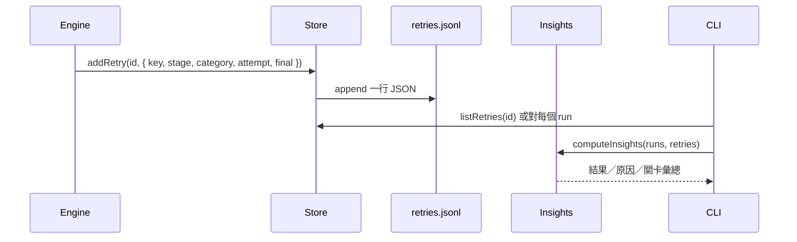

# Run Insights Implementation Plan

> **For agentic workers:** REQUIRED SUB-SKILL: Use superpowers:executing-plans to implement this plan task-by-task. Steps use checkbox (`- [ ]`) syntax for tracking.

> **狀態：已完成（d54f5ad–befb454），部分約束已被 0be1df5 推翻。** 以程式與 `docs/reference.md` 為準。差異見 `2026-09-28-insights-plan-review.md` 的 R1–R10，特別是新增 `FlowRun.failureCategory` 與 `arbitration_revise` 的理由：若不記錄非 `retry()` 的失敗，`insights` 的失敗數與「達上限」數會對不上。

**Goal:** 每次關卡失敗都留下可統計的原因代碼，並用一條指令彙總這個專案所有 run，指出該先改哪個 prompt 或關卡。

**Architecture:** 分類在 `retry()` 呼叫當下寫入 `.agentflowctl/runs/<id>/retries.jsonl`（與 `costs.jsonl`、`substitutions.jsonl` 相同：只 append、不改寫）。跨 run 彙總是純函式，CLI 只負責列印。舊 run 沒有檔案就當成沒有重試紀錄，不回填。

**Tech Stack:** Node.js >=22、TypeScript、Commander、Zod、Vitest、pnpm。

## Global Constraints

- 程式碼、註解、commit 訊息與使用者輸出使用繁體中文。
- 使用者可見行為（新指令、`status` 輸出）須在同一個 commit 更新 `README.md`；完整分類表放入 `docs/reference.md`。
- 關卡仍由檔案、diff、測試與 zod 判斷；分類代碼由程式在 `retry()` 寫入，不解析 `feedback.md` 的自由文字。
- 不新增 `FlowRun` 欄位；重試紀錄獨立於 `state.json`，舊 run 可 resume。
- 不追蹤 PR 是否 merge、不回填舊 run、不在仲裁／額度暫停路徑另外記一筆（那些不是 `retry()`）。

## Review Focus

- `retry()` 的每個呼叫點都有明確 `category`，編譯期不可省略。
- 沒有 `retries.jsonl` 的舊 run：`listRetries` 回空陣列，`insights` 不崩潰。
- 達 `maxAttempts` 而失敗時仍寫入一筆，且 `final: true`。
- `insights` 沒有任何 run 時印「還沒有 run」，結束碼 0。
- 分類代碼是穩定英文 id；終端機顯示繁體中文標籤。

## 檔案職責

| 檔案 | 職責 |
|---|---|
| `src/store.ts` | `addRetry` / `listRetries`，append `retries.jsonl` |
| `src/engine.ts` | `retry()` 多一個 `category`，所有呼叫點補上 |
| `src/insights.ts` | 純函式：跨 run 彙總結果、原因、關卡 |
| `src/cli.ts` | `insights` 指令；`status` 列出該 run 的重試 |
| `README.md` / `docs/reference.md` | 指令與分類表 |
| `AGENTS.md` | `retries.jsonl` 寫進 run 資料目錄那一段 |

## 分類代碼

呼叫點已知失敗種類，直接傳 enum，不從 reason 字串猜。

| category | 顯示 | 呼叫點 |
|---|---|---|
| `agent_error` | Agent 執行失敗 | `!r.ok` |
| `missing_artifact` | 缺少必要檔案 | 缺少 `spec.md` / `plan.md` |
| `format_invalid` | 輸出格式錯誤 | zod／驗收 id 重複／`validatePlan` 字串 |
| `handoff_invalid` | 交接回覆不合格 | `finishHandoff` 回傳錯誤 |
| `open_handoff` | 未結交接事項 | `planSettled` 的未結 action |
| `review_changes` | 審查要求修改 | 計畫／任務／整體審查 `changes_requested` |
| `plan_tampered` | 改動已鎖定的計畫檔 | `planTamperedMessage` |
| `tests_not_written` | 未寫測試 | 無 commit、或沒改測試檔 |
| `tests_not_red` | 紅燈測試未失敗 | 實作前測試就全過 |
| `tests_modified` | 實作改了測試 | 綠燈階段動到測試檔 |
| `tests_not_green` | 測試仍未通過 | 實作後測試失敗 |
| `tests_deleted` | 刪除測試檔 | fix 刪測試 |
| `checks_failed` | 專案檢查失敗 | `runChecks` 有失敗 |

終端機顯示用 `RETRY_LABEL`：`Record<RetryCategory, string>`，與上表「顯示」欄相同。

## 資料流



---

### Task 1: retries.jsonl 儲存

**Files:**
- Modify: `src/store.ts`
- Modify: `src/store.test.ts`（檔尾已有未完成測試「依序記錄重試原因，沒有紀錄時回傳空陣列」，以此為起點）

**Interfaces:**
- `RetryCategory`：上表 13 個字面量的 union。
- `RetryEntry`：`{ key: string; stage: string; category: RetryCategory; attempt: number; final: boolean }`。
- `addRetry(id: string, entry: RetryEntry): void`：寫入 `{ at: ISO string, ...entry }` 一行。
- `listRetries(id: string): (RetryEntry & { at: string })[]`：檔案不存在回 `[]`。

- [ ] **Step 1: 確認現有測試會失敗**

`src/store.test.ts` 已有：

```ts
it("依序記錄重試原因，沒有紀錄時回傳空陣列", () => {
  expect(listRetries("f-retry")).toEqual([]);
  addRetry("f-retry", { key: "T-1:tests", stage: "implement", category: "tests_not_red", attempt: 1, final: false });
  addRetry("f-retry", { key: "T-1:tests", stage: "implement", category: "agent_error", attempt: 2, final: true });
  expect(listRetries("f-retry").map((r) => [r.category, r.attempt, r.final])).toEqual([["tests_not_red", 1, false], ["agent_error", 2, true]]);
  expect(listRetries("f-retry")[0]?.at).toMatch(/^\d{4}-/);
});
```

檔案頂部 import 也已加入 `addRetry`、`listRetries`。跑：

```bash
npx vitest run src/store.test.ts -t "依序記錄重試原因"
```

預期：`addRetry` / `listRetries` 不存在而失敗。若 import 還沒改，一併改成：

```ts
const { addRetry, addSubstitution, addUsage, agentRuns, listRetries, listSubstitutions, getRun, listRuns, saveRun, usageByAgent, usageByStage, usageByStrength, usageByTask } = await import("./store.js");
```

- [ ] **Step 2: 實作儲存**

在 `src/store.ts` 的 `listSubstitutions` 之後，仿 `substitutions.jsonl`：

```ts
export const RetryCategories = [
  "agent_error", "missing_artifact", "format_invalid", "handoff_invalid", "open_handoff",
  "review_changes", "plan_tampered", "tests_not_written", "tests_not_red", "tests_modified",
  "tests_not_green", "tests_deleted", "checks_failed",
] as const;
export type RetryCategory = (typeof RetryCategories)[number];

export interface RetryEntry {
  key: string;
  stage: string;
  category: RetryCategory;
  attempt: number;
  final: boolean;
}

const retryPath = (id: string) => join(runDir(id), "retries.jsonl");

export function addRetry(id: string, entry: RetryEntry): void {
  mkdirSync(runDir(id), { recursive: true });
  appendFileSync(retryPath(id), `${JSON.stringify({ at: new Date().toISOString(), ...entry })}\n`);
}

export function listRetries(id: string): (RetryEntry & { at: string })[] {
  const p = retryPath(id);
  if (!existsSync(p)) return [];
  return readFileSync(p, "utf8").split("\n").filter(Boolean).map((l) => JSON.parse(l) as RetryEntry & { at: string });
}
```

- [ ] **Step 3: 跑測試確認通過**

```bash
npx vitest run src/store.test.ts
```

預期：全部通過。

- [ ] **Step 4: Commit**

```bash
git add src/store.ts src/store.test.ts
git commit -m "$(cat <<'EOF'
新增 retries.jsonl，記錄每次關卡重試的原因代碼。

EOF
)"
```

---

### Task 2: `retry()` 寫入分類

**Files:**
- Modify: `src/engine.ts`（`retry` 與所有呼叫點）
- Modify: `src/engine.test.ts`

**Interfaces:**
- `retry(run: FlowRun, key: string, reason: string, backTo: Stage, category: RetryCategory): FlowRun`
- `applyFix` 內的 `again` 改為 `(reason: string, category: RetryCategory)`
- `addRetry` 在寫 `feedback.md` 的同時呼叫；`final` 為 `n >= config.maxAttempts`

- [ ] **Step 1: 寫失敗測試**

在 `src/engine.test.ts` 現有 import 加上 `listRetries`：

```ts
const { agentRuns, listRetries, listSubstitutions, listUsage } = await import("./store.js");
```

在「審查交接關卡」裡「審查核准卻未處理 action 時不會開 PR」測試末尾加上：

```ts
expect(listRetries(run.id).map((r) => r.category)).toContain("handoff_invalid");
expect(listRetries(run.id).every((r) => r.key === "review-run")).toBe(true);
```

`reviewHandoffGate` 失敗走的是 `finishHandoff` 錯誤，分類用 `handoff_invalid`（不是 `open_handoff`；`open_handoff` 只給 `planSettled` 那條未結事項檢查）。

再在「計畫審查核准仍有未結事項時不能開始實作」測試末尾加上：

```ts
expect(listRetries(id).map((r) => [r.key, r.category])).toContainEqual(["plan-handoff", "open_handoff"]);
```

- [ ] **Step 2: 跑測試確認失敗**

```bash
npx vitest run src/engine.test.ts -t "審查核准卻未處理 action"
```

預期：`retry` 還沒寫 `retries.jsonl`，`toContain` 失敗。

- [ ] **Step 3: 改 `retry` 並補齊呼叫點**

`src/engine.ts` 加上 import：

```ts
import { addRetry, addSubstitution, addUsage, agentRuns, saveRun, type RetryCategory } from "./store.js";
```

改 `retry`：

```ts
function retry(run: FlowRun, key: string, reason: string, backTo: Stage, category: RetryCategory): FlowRun {
  const n = (run.attempts[key] ?? 0) + 1;
  const attempts = { ...run.attempts, [key]: n };
  const final = n >= config.maxAttempts;
  mkdirSync(flowDir(run.id), { recursive: true });
  writeFileSync(flowFile(run, "feedback.md"), `# 前次嘗試未通過（第 ${n} 次）\n\n${reason}\n`);
  addRetry(run.id, { key, stage: backTo, category, attempt: n, final });
  if (final) {
    return { ...run, attempts, stage: "failed", failedStage: backTo, failureReason: `${key} 連續失敗 ${n} 次：${tail(reason, 500)}` };
  }
  info(run, `⚠️  ${key} 未通過，重試（${n}/${config.maxAttempts}）`);
  return { ...run, attempts, stage: backTo };
}
```

依呼叫原因補第五個參數（完整清單，不可漏）：

| 位置（約略） | category |
|---|---|
| spec：`!r.ok` | `agent_error` |
| spec：缺少 `spec.md` | `missing_artifact` |
| spec：`ac.error`、id 重複 | `format_invalid` |
| spec：`handoffError` | `handoff_invalid` |
| `planSettled` 未結事項 | `open_handoff` |
| plan：`!r.ok` | `agent_error` |
| plan：`validatePlan` 字串 | `format_invalid` |
| plan：`handoffError` | `handoff_invalid` |
| plan-review-run：`!r.ok` | `agent_error` |
| plan-review-run：`review.error` | `format_invalid` |
| plan-review-run：`handoffError` | `handoff_invalid` |
| plan-review：`changes_requested` | `review_changes` |
| plan-fix：agent 失敗 | `agent_error` |
| plan-fix：格式檢查 | `format_invalid` |
| plan-fix：handoff | `handoff_invalid` |
| tests：`!r.ok` | `agent_error` |
| tests：`tampered` | `plan_tampered` |
| tests：無 commit、沒改測試檔 | `tests_not_written` |
| tests：紅燈全過 | `tests_not_red` |
| tests：handoff | `handoff_invalid` |
| code：`!r.ok` | `agent_error` |
| code：`tampered` | `plan_tampered` |
| code：改測試檔 | `tests_modified` |
| code：測試未過 | `tests_not_green` |
| code：handoff | `handoff_invalid` |
| task review：issues | `review_changes` |
| task verify：`runChecks` | `checks_failed` |
| verify：`runChecks` | `checks_failed` |
| `codeReview` 內 `!r.ok` | `agent_error` |
| `codeReview` 內 `review.error` | `format_invalid` |
| `codeReview` 內 handoff | `handoff_invalid` |
| 整體 review：issues | `review_changes` |
| `applyFix` again：agent 失敗 | `agent_error` |
| `applyFix` again：tampered | `plan_tampered` |
| `applyFix` again：刪測試 | `tests_deleted` |
| `applyFix` again：handoff | `handoff_invalid` |

`applyFix` 的 `again`：

```ts
const again = (reason: string, category: RetryCategory) => ({ run: retry(run, opts.key, reason, opts.backTo, category) });
```

改完後 `pnpm run typecheck` 必須通過（漏傳第五參數會編譯失敗）。

- [ ] **Step 4: 跑相關測試**

```bash
npx vitest run src/engine.test.ts
pnpm run typecheck
```

預期：通過。

- [ ] **Step 5: Commit**

```bash
git add src/engine.ts src/engine.test.ts
git commit -m "$(cat <<'EOF'
關卡重試時寫入分類代碼，不再只靠 feedback.md 自由文字。

EOF
)"
```

---

### Task 3: 跨 run 彙總純函式

**Files:**
- Create: `src/insights.ts`
- Create: `src/insights.test.ts`

**Interfaces:**
- `RETRY_LABEL: Record<RetryCategory, string>`：繁體中文標籤。
- `InsightsInputRun`：`{ id: string; stage: string; retries: RetryEntry[] }`（測試不碰檔案）。
- `Insights`：
  - `runCount: number`
  - `byOutcome: Record<"done" | "failed" | "paused" | "awaiting_approval" | "active", number>`
  - `byCategory: { category: RetryCategory; count: number; finals: number }[]`（次數高到低）
  - `byKey: { key: string; count: number }[]`（次數高到低）
  - `runs: { id: string; stage: string; retries: number; topCategory?: RetryCategory }[]`（維持輸入順序）
- `computeInsights(runs: InsightsInputRun[]): Insights`
- `outcomeOf(stage: string)`：`done` / `failed` / `paused` / `awaiting_approval` 對應原值，其餘為 `active`

- [ ] **Step 1: 寫失敗測試**

`src/insights.test.ts`：

```ts
import { describe, expect, it } from "vitest";
import { computeInsights, RETRY_LABEL } from "./insights.js";
import type { RetryEntry } from "./store.js";

const retry = (partial: Partial<RetryEntry> & Pick<RetryEntry, "category">): RetryEntry => ({
  key: "spec", stage: "spec", attempt: 1, final: false, ...partial,
});

describe("computeInsights", () => {
  it("沒有 run 時全部為 0", () => {
    expect(computeInsights([])).toEqual({
      runCount: 0,
      byOutcome: { done: 0, failed: 0, paused: 0, awaiting_approval: 0, active: 0 },
      byCategory: [],
      byKey: [],
      runs: [],
    });
  });

  it("依結果、原因、關卡加總，原因按次數排序", () => {
    const insights = computeInsights([
      { id: "f-a", stage: "done", retries: [retry({ category: "format_invalid", key: "plan" }), retry({ category: "format_invalid", key: "plan", attempt: 2 })] },
      { id: "f-b", stage: "failed", retries: [retry({ category: "review_changes", key: "review", final: true })] },
      { id: "f-c", stage: "implement", retries: [] },
    ]);
    expect(insights.runCount).toBe(3);
    expect(insights.byOutcome).toEqual({ done: 1, failed: 1, paused: 0, awaiting_approval: 0, active: 1 });
    expect(insights.byCategory).toEqual([
      { category: "format_invalid", count: 2, finals: 0 },
      { category: "review_changes", count: 1, finals: 1 },
    ]);
    expect(insights.byKey).toEqual([
      { key: "plan", count: 2 },
      { key: "review", count: 1 },
    ]);
    expect(insights.runs.map((r) => [r.id, r.retries, r.topCategory])).toEqual([
      ["f-a", 2, "format_invalid"],
      ["f-b", 1, "review_changes"],
      ["f-c", 0, undefined],
    ]);
  });
});

describe("RETRY_LABEL", () => {
  it("每個分類都有繁中標籤", () => {
    expect(RETRY_LABEL.format_invalid).toBe("輸出格式錯誤");
    expect(RETRY_LABEL.tests_not_red).toBe("紅燈測試未失敗");
  });
});
```

- [ ] **Step 2: 跑測試確認失敗**

```bash
npx vitest run src/insights.test.ts
```

預期：找不到模組而失敗。

- [ ] **Step 3: 實作 `src/insights.ts`**

```ts
import { RetryCategories, type RetryCategory, type RetryEntry } from "./store.js";

export const RETRY_LABEL: Record<RetryCategory, string> = {
  agent_error: "Agent 執行失敗",
  missing_artifact: "缺少必要檔案",
  format_invalid: "輸出格式錯誤",
  handoff_invalid: "交接回覆不合格",
  open_handoff: "未結交接事項",
  review_changes: "審查要求修改",
  plan_tampered: "改動已鎖定的計畫檔",
  tests_not_written: "未寫測試",
  tests_not_red: "紅燈測試未失敗",
  tests_modified: "實作改了測試",
  tests_not_green: "測試仍未通過",
  tests_deleted: "刪除測試檔",
  checks_failed: "專案檢查失敗",
};

export interface InsightsInputRun {
  id: string;
  stage: string;
  retries: RetryEntry[];
}

const OUTCOMES = ["done", "failed", "paused", "awaiting_approval"] as const;
type Outcome = (typeof OUTCOMES)[number] | "active";

export function outcomeOf(stage: string): Outcome {
  return (OUTCOMES as readonly string[]).includes(stage) ? stage as Exclude<Outcome, "active"> : "active";
}

export interface Insights {
  runCount: number;
  byOutcome: Record<Outcome, number>;
  byCategory: { category: RetryCategory; count: number; finals: number }[];
  byKey: { key: string; count: number }[];
  runs: { id: string; stage: string; retries: number; topCategory?: RetryCategory }[];
}

export function computeInsights(runs: InsightsInputRun[]): Insights {
  const byOutcome: Record<Outcome, number> = { done: 0, failed: 0, paused: 0, awaiting_approval: 0, active: 0 };
  const cat = new Map<RetryCategory, { count: number; finals: number }>();
  const keys = new Map<string, number>();
  for (const run of runs) {
    byOutcome[outcomeOf(run.stage)] += 1;
    for (const r of run.retries) {
      const cur = cat.get(r.category) ?? { count: 0, finals: 0 };
      cur.count += 1;
      if (r.final) cur.finals += 1;
      cat.set(r.category, cur);
      keys.set(r.key, (keys.get(r.key) ?? 0) + 1);
    }
  }
  const topOf = (retries: RetryEntry[]) => {
    const n = new Map<RetryCategory, number>();
    for (const r of retries) n.set(r.category, (n.get(r.category) ?? 0) + 1);
    return [...n.entries()].sort((a, b) => b[1] - a[1] || RetryCategories.indexOf(a[0]) - RetryCategories.indexOf(b[0]))[0]?.[0];
  };
  return {
    runCount: runs.length,
    byOutcome,
    byCategory: [...cat.entries()].map(([category, v]) => ({ category, ...v })).sort((a, b) => b.count - a.count),
    byKey: [...keys.entries()].map(([key, count]) => ({ key, count })).sort((a, b) => b.count - a.count),
    runs: runs.map((r) => ({ id: r.id, stage: r.stage, retries: r.retries.length, topCategory: topOf(r.retries) })),
  };
}
```

- [ ] **Step 4: 跑測試確認通過**

```bash
npx vitest run src/insights.test.ts
```

預期：通過。

- [ ] **Step 5: Commit**

```bash
git add src/insights.ts src/insights.test.ts
git commit -m "$(cat <<'EOF'
新增跨 run 重試彙總，依結果、原因與關卡加總。

EOF
)"
```

---

### Task 4: CLI、`status` 與文件

**Files:**
- Modify: `src/cli.ts`
- Modify: `README.md`
- Modify: `docs/reference.md`
- Modify: `AGENTS.md`

**Interfaces:**
- `agentflowctl insights`：無參數。沒有 run 印 `還沒有 run`。
- `status <id>`：在代打紀錄之後、任務清單之前，若有重試就列出。

- [ ] **Step 1: 實作 CLI 輸出**

`src/cli.ts` import 加上 `computeInsights`、`RETRY_LABEL`、`listRetries`。

`insights` 指令放在 `stats` 後面：

```ts
program
  .command("insights")
  .description("彙總這個專案所有 run 的結果與重試原因，找出該先改的 prompt 或關卡")
  .action(() => {
    const runs = listRuns();
    if (!runs.length) return console.log("還沒有 run");
    const insights = computeInsights(runs.map((r) => ({ id: r.id, stage: r.stage, retries: listRetries(r.id) })));
    const o = insights.byOutcome;
    console.log(`專案彙總（${insights.runCount} 個 run）`);
    console.log(`  完成 ${o.done}  失敗 ${o.failed}  暫停 ${o.paused}  等待核准 ${o.awaiting_approval}  進行中 ${o.active}`);
    if (!insights.byCategory.length) return console.log("\n還沒有重試紀錄（舊 run 不會回填）");
    console.log("\n重試原因");
    for (const row of insights.byCategory) {
      const finals = row.finals ? `，其中 ${row.finals} 次達上限` : "";
      console.log(`  ${RETRY_LABEL[row.category].padEnd(14)}  ${String(row.count).padStart(4)} 次${finals}`);
    }
    console.log("\n最常重試的關卡");
    for (const row of insights.byKey.slice(0, 10)) {
      console.log(`  ${row.key.padEnd(19)}  ${String(row.count).padStart(4)} 次`);
    }
    console.log("\n各 run");
    for (const r of insights.runs) {
      const cat = r.topCategory ? `  最多 ${RETRY_LABEL[r.topCategory]}` : "";
      console.log(`  ${r.id}  ${r.stage.padEnd(17)}  重試 ${String(r.retries).padStart(3)} 次${cat}`);
    }
    console.log("\n次數多的原因對應 prompt 或關卡；單一 run 用 agentflowctl status <id> 與 stats <id>");
  });
```

`status` 在代打紀錄迴圈之後：

```ts
const retries = listRetries(id);
if (retries.length) {
  console.log("\n重試紀錄");
  for (const r of retries) {
    console.log(`  ${r.key.padEnd(19)}  ${RETRY_LABEL[r.category]}${r.final ? "（達上限）" : `（第 ${r.attempt} 次）`}`);
  }
}
```

- [ ] **Step 2: 更新文件**

`README.md`「查看進度」的指令列加上：

```bash
agentflowctl insights              # 這個專案所有 run 的結果與重試原因
```

`stats` 那段後面加一段：

`insights` 彙總所有 run 的最終狀態，以及每次關卡失敗的原因代碼（例如輸出格式錯誤、紅燈測試未失敗）。舊 run 沒有這份紀錄，不會回填。單一 run 的重試明細在 `status <id>`。

`docs/reference.md` 指令列表加上 `insights`，並在執行紀錄附近加分類表（用本 plan 的分類表）。

`AGENTS.md` 隔離方式那句，run 資料列出 `retries.jsonl`。

- [ ] **Step 3: 完整驗證**

```bash
pnpm run typecheck
pnpm test
pnpm run build
git diff --check
```

預期：全部通過、沒有空白行錯誤。

- [ ] **Step 4: Commit**

```bash
git add src/cli.ts README.md docs/reference.md AGENTS.md
git commit -m "$(cat <<'EOF'
新增 insights 指令，並在 status 列出重試原因。

EOF
)"
```

---

## 刻意不做

- 不解析舊 `feedback.md` 來回填分類。
- 仲裁修訂、額度暫停、`maxAgentRuns` 用盡：不是 `retry()`，這次不記。
- 不依 agent 交叉統計重試率（`retry()` 當下不一定有該步的 agent）。
- 不把 token 用量再彙總一次（`status` 已有單一 run 的用量）。
- 不追蹤 PR merge。
