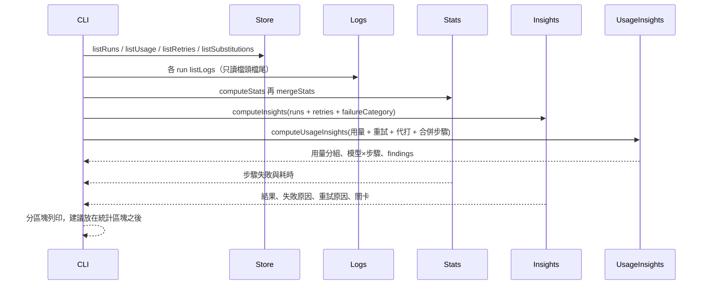

# Usage Insights Implementation Plan

> **For agentic workers:** REQUIRED SUB-SKILL: Use superpowers:subagent-driven-development (recommended) or superpowers:executing-plans to implement this plan task-by-task. Steps use checkbox (`- [ ]`) syntax for tracking.

> **狀態：已完成（bd2975a–4b87c45），跨 run 分組已依 `2026-09-28-insights-plan-review.md` 的 U1–U7 修正（d98764c、50ac2d3）。** 內文的 `byTask`、`small / T-1-code`、`T-1-tests` 等跨 run 預期值已不適用，以程式與 `docs/reference.md` 為準。

**Goal:** 在既有 `insights` 指令上，把這個專案所有 run 的用量、模型×步驟、步驟失敗／耗時與重試原因分開彙總，並用規則式建議指出該先改選模、關卡還是上下文。

**Architecture:** 沿用 `docs/superpowers/plans/2026-09-28-run-insights.md`：跨 run 彙總是純函式，CLI 只負責讀檔與列印。用量來自 `costs.jsonl`，步驟失敗與耗時來自各 run log 的檔頭檔尾（與 `stats` 相同，不讀 log 內文）。不新增 `FlowRun` 欄位、不回填舊資料、不呼叫 LLM。終端機用獨立區塊列印，token 與失敗次數不印在同一張表。建議是封閉的 finding 代碼，門檻寫死在函式裡。

**Tech Stack:** Node.js >=22、TypeScript、Commander、Zod、Vitest、pnpm。

## Prerequisite

**本分支已完成** `2026-09-28-run-insights.md` 及其後續（`failureCategory`、`byGate`、`RetryEntry.backTo`、jsonl 殘行略過），不要重做。開工前確認仍在：

- `src/store.ts`：`addRetry` / `listRetries`；`RetryEntry` 欄位是 `key`、`backTo`（不是 `stage`）、`category`、`attempt`、`final`；`listRetries`／`listSubstitutions` 走 `readJsonl`
- `src/insights.ts`：`computeInsights`、`RETRY_LABEL`、`retryLabel`、`failureLabel`、`byFailure`、`byGate`（不是 `byKey`）
- `src/cli.ts` 的 `insights`（約 570–600 行）在沒有重試時會 `return`，本計畫必須整段換掉，但**保留**「失敗原因」與「最常重試的關卡」合併顯示
- `src/store.test.ts` 頂部已有 `appendFileSync` 與 `runDir` import → Task 1 **只加欄位**，不要整行覆蓋
- `README.md` / `docs/reference.md` 已有 `insights` 一行與說明 → Task 5 **改現有文字**，不要再加一條指令
- `pnpm test` 通過

本計畫收回該文件「刻意不做」的「不把 token 用量再彙總一次」。重試原因仍由 `computeInsights` 負責；用量、模型×步驟、步驟統計與建議由本計畫負責。不改 `retry()`。

`listLogs` 實作會讀完整 log 再抽檔頭檔尾（與 `stats` 相同）。跨 run 接受同一代價，不另做只讀首末行的優化。

## Global Constraints

- 程式碼、註解、commit 訊息與使用者輸出使用繁體中文。
- 使用者可見行為（`insights` 輸出、README）須在同一個 commit 更新 `README.md`；建議代碼表放入 `docs/reference.md`。
- 關卡仍由檔案、diff、測試與 zod 判斷；建議由用量、重試與步驟失敗次數算出，不解析 `feedback.md` 或 log 內文。
- 不新增 `FlowRun` 欄位；舊 run 沒有 `usageReported` 時沿用 `status` 的「舊紀錄不明」，不算進合計與占比。
- 各 agent、階段、任務、模型×步驟、模型強度是同一批呼叫的不同分組，CLI 與文件都要寫「不要跨組相加」。
- 主指標是各強度 token 占比與高強度呼叫次數；合計 token 為輔。步驟失敗是另一個區塊，不要折算進占比。
- `insights` 輸出必須分區塊：結果、失敗原因、用量、模型與步驟、步驟執行與失敗、重試、建議、各 run。`用量`、`建議`、`各 run` 即使沒有明細也印標題加空狀態（「還沒有用量紀錄」「還沒有足夠訊號」）。沒有重試時仍印「還沒有重試紀錄（舊 run 不會回填）」後繼續往下，禁止 `return`。階段／任務／agent／模型×步驟／步驟失敗沒有列就整塊不印（沿用 `printUsage` 對空陣列直接 return）。失敗原因沿用現有：有 `byFailure` 才印。

## Review Focus

- `summarizeUsage` / `totalUsage` 與現有 `usageByAgent` 等加總規則一致（含 cache、未回報、舊紀錄）。
- 建議代碼是穩定英文 id；終端機顯示繁體中文標題與細節。
- 沒有用量的 run：彙總為 0，不崩潰；`insights` 沒有 run 時仍印「還沒有 run」。
- 回報覆蓋不足時，`coverage_low` 永遠排在建議最前面，避免使用者被失真占比誤導。
- `insights.ts` 不 import `usageInsights.ts`（避免循環依賴）。不要改寫 `src/insights.ts`／`src/insights.test.ts`。
- `mergeStats` 不加總 `wallMs`（跨 run 的「總經過時間」沒有意義）；步驟列以失敗次數、再執行次數、再耗時排序。
- **禁止**保留現有 `if (!insights.byCategory.length) return …`。沒有重試時仍須印用量、建議與各 run。Task 5 整段替換 `.action`，不要 merge 進舊函式。
- 既有 `insights` 的「失敗原因」（`byFailure`）與「最常重試的關卡」（`byGate`、任務 id 合併）必須保留。標籤用 `retryLabel`／`failureLabel`／`padDisplay`，不要 `RETRY_LABEL[category]` 或 `insights.byKey`。
- `computeInsights` 的輸入必須帶 `failureCategory: r.failureCategory`，否則失敗 run 會全部變成未分類。
- `listUsage` 改走既有 `readJsonl`，與重試／代打一樣略過殘行。
- 測試裡的 `RetryEntry` 用 `backTo`，不要寫 `stage`。
- 分組鍵只定義在 `store.ts` 的 `usageKey*`；`usageBy*` 與 `usageInsights.ts` 都引用它們，禁止再抄一份字串模板。
- `hot_failing_step`：優先選 `failed >= 3` 的 **agent** 步驟；沒有才退到 cmd。cmd 的 `impactTokens` 固定為 `0`，避免測試／lint 失敗擠掉真正的用量建議。

## 檔案職責

| 檔案 | 職責 |
|---|---|
| `src/store.ts` | 匯出 `totalUsage` / `summarizeUsage` / `usageKey*`；`listUsage` 改走 `readJsonl`；磁碟版 `usageBy*` 改走它們 |
| `src/stats.ts` | 既有 `computeStats`；新增 `mergeStats` 合併多個 run 的步驟統計 |
| `src/usageInsights.ts` | 純函式：跨 run 用量、模型×步驟彙總與規則式建議 |
| `src/cli.ts` | `insights` 分區塊印結果、失敗原因、用量、模型×步驟、步驟失敗、重試、建議；標籤沿用 `retryLabel`／`failureLabel`／`padDisplay` |
| `README.md` / `docs/reference.md` / `AGENTS.md` | 指令說明與建議代碼表 |

`status <id>` 仍是單一 run 全量明細；`insights` 的模型×步驟只印 tokens 最高的 10 列。`stats <id>` 仍是單一 run 耗時表。

## 建議代碼

呼叫點已知的事實，直接對代碼，不從字串猜。門檻如下，測試必須用同一組數字。

| code | 顯示標題 | 觸發條件 | impactTokens |
|---|---|---|---|
| `coverage_low` | 用量回報不完整 | `runs >= 5` 且 `(unreportedRuns + legacyRuns) / runs >= 0.3` | `0` |
| `high_strength_share` | 高強度模型占比偏高 | `total.tokens > 0` 且 `high.tokens / total.tokens >= 0.4` | `high.tokens` |
| `retry_waste` | 重試可能比單次 prompt 更耗 token | 跨 run 重試筆數 `>= 2` | `avgTokensPerCall * retries.length`（無已回報呼叫則 `avg = 0`） |
| `input_heavy` | 輸入遠大於輸出 | `total.tokens >= 5000` 且 `inputTokens / tokens >= 0.85` | `inputTokens` |
| `hot_stage` | 單一階段佔用量過高 | 至少兩個階段 `tokens > 0`，最高階段 `>= 35%` | 該階段 tokens |
| `hot_task` | 單一任務佔用量過高 | 排除「非任務步驟」後至少兩個任務 `tokens > 0`，最高任務佔任務合計 `>= 40%` | 該任務 tokens |
| `substitution_waste` | 額度代打造成重做 | 跨 run 代打次數 `>= 2` | `avgTokensPerCall * substitutions` |
| `cache_unread` | cache 寫入多、讀取少 | `cacheWriteTokens >= 1000` 且 `cacheReadTokens < cacheWriteTokens * 0.5` | `cacheWriteTokens` |
| `hot_model_step` | 單一模型與步驟佔用量過高 | 至少兩個「模型 / 步驟」`tokens > 0`，最高列佔合計 `>= 35%` | 該列 tokens |
| `hot_failing_step` | 單一執行步驟失敗次數過多 | 合併後有步驟 `failed >= 3`：先取失敗最多的 agent 步驟，沒有才取 cmd | agent：`avgTokensPerCall * failed`；cmd：`0`（detail 標明專案指令） |

排序：`coverage_low` 若存在固定第一，其餘依 `impactTokens` 高到低，再依上表順序。最多印 5 則。

`avgTokensPerCall` = `total.tokens / total.reportedRuns` 四捨五入為整數；`reportedRuns === 0` 時為 0。重試估算是「次數 × 平均每次」，不是精確歸因到失敗那一筆。

階段鍵與 `status` 相同（`taskCode`、`planReview`…），方便對 `model stage`。任務鍵為 `T-n`。

## 資料流



---

### Task 1: 記憶體用量加總

**Files:**
- Modify: `src/store.ts`
- Modify: `src/store.test.ts`

**Interfaces:**
- Consumes: 現有 `UsageEntry`、`UsageSummary`、`addSummary`（維持私有）
- Produces:
  - `totalUsage(entries: UsageEntry[]): UsageSummary`
  - `summarizeUsage(entries: UsageEntry[], keyOf: (e: UsageEntry) => string): Record<string, UsageSummary>`
  - `usageKeyAgent` / `usageKeyStrength` / `usageKeyStage` / `usageKeyTask` / `usageKeyModelStage`
  - `usageByAgent` 等五個磁碟版函式改為 `summarizeUsage(listUsage(id), usageKey*)`，對外行為不變
  - `listUsage` 改為 `readJsonl(usagePath(id))`（與 `listRetries` 相同，殘行略過）

- [ ] **Step 1: 寫失敗測試**

`src/store.test.ts` 現有兩行 dynamic import 保留；只在 store 那行加上 `listUsage`、`summarizeUsage`、`totalUsage`、`usageKeyAgent`、`usageKeyModelStage`：

```ts
const { runDir } = await import("./paths.js");
const { addRetry, addSubstitution, addUsage, agentRuns, listRetries, listSubstitutions, listUsage, getRun, listRuns, saveRun, summarizeUsage, totalUsage, usageByAgent, usageByStage, usageByStrength, usageByTask, usageKeyAgent, usageKeyModelStage } = await import("./store.js");
```

不要刪掉 `appendFileSync` 或 `runDir`。現有「jsonl 有寫到一半的殘行時略過該行」只測 retries／substitutions，不要改它。在「檔案儲存」末尾加：

```ts
  it("對記憶體中的用量分組，不讀檔", () => {
    const entries = [
      { stage: "spec", agent: "a", usageReported: true as const, inputTokens: 10, outputTokens: 1, cacheReadTokens: 4 },
      { stage: "plan", agent: "b", usageReported: true as const, inputTokens: 20, outputTokens: 2 },
      { stage: "review", agent: "a", usageReported: false as const },
    ];
    expect(totalUsage(entries)).toMatchObject({
      tokens: 33, inputTokens: 30, outputTokens: 3, cacheReadTokens: 4, runs: 3, reportedRuns: 2, unreportedRuns: 1,
    });
    expect(summarizeUsage(entries, usageKeyAgent).a).toMatchObject({ tokens: 11, runs: 2, reportedRuns: 1, unreportedRuns: 1 });
    expect(summarizeUsage([], usageKeyAgent)).toEqual({});
    expect(usageKeyModelStage({ stage: "plan", agent: "a" })).toBe("CLI 預設（名稱未知） / plan");
    expect(usageKeyModelStage({ stage: "T-1-code", agent: "a", model: "small" })).toBe("small / T-1-code");
  });

  it("用量 jsonl 殘行略過，不讓整份讀失敗", () => {
    addUsage("f-torn-u", { stage: "spec", agent: "a", usageReported: true, inputTokens: 1, outputTokens: 1 });
    appendFileSync(join(runDir("f-torn-u"), "costs.jsonl"), "{");
    expect(listUsage("f-torn-u")).toHaveLength(1);
  });
```

- [ ] **Step 2: 跑測試確認失敗**

```bash
npx vitest run src/store.test.ts -t "對記憶體中的用量分組"
```

預期：`summarizeUsage` / `totalUsage` 不存在而失敗。

- [ ] **Step 3: 實作加總並讓磁碟版改走同一條路**

在 `src/store.ts` 的 `addSummary` 之後，把 `groupUsage` 與 `usageBy*` 換成：

```ts
export function totalUsage(entries: UsageEntry[]): UsageSummary {
  const acc = emptySummary();
  for (const e of entries) addSummary(acc, e);
  return acc;
}

export function summarizeUsage(entries: UsageEntry[], keyOf: (e: UsageEntry) => string): Record<string, UsageSummary> {
  const out: Record<string, UsageSummary> = {};
  for (const e of entries) addSummary(out[keyOf(e)] ??= emptySummary(), e);
  return out;
}

export const usageKeyAgent = (e: UsageEntry) => e.agent;
export const usageKeyStrength = (e: UsageEntry) => e.strength ?? "未知";
export const usageKeyStage = (e: UsageEntry) => stageOfStep(e.stage) ?? "其他";
export const usageKeyTask = (e: UsageEntry) => /^(T-\d+)-/.exec(e.stage)?.[1] ?? "非任務步驟";
export const usageKeyModelStage = (e: UsageEntry) => `${e.model ?? "CLI 預設（名稱未知）"} / ${e.stage}`;

function groupUsage(id: string, keyOf: (e: UsageEntry) => string): Record<string, UsageSummary> {
  return summarizeUsage(listUsage(id), keyOf);
}

export const usageByAgent = (id: string) => groupUsage(id, usageKeyAgent);
export const usageByModelStage = (id: string) => groupUsage(id, usageKeyModelStage);
export const usageByStrength = (id: string) => groupUsage(id, usageKeyStrength);
export const usageByStage = (id: string) => groupUsage(id, usageKeyStage);
export const usageByTask = (id: string) => groupUsage(id, usageKeyTask);
```

刪掉舊的五個 `export const usageBy…` 與舊 `groupUsage`。不要改 `addSummary` 的回報／舊紀錄判斷。

`listUsage` 目前對每行 `JSON.parse`，殘行會讓跨 run 的 `insights` 整段炸掉。把 `readJsonl` 從 `listSubstitutions` 前面移到 `listUsage` 前面（`emptySummary` 之後），再改成：

```ts
export function listUsage(id: string): UsageEntry[] {
  return readJsonl(usagePath(id));
}
```

- [ ] **Step 4: 跑測試確認通過**

```bash
npx vitest run src/store.test.ts
```

預期：全部通過，包含原本的 `usageByAgent` / `usageByStage` / cache／殘行／去重測試。

- [ ] **Step 5: Commit**

```bash
git add src/store.ts src/store.test.ts
git commit -m "$(cat <<'EOF'
匯出記憶體用量加總與分組鍵，讓跨 run 彙總與 status 用同一套規則。

EOF
)"
```

---

### Task 2: 跨 run 用量彙總純函式

**Files:**
- Create: `src/usageInsights.ts`
- Create: `src/usageInsights.test.ts`

**Interfaces:**
- Consumes: `totalUsage`、`summarizeUsage`、`usageKeyAgent` / `usageKeyStrength` / `usageKeyStage` / `usageKeyTask` / `usageKeyModelStage`、`RetryEntry`、`UsageEntry`
- Produces:
  - `UsageInsightsInputRun`：`{ id: string; usage: UsageEntry[]; retries: RetryEntry[]; substitutions: number }`
  - `UsageInsights`：
    - `total: UsageSummary`
    - `byStrength` / `byStage` / `byTask` / `byAgent` / `byModelStage`：`Record<string, UsageSummary>`
    - `substitutions: number`
    - `findings: Finding[]`（本任務先回空陣列）
    - `runs: { id: string; tokens: number; calls: number }[]`（維持輸入順序；`tokens` 只含已回報）
  - `computeUsageInsights(runs: UsageInsightsInputRun[]): UsageInsights`
  - 分組一律呼叫 Task 1 的 `usageKey*`，不要在此檔再寫 `stageOfStep` 或模型名稱模板

- [ ] **Step 1: 寫失敗測試**

`src/usageInsights.test.ts`：

```ts
import { describe, expect, it } from "vitest";
import { computeUsageInsights } from "./usageInsights.js";
import type { RetryEntry } from "./store.js";
import type { UsageEntry } from "./store.js";

const usage = (partial: Partial<UsageEntry> & Pick<UsageEntry, "stage">): UsageEntry => ({
  agent: "a", usageReported: true, inputTokens: 0, outputTokens: 0, ...partial,
});

const retry = (partial: Partial<RetryEntry> & Pick<RetryEntry, "category">): RetryEntry => ({
  key: "spec", backTo: "spec", attempt: 1, final: false, ...partial,
});

describe("computeUsageInsights", () => {
  it("沒有 run 時全部為 0", () => {
    const insights = computeUsageInsights([]);
    expect(insights.total).toMatchObject({ tokens: 0, runs: 0, reportedRuns: 0 });
    expect(insights.byStage).toEqual({});
    expect(insights.substitutions).toBe(0);
    expect(insights.findings).toEqual([]);
    expect(insights.runs).toEqual([]);
  });

  it("跨 run 加總強度、階段、任務與代打，並保留各 run 小計", () => {
    const insights = computeUsageInsights([
      {
        id: "f-a",
        substitutions: 1,
        retries: [retry({ category: "format_invalid" })],
        usage: [
          usage({ stage: "plan", strength: "high", inputTokens: 100, outputTokens: 10 }),
          usage({ stage: "T-1-code", strength: "low", model: "small", inputTokens: 30, outputTokens: 3 }),
        ],
      },
      {
        id: "f-b",
        substitutions: 2,
        retries: [],
        usage: [
          usage({ stage: "T-1-code", agent: "b", model: "small", strength: "low", inputTokens: 40, outputTokens: 4 }),
          usage({ stage: "review", agent: "b", usageReported: false }),
        ],
      },
    ]);
    expect(insights.total).toMatchObject({ tokens: 187, inputTokens: 170, outputTokens: 17, runs: 4, reportedRuns: 3, unreportedRuns: 1 });
    expect(insights.byStrength.high).toMatchObject({ tokens: 110, runs: 1 });
    expect(insights.byStrength.low).toMatchObject({ tokens: 77, runs: 2 });
    expect(insights.byStage.taskCode).toMatchObject({ tokens: 77, runs: 2 });
    expect(insights.byStage.plan).toMatchObject({ tokens: 110, runs: 1 });
    expect(insights.byTask["T-1"]).toMatchObject({ tokens: 77, runs: 2 });
    expect(insights.byTask["非任務步驟"]).toMatchObject({ tokens: 110, runs: 2, unreportedRuns: 1 });
    expect(insights.byAgent.a).toMatchObject({ tokens: 143, runs: 2 });
    expect(insights.byModelStage["CLI 預設（名稱未知） / plan"]).toMatchObject({ tokens: 110, runs: 1 });
    expect(insights.byModelStage["small / T-1-code"]).toMatchObject({ tokens: 77, runs: 2 });
    expect(insights.substitutions).toBe(3);
    expect(insights.runs).toEqual([
      { id: "f-a", tokens: 143, calls: 2 },
      { id: "f-b", tokens: 44, calls: 2 },
    ]);
  });
});
```

- [ ] **Step 2: 跑測試確認失敗**

```bash
npx vitest run src/usageInsights.test.ts
```

預期：找不到模組而失敗。

- [ ] **Step 3: 實作彙總（建議先回空陣列）**

`src/usageInsights.ts`：

```ts
import type { RetryEntry, UsageEntry, UsageSummary } from "./store.js";
import { summarizeUsage, totalUsage, usageKeyAgent, usageKeyModelStage, usageKeyStage, usageKeyStrength, usageKeyTask } from "./store.js";

export interface UsageInsightsInputRun {
  id: string;
  usage: UsageEntry[];
  retries: RetryEntry[];
  substitutions: number;
}

export interface Finding {
  code: string;
  impactTokens: number;
  title: string;
  detail: string;
}

export interface UsageInsights {
  total: UsageSummary;
  byStrength: Record<string, UsageSummary>;
  byStage: Record<string, UsageSummary>;
  byTask: Record<string, UsageSummary>;
  byAgent: Record<string, UsageSummary>;
  byModelStage: Record<string, UsageSummary>;
  substitutions: number;
  findings: Finding[];
  runs: { id: string; tokens: number; calls: number }[];
}

export function computeUsageInsights(runs: UsageInsightsInputRun[]): UsageInsights {
  const usage = runs.flatMap((r) => r.usage);
  const substitutions = runs.reduce((n, r) => n + r.substitutions, 0);
  const total = totalUsage(usage);
  return {
    total,
    byStrength: summarizeUsage(usage, usageKeyStrength),
    byStage: summarizeUsage(usage, usageKeyStage),
    byTask: summarizeUsage(usage, usageKeyTask),
    byAgent: summarizeUsage(usage, usageKeyAgent),
    byModelStage: summarizeUsage(usage, usageKeyModelStage),
    substitutions,
    findings: [],
    runs: runs.map((r) => {
      const t = totalUsage(r.usage);
      return { id: r.id, tokens: t.tokens, calls: t.runs };
    }),
  };
}
```

本任務不要實作 `usageFindings`。`Finding.code` 在 Task 4 會收成 union。`stats` 欄位在 Task 3 之後才傳入，本任務的測試不必帶。

- [ ] **Step 4: 跑測試確認通過**

```bash
npx vitest run src/usageInsights.test.ts
```

預期：通過。

- [ ] **Step 5: Commit**

```bash
git add src/usageInsights.ts src/usageInsights.test.ts
git commit -m "$(cat <<'EOF'
新增跨 run 用量彙總，依強度、階段、任務、agent 與模型步驟加總。

EOF
)"
```

---

### Task 3: 跨 run 步驟失敗與耗時

**Files:**
- Modify: `src/stats.ts`
- Modify: `src/stats.test.ts`

**Interfaces:**
- Consumes: 現有 `computeStats`、`RunStats`、`StepStat`
- Produces:
  - `MergedStats`：`{ steps: StepStat[]; agentMs: number; cmdMs: number; unfinished: number }`（沒有 `wallMs`）
  - `mergeStats(runs: RunStats[]): MergedStats`
  - 同一步（`kind` + `step`）加總 `runs` / `failed` / `unfinished` / `totalMs`，`maxMs` 取最大
  - `steps` 排序：`failed` 高到低，其次 `runs`，再其次 `totalMs`（與單一 run `stats` 依耗時排序不同，這裡優先看失敗）

- [ ] **Step 1: 寫失敗測試**

`src/stats.test.ts` import 加上 `mergeStats`。檔尾加：

```ts
describe("mergeStats", () => {
  it("跨 run 合併次數與失敗，不計算總經過時間", () => {
    const a = computeStats([
      entry("T-1-tests", "claude", "00:00", "02:00", false),
      entry("lint", "cmd", "02:00", "02:10"),
    ]);
    const b = computeStats([
      entry("T-1-tests", "codex", "00:00", "01:00", false),
      entry("T-1-tests", "codex", "01:00", "01:30"),
    ]);
    const merged = mergeStats([a, b]);
    expect("wallMs" in merged).toBe(false);
    expect(merged.steps.find((s) => s.step === "T-1-tests")).toMatchObject({
      kind: "agent", runs: 3, failed: 2, unfinished: 0,
    });
    expect(merged.steps[0]?.step).toBe("T-1-tests");
    expect(merged.unfinished).toBe(0);
  });

  it("沒有 run 時全部為 0", () => {
    expect(mergeStats([])).toEqual({ steps: [], agentMs: 0, cmdMs: 0, unfinished: 0 });
  });
});
```

- [ ] **Step 2: 跑測試確認失敗**

```bash
npx vitest run src/stats.test.ts -t "mergeStats"
```

預期：`mergeStats` 不存在而失敗。

- [ ] **Step 3: 實作合併**

在 `src/stats.ts` 的 `computeStats` 之後加：

```ts
export interface MergedStats {
  steps: StepStat[];
  agentMs: number;
  cmdMs: number;
  unfinished: number;
}

export function mergeStats(runs: RunStats[]): MergedStats {
  const byKey = new Map<string, StepStat>();
  let agentMs = 0;
  let cmdMs = 0;
  let unfinished = 0;
  for (const run of runs) {
    agentMs += run.agentMs;
    cmdMs += run.cmdMs;
    unfinished += run.unfinished;
    for (const s of run.steps) {
      const key = `${s.kind}:${s.step}`;
      const acc = byKey.get(key) ?? { step: s.step, kind: s.kind, runs: 0, failed: 0, unfinished: 0, totalMs: 0, maxMs: 0 };
      acc.runs += s.runs;
      acc.failed += s.failed;
      acc.unfinished += s.unfinished;
      acc.totalMs += s.totalMs;
      acc.maxMs = Math.max(acc.maxMs, s.maxMs);
      byKey.set(key, acc);
    }
  }
  const steps = [...byKey.values()].sort((a, b) => b.failed - a.failed || b.runs - a.runs || b.totalMs - a.totalMs);
  return { steps, agentMs, cmdMs, unfinished };
}
```

- [ ] **Step 4: 跑測試確認通過**

```bash
npx vitest run src/stats.test.ts
```

預期：通過。

- [ ] **Step 5: Commit**

```bash
git add src/stats.ts src/stats.test.ts
git commit -m "$(cat <<'EOF'
合併多個 run 的步驟失敗與耗時，不計算跨 run 經過時間。

EOF
)"
```

---

### Task 4: 規則式建議

**Files:**
- Modify: `src/usageInsights.ts`（`Finding` 改為封閉代碼；`computeUsageInsights` 改呼叫 `usageFindings`；回傳 `stepStats`）
- Modify: `src/usageInsights.test.ts`

**Interfaces:**
- Consumes: Task 2 的彙總結果、`retryLabel`（不要直接 `RETRY_LABEL[category]`，較新版本寫入、這一版不認得的分類才顯示代碼）、`RetryCategories`、`mergeStats`、`StepStat`
- Produces:
  - `FindingCodes`：上表 10 個字面量
  - `FindingCode`、`FINDING_LABEL: Record<FindingCode, string>`
  - `Finding`：`{ code: FindingCode; impactTokens: number; title: string; detail: string }`
  - `usageFindings(input): Finding[]`（門檻與排序見「建議代碼」；`byModelStage` 與 `steps` 缺省為 `{}` / `[]`）
  - `UsageInsightsInputRun.stats?: RunStats`
  - `UsageInsights.stepStats: MergedStats`
  - `computeUsageInsights` 的 `findings` 改為 `usageFindings(...)` 的回傳值

- [ ] **Step 1: 寫失敗測試**

在 `src/usageInsights.test.ts` 補 import：

```ts
import { computeUsageInsights, FINDING_LABEL, usageFindings } from "./usageInsights.js";
import { totalUsage } from "./store.js";
```

在檔尾加：

```ts
describe("FINDING_LABEL", () => {
  it("每個建議代碼都有繁中標題", () => {
    expect(FINDING_LABEL.high_strength_share).toBe("高強度模型占比偏高");
    expect(FINDING_LABEL.retry_waste).toBe("重試可能比單次 prompt 更耗 token");
    expect(FINDING_LABEL.hot_model_step).toBe("單一模型與步驟佔用量過高");
    expect(FINDING_LABEL.hot_failing_step).toBe("單一執行步驟失敗次數過多");
  });
});

describe("usageFindings", () => {
  const empty = totalUsage([]);
  const summary = (partial: Partial<typeof empty> & Pick<typeof empty, "tokens" | "runs" | "reportedRuns">) => ({ ...empty, ...partial });

  it("覆蓋不足時固定排第一，其餘依 impact 排序且最多 5 則", () => {
    const findings = usageFindings({
      total: summary({
        tokens: 20000, inputTokens: 19000, outputTokens: 1000, runs: 10, reportedRuns: 6, unreportedRuns: 4,
        cacheWriteTokens: 2000, cacheReadTokens: 100,
      }),
      byStrength: { high: summary({ tokens: 12000, runs: 4, reportedRuns: 4 }) },
      byStage: {
        taskCode: summary({ tokens: 9000, runs: 3, reportedRuns: 3 }),
        review: summary({ tokens: 8000, runs: 2, reportedRuns: 2 }),
        spec: summary({ tokens: 3000, runs: 1, reportedRuns: 1 }),
      },
      byTask: {
        "T-1": summary({ tokens: 7000, runs: 2, reportedRuns: 2 }),
        "T-2": summary({ tokens: 2000, runs: 1, reportedRuns: 1 }),
        "非任務步驟": summary({ tokens: 11000, runs: 3, reportedRuns: 3 }),
      },
      retries: [retry({ category: "format_invalid" }), retry({ category: "format_invalid", attempt: 2 }), retry({ category: "tests_not_red", key: "T-1:tests" })],
      substitutions: 2,
    });
    expect(findings.map((f) => f.code)).toEqual([
      "coverage_low", "input_heavy", "high_strength_share", "retry_waste", "hot_stage",
    ]);
    const retryFinding = findings.find((f) => f.code === "retry_waste");
    expect(retryFinding?.detail).toContain("輸出格式錯誤");
    expect(retryFinding?.detail).toContain("3 次");
  });

  it("未達門檻時不產生建議", () => {
    expect(usageFindings({
      total: summary({ tokens: 100, inputTokens: 80, outputTokens: 20, runs: 2, reportedRuns: 2 }),
      byStrength: { low: summary({ tokens: 100, runs: 2, reportedRuns: 2 }) },
      byStage: { spec: summary({ tokens: 100, runs: 2, reportedRuns: 2 }) },
      byTask: { "非任務步驟": summary({ tokens: 100, runs: 2, reportedRuns: 2 }) },
      retries: [retry({ category: "format_invalid" })],
      substitutions: 1,
    })).toEqual([]);
  });

  it("高強度占比、輸入偏重、熱階段與熱任務各自觸發", () => {
    const codes = (input: Parameters<typeof usageFindings>[0]) => usageFindings(input).map((f) => f.code);
    expect(codes({
      total: summary({ tokens: 100, inputTokens: 50, outputTokens: 50, runs: 2, reportedRuns: 2 }),
      byStrength: { high: summary({ tokens: 39, runs: 1, reportedRuns: 1 }), low: summary({ tokens: 61, runs: 1, reportedRuns: 1 }) },
      byStage: {},
      byTask: {},
      retries: [],
      substitutions: 0,
    })).not.toContain("high_strength_share");
    expect(codes({
      total: summary({ tokens: 100, inputTokens: 50, outputTokens: 50, runs: 2, reportedRuns: 2 }),
      byStrength: { high: summary({ tokens: 40, runs: 1, reportedRuns: 1 }), low: summary({ tokens: 60, runs: 1, reportedRuns: 1 }) },
      byStage: {},
      byTask: {},
      retries: [],
      substitutions: 0,
    })).toContain("high_strength_share");
    expect(codes({
      total: summary({ tokens: 5000, inputTokens: 4250, outputTokens: 750, runs: 1, reportedRuns: 1 }),
      byStrength: {},
      byStage: {},
      byTask: {},
      retries: [],
      substitutions: 0,
    })).toContain("input_heavy");
    expect(codes({
      total: summary({ tokens: 100, inputTokens: 50, outputTokens: 50, runs: 3, reportedRuns: 3 }),
      byStrength: {},
      byStage: {
        taskCode: summary({ tokens: 35, runs: 1, reportedRuns: 1 }),
        plan: summary({ tokens: 65, runs: 2, reportedRuns: 2 }),
      },
      byTask: {},
      retries: [],
      substitutions: 0,
    })).toContain("hot_stage");
    expect(codes({
      total: summary({ tokens: 100, inputTokens: 50, outputTokens: 50, runs: 3, reportedRuns: 3 }),
      byStrength: {},
      byStage: {},
      byTask: {
        "T-1": summary({ tokens: 40, runs: 1, reportedRuns: 1 }),
        "T-2": summary({ tokens: 50, runs: 1, reportedRuns: 1 }),
        "非任務步驟": summary({ tokens: 10, runs: 1, reportedRuns: 1 }),
      },
      retries: [],
      substitutions: 0,
    })).toContain("hot_task");
    expect(codes({
      total: summary({ tokens: 100, inputTokens: 50, outputTokens: 50, runs: 2, reportedRuns: 2 }),
      byStrength: {},
      byStage: {},
      byTask: {},
      retries: [],
      substitutions: 0,
      byModelStage: {
        "large / review": summary({ tokens: 34, runs: 1, reportedRuns: 1 }),
        "small / spec": summary({ tokens: 66, runs: 1, reportedRuns: 1 }),
      },
    })).not.toContain("hot_model_step");
    expect(codes({
      total: summary({ tokens: 100, inputTokens: 50, outputTokens: 50, runs: 2, reportedRuns: 2 }),
      byStrength: {},
      byStage: {},
      byTask: {},
      retries: [],
      substitutions: 0,
      byModelStage: {
        "large / review": summary({ tokens: 35, runs: 1, reportedRuns: 1 }),
        "small / spec": summary({ tokens: 65, runs: 1, reportedRuns: 1 }),
      },
    })).toContain("hot_model_step");
    expect(codes({
      total: summary({ tokens: 100, inputTokens: 50, outputTokens: 50, runs: 3, reportedRuns: 3 }),
      byStrength: {},
      byStage: {},
      byTask: {},
      retries: [],
      substitutions: 0,
      steps: [{ step: "T-1-code", kind: "agent", runs: 4, failed: 2, unfinished: 0, totalMs: 0, maxMs: 0 }],
    })).not.toContain("hot_failing_step");
    expect(codes({
      total: summary({ tokens: 100, inputTokens: 50, outputTokens: 50, runs: 3, reportedRuns: 3 }),
      byStrength: {},
      byStage: {},
      byTask: {},
      retries: [],
      substitutions: 0,
      steps: [{ step: "T-1-code", kind: "agent", runs: 5, failed: 3, unfinished: 0, totalMs: 0, maxMs: 0 }],
    })).toContain("hot_failing_step");
    const cmdOnly = usageFindings({
      total: summary({ tokens: 90, inputTokens: 45, outputTokens: 45, runs: 3, reportedRuns: 3 }),
      byStrength: {},
      byStage: {},
      byTask: {},
      retries: [],
      substitutions: 0,
      steps: [{ step: "lint", kind: "cmd", runs: 5, failed: 3, unfinished: 0, totalMs: 0, maxMs: 0 }],
    }).find((f) => f.code === "hot_failing_step");
    expect(cmdOnly?.impactTokens).toBe(0);
    expect(cmdOnly?.detail).toContain("專案指令");
    const preferAgent = usageFindings({
      total: summary({ tokens: 90, inputTokens: 45, outputTokens: 45, runs: 3, reportedRuns: 3 }),
      byStrength: {},
      byStage: {},
      byTask: {},
      retries: [],
      substitutions: 0,
      steps: [
        { step: "lint", kind: "cmd", runs: 10, failed: 8, unfinished: 0, totalMs: 0, maxMs: 0 },
        { step: "T-1-code", kind: "agent", runs: 5, failed: 3, unfinished: 0, totalMs: 0, maxMs: 0 },
      ],
    }).find((f) => f.code === "hot_failing_step");
    expect(preferAgent?.detail).toContain("T-1-code");
    expect(preferAgent?.impactTokens).toBe(90);
  });
});
```

- [ ] **Step 2: 跑測試確認失敗**

```bash
npx vitest run src/usageInsights.test.ts -t "usageFindings"
```

預期：`usageFindings` 不存在，或 `findings` 仍是 `[]`。

- [ ] **Step 3: 實作建議規則**

把 `src/usageInsights.ts` 換成完整檔（含 Task 2 的彙總）。`insights.ts` 只被這裡 import `retryLabel`，不可反向 import。

```ts
import { retryLabel } from "./insights.js";
import { RetryCategories, type RetryCategory, type RetryEntry, type UsageEntry, type UsageSummary } from "./store.js";
import { summarizeUsage, totalUsage, usageKeyAgent, usageKeyModelStage, usageKeyStage, usageKeyStrength, usageKeyTask } from "./store.js";
import { mergeStats, type RunStats, type StepStat } from "./stats.js";

export const FindingCodes = [
  "coverage_low", "high_strength_share", "retry_waste", "input_heavy",
  "hot_stage", "hot_task", "substitution_waste", "cache_unread",
  "hot_model_step", "hot_failing_step",
] as const;
export type FindingCode = (typeof FindingCodes)[number];

export const FINDING_LABEL: Record<FindingCode, string> = {
  coverage_low: "用量回報不完整",
  high_strength_share: "高強度模型占比偏高",
  retry_waste: "重試可能比單次 prompt 更耗 token",
  input_heavy: "輸入遠大於輸出",
  hot_stage: "單一階段佔用量過高",
  hot_task: "單一任務佔用量過高",
  substitution_waste: "額度代打造成重做",
  cache_unread: "cache 寫入多、讀取少",
  hot_model_step: "單一模型與步驟佔用量過高",
  hot_failing_step: "單一執行步驟失敗次數過多",
};

export interface UsageInsightsInputRun {
  id: string;
  usage: UsageEntry[];
  retries: RetryEntry[];
  substitutions: number;
  stats?: RunStats;
}

export interface Finding {
  code: FindingCode;
  impactTokens: number;
  title: string;
  detail: string;
}

export interface UsageInsights {
  total: UsageSummary;
  byStrength: Record<string, UsageSummary>;
  byStage: Record<string, UsageSummary>;
  byTask: Record<string, UsageSummary>;
  byAgent: Record<string, UsageSummary>;
  byModelStage: Record<string, UsageSummary>;
  stepStats: ReturnType<typeof mergeStats>;
  substitutions: number;
  findings: Finding[];
  runs: { id: string; tokens: number; calls: number }[];
}

const pct = (part: number, whole: number) => (whole ? `${(part / whole * 100).toFixed(1)}%` : "無法計算");

function topByTokens(record: Record<string, UsageSummary>, exclude: string[] = []): [string, UsageSummary] | undefined {
  return Object.entries(record)
    .filter(([key, v]) => !exclude.includes(key) && v.tokens > 0)
    .sort((a, b) => b[1].tokens - a[1].tokens)[0];
}

export function usageFindings(input: {
  total: UsageSummary;
  byStrength: Record<string, UsageSummary>;
  byStage: Record<string, UsageSummary>;
  byTask: Record<string, UsageSummary>;
  retries: RetryEntry[];
  substitutions: number;
  byModelStage?: Record<string, UsageSummary>;
  steps?: StepStat[];
}): Finding[] {
  const { total, byStrength, byStage, byTask, retries, substitutions, byModelStage = {}, steps = [] } = input;
  const out: Finding[] = [];
  const avg = total.reportedRuns ? Math.round(total.tokens / total.reportedRuns) : 0;
  const unknownCalls = total.unreportedRuns + total.legacyRuns;

  if (total.runs >= 5 && unknownCalls / total.runs >= 0.3) {
    out.push({
      code: "coverage_low", impactTokens: 0, title: FINDING_LABEL.coverage_low,
      detail: `${unknownCalls} / ${total.runs} 次呼叫沒有明確 token。強度占比可能失真，先看未回報的 agent。`,
    });
  }

  const high = byStrength.high;
  if (total.tokens > 0 && high && high.tokens / total.tokens >= 0.4) {
    out.push({
      code: "high_strength_share", impactTokens: high.tokens, title: FINDING_LABEL.high_strength_share,
      detail: `high 佔已回報 token 的 ${pct(high.tokens, total.tokens)}，呼叫 ${high.runs} 次。合計 token 不是主指標；可查 model stage 與任務 complexity。`,
    });
  }

  if (retries.length >= 2) {
    const cat = new Map<RetryCategory, number>();
    for (const r of retries) cat.set(r.category, (cat.get(r.category) ?? 0) + 1);
    const top = [...cat.entries()].sort((a, b) => b[1] - a[1] || RetryCategories.indexOf(a[0]) - RetryCategories.indexOf(b[0]))[0];
    const waste = avg * retries.length;
    out.push({
      code: "retry_waste", impactTokens: waste, title: FINDING_LABEL.retry_waste,
      detail: `重試 ${retries.length} 次，最多「${top ? retryLabel(top[0]) : "未知"}」（${top?.[1] ?? 0} 次）。以平均每次 ${avg} tokens 估算，重試約 ${waste} tokens。先改該關卡，再縮 prompt。`,
    });
  }

  if (total.tokens >= 5000 && total.inputTokens / total.tokens >= 0.85) {
    out.push({
      code: "input_heavy", impactTokens: total.inputTokens, title: FINDING_LABEL.input_heavy,
      detail: `輸入 ${total.inputTokens}、輸出 ${total.outputTokens}（輸入佔 ${pct(total.inputTokens, total.tokens)}）。上下文可能太大：規格、計畫、測試輸出或一次讀太多檔。`,
    });
  }

  const stagesWithTokens = Object.values(byStage).filter((s) => s.tokens > 0).length;
  const topStage = topByTokens(byStage);
  if (total.tokens > 0 && stagesWithTokens >= 2 && topStage && topStage[1].tokens / total.tokens >= 0.35) {
    out.push({
      code: "hot_stage", impactTokens: topStage[1].tokens, title: FINDING_LABEL.hot_stage,
      detail: `${topStage[0]} 佔 ${pct(topStage[1].tokens, total.tokens)}（${topStage[1].tokens} tokens，${topStage[1].runs} 次）。改該階段 prompt 或最低強度。`,
    });
  }

  const taskEntries = Object.entries(byTask).filter(([key]) => key !== "非任務步驟");
  const taskTotal = taskEntries.reduce((n, [, v]) => n + v.tokens, 0);
  const tasksWithTokens = taskEntries.filter(([, v]) => v.tokens > 0).length;
  const topTask = topByTokens(byTask, ["非任務步驟"]);
  if (taskTotal > 0 && tasksWithTokens >= 2 && topTask && topTask[1].tokens / taskTotal >= 0.4) {
    out.push({
      code: "hot_task", impactTokens: topTask[1].tokens, title: FINDING_LABEL.hot_task,
      detail: `${topTask[0]} 佔任務用量 ${pct(topTask[1].tokens, taskTotal)}（${topTask[1].tokens} tokens）。考慮切小任務或降低 complexity。`,
    });
  }

  if (substitutions >= 2) {
    out.push({
      code: "substitution_waste", impactTokens: avg * substitutions, title: FINDING_LABEL.substitution_waste,
      detail: `代打 ${substitutions} 次。寫入步驟額度用完會還原半成品再換人，等於重跑。`,
    });
  }

  if (total.cacheWriteTokens >= 1000 && total.cacheReadTokens < total.cacheWriteTokens * 0.5) {
    out.push({
      code: "cache_unread", impactTokens: total.cacheWriteTokens, title: FINDING_LABEL.cache_unread,
      detail: `cache 寫 ${total.cacheWriteTokens}、讀 ${total.cacheReadTokens}。合計 token 含 cache，讀取少時較不像在吃快取。`,
    });
  }

  const modelGroups = Object.values(byModelStage).filter((s) => s.tokens > 0).length;
  const topModel = topByTokens(byModelStage);
  if (total.tokens > 0 && modelGroups >= 2 && topModel && topModel[1].tokens / total.tokens >= 0.35) {
    out.push({
      code: "hot_model_step", impactTokens: topModel[1].tokens, title: FINDING_LABEL.hot_model_step,
      detail: `${topModel[0]} 佔 ${pct(topModel[1].tokens, total.tokens)}（${topModel[1].tokens} tokens，${topModel[1].runs} 次）。可換模型或只調該步驟強度。`,
    });
  }

  const topFail = (() => {
    const candidates = steps.filter((s) => s.failed >= 3).sort((a, b) => b.failed - a.failed || b.runs - a.runs);
    return candidates.find((s) => s.kind === "agent") ?? candidates[0];
  })();
  if (topFail) {
    const kindLabel = topFail.kind === "cmd" ? "專案指令" : "agent";
    out.push({
      code: "hot_failing_step",
      impactTokens: topFail.kind === "agent" ? avg * topFail.failed : 0,
      title: FINDING_LABEL.hot_failing_step,
      detail: `${topFail.step}（${kindLabel}）失敗 ${topFail.failed} / ${topFail.runs} 次。先看該步驟的 stats 與 logs，再改 prompt 或檢查指令。`,
    });
  }

  const coverage = out.filter((f) => f.code === "coverage_low");
  const rest = out
    .filter((f) => f.code !== "coverage_low")
    .sort((a, b) => b.impactTokens - a.impactTokens || FindingCodes.indexOf(a.code) - FindingCodes.indexOf(b.code));
  return [...coverage, ...rest].slice(0, 5);
}

export function computeUsageInsights(runs: UsageInsightsInputRun[]): UsageInsights {
  const usage = runs.flatMap((r) => r.usage);
  const retries = runs.flatMap((r) => r.retries);
  const substitutions = runs.reduce((n, r) => n + r.substitutions, 0);
  const emptyStats = (): RunStats => ({ steps: [], agentMs: 0, cmdMs: 0, wallMs: 0, unfinished: 0 });
  const stepStats = mergeStats(runs.map((r) => r.stats ?? emptyStats()));
  const total = totalUsage(usage);
  const byStrength = summarizeUsage(usage, usageKeyStrength);
  const byStage = summarizeUsage(usage, usageKeyStage);
  const byTask = summarizeUsage(usage, usageKeyTask);
  const byAgent = summarizeUsage(usage, usageKeyAgent);
  const byModelStage = summarizeUsage(usage, usageKeyModelStage);
  return {
    total,
    byStrength,
    byStage,
    byTask,
    byAgent,
    byModelStage,
    stepStats,
    substitutions,
    findings: usageFindings({ total, byStrength, byStage, byTask, byModelStage, retries, substitutions, steps: stepStats.steps }),
    runs: runs.map((r) => {
      const t = totalUsage(r.usage);
      return { id: r.id, tokens: t.tokens, calls: t.runs };
    }),
  };
}
```

- [ ] **Step 4: 跑測試確認通過**

```bash
npx vitest run src/usageInsights.test.ts
pnpm run typecheck
```

預期：通過。`computeUsageInsights` 的「沒有 run」測試仍要求 `findings` 為 `[]`。

- [ ] **Step 5: Commit**

```bash
git add src/usageInsights.ts src/usageInsights.test.ts
git commit -m "$(cat <<'EOF'
依覆蓋、強度、重試、模型步驟與失敗熱點產出建議，不呼叫 LLM。

EOF
)"
```

---

### Task 5: `insights` 輸出與文件

**Files:**
- Modify: `src/cli.ts`（`insights` 指令；import `computeUsageInsights`；store import 加上 `listUsage`。`listLogs`、`logDir`、`computeStats`、`formatDuration`、`failureLabel`、`retryLabel`、`padDisplay` 已在檔內）
- Modify: `README.md`
- Modify: `docs/reference.md`
- Modify: `AGENTS.md`

**Interfaces:**
- Consumes: `computeInsights`、`computeUsageInsights`、`printUsage`、`cacheNote`、`computeStats`
- Produces: 同一個 `insights` 指令；沒有新的子指令或旗標
- 輸出順序固定如下（各塊標題必須分開，token 與失敗次數不混在同一張表）：
  1. `專案彙總（N 個 run）` 與結果計數（一定印）
  2. **失敗原因**：有 `byFailure` 才印（沿用現況；標籤 `failureLabel` + `padDisplay`）
  3. **用量** 標題一定印；沒有呼叫則「還沒有用量紀錄」，有則合計 + 模型強度
  4. **用量最高的階段／任務／agent**（各最多 8 列，`printUsage`；沒有列整塊不印）
  5. **各模型與步驟用量**（最多 10 列，`printUsage`；沒有列整塊不印）
  6. **步驟執行與失敗**：有步驟才印。agent／指令耗時占比；表格對齊 `stats`（步驟、類型、次數、失敗、總耗時、最長，列上未完成數）。列順序用 `usage.stepStats.steps`，最多 10 列。不印跨 run 總經過時間。`listLogs` 會讀完整 log，與 `stats` 相同
  7. **重試原因**：沒有重試時印「還沒有重試紀錄（舊 run 不會回填）」後**繼續**，禁止 `return`。有重試時接著印「最常重試的關卡（任務關卡不分 task id 合併計算）」：`insights.byGate`、`padDisplay(row.gate, 19)`，最多 10 列
  8. **建議** 標題一定印；沒有 finding 時印「還沒有足夠訊號」
  9. **各 run** 一定印（即使重試 0）；重試原因標籤用 `retryLabel`
  10. 結尾句含 `status` / `stats` / `logs`

- [ ] **Step 1: 改 `insights` 指令**

`src/cli.ts` 加 `import { computeUsageInsights } from "./usageInsights.js";`。store 那行加上 `listUsage`（目前沒有）。不要改 `failureLabel` / `retryLabel` / `padDisplay` 的既有 import。

**整段替換**現有 `insights` 的 `.action`（約 `src/cli.ts` 573–600 行）。禁止在舊函式裡插入用量後仍留下：

```ts
if (!insights.byCategory.length) return console.log("\n還沒有重試紀錄（舊 run 不會回填）");
```

換成：

```ts
  .action(() => {
    const runs = listRuns();
    if (!runs.length) return console.log("還沒有 run");
    const rows = runs.map((r) => ({
      id: r.id,
      stage: r.stage,
      failureCategory: r.failureCategory,
      retries: listRetries(r.id),
      usage: listUsage(r.id),
      substitutions: listSubstitutions(r.id).length,
      stats: computeStats(listLogs(logDir(r.id))),
    }));
    const insights = computeInsights(rows);
    const usage = computeUsageInsights(rows);
    const o = insights.byOutcome;
    console.log(`專案彙總（${insights.runCount} 個 run）`);
    console.log(`  完成 ${o.done}  失敗 ${o.failed}  暫停 ${o.paused}  等待核准 ${o.awaiting_approval}  進行中 ${o.active}`);
    if (insights.byFailure.length) {
      console.log("\n失敗原因");
      for (const row of insights.byFailure) console.log(`  ${padDisplay(failureLabel(row.category), 20)}  ${String(row.count).padStart(4)} 個 run`);
    }

    const t = usage.total;
    console.log("\n用量");
    if (t.runs) {
      const value = t.reportedRuns
        ? `輸入 ${t.inputTokens}${cacheNote(t)}、輸出 ${t.outputTokens}、合計 ${t.tokens} tokens`
        : "未回報或回報狀態不明";
      console.log(`  ${value}；${t.runs} 次（未回報 ${t.unreportedRuns}、舊紀錄不明 ${t.legacyRuns}）`);
    } else console.log("  還沒有用量紀錄");

    const byStrength = usage.byStrength;
    const reportedTotal = Object.values(byStrength).reduce((sum, entry) => sum + entry.tokens, 0);
    if (Object.keys(byStrength).length) {
      console.log("\n模型強度用量（占比只計入明確回報）");
      for (const strength of ["low", "medium", "high", "未知"]) {
        const entry = byStrength[strength];
        if (!entry) continue;
        const share = reportedTotal ? `${(entry.tokens / reportedTotal * 100).toFixed(1)}%` : "無法計算";
        console.log(`  ${strength}: ${entry.tokens} tokens，占比 ${share}，呼叫 ${entry.runs} 次（未回報 ${entry.unreportedRuns}、舊紀錄不明 ${entry.legacyRuns}）`);
      }
      console.log(`  高強度呼叫：${byStrength.high?.runs ?? 0} 次`);
    }

    const byTokens = (record: Record<string, typeof t>, n: number) =>
      Object.entries(record).sort((a, b) => b[1].tokens - a[1].tokens).slice(0, n);
    printUsage("用量最高的階段", byTokens(usage.byStage, 8));
    printUsage("用量最高的任務", byTokens(usage.byTask, 8));
    printUsage("各 agent 用量", byTokens(usage.byAgent, 8));
    printUsage("各模型與步驟用量（只加總明確回報）", byTokens(usage.byModelStage, 10));

    const ss = usage.stepStats;
    if (ss.steps.length) {
      const totalMs = ss.agentMs + ss.cmdMs;
      const share = (ms: number) => (totalMs ? `${(ms / totalMs * 100).toFixed(0)}%` : "-");
      console.log("\n步驟執行與失敗（跨 run，不含總經過時間）");
      console.log(`  agent    ${formatDuration(ss.agentMs).padStart(7)}  ${share(ss.agentMs)}`);
      console.log(`  專案指令 ${formatDuration(ss.cmdMs).padStart(7)}  ${share(ss.cmdMs)}`);
      if (ss.unfinished) console.log(`  未完成 ${ss.unfinished} 份（沒有結束紀錄，不計入耗時）`);
      console.log("\n  步驟                 類型   次數  失敗   總耗時     最長");
      for (const s of ss.steps.slice(0, 10)) {
        console.log(
          `  ${s.step.padEnd(19)}  ${s.kind === "cmd" ? "指令 " : "agent"}  ${String(s.runs).padStart(4)}  ${String(s.failed).padStart(4)}  ${formatDuration(s.totalMs).padStart(7)}  ${formatDuration(s.maxMs).padStart(7)}${s.unfinished ? `  （未完成 ${s.unfinished}）` : ""}`,
        );
      }
    }

    if (!insights.byCategory.length) console.log("\n還沒有重試紀錄（舊 run 不會回填）");
    else {
      console.log("\n重試原因");
      for (const row of insights.byCategory) {
        const finals = row.finals ? `，其中 ${row.finals} 次達上限` : "";
        console.log(`  ${padDisplay(retryLabel(row.category), 20)}  ${String(row.count).padStart(4)} 次${finals}`);
      }
      console.log("\n最常重試的關卡（任務關卡不分 task id 合併計算）");
      for (const row of insights.byGate.slice(0, 10)) {
        console.log(`  ${padDisplay(row.gate, 19)}  ${String(row.count).padStart(4)} 次`);
      }
    }

    console.log("\n建議");
    if (!usage.findings.length) console.log("  還沒有足夠訊號");
    else usage.findings.forEach((f, i) => {
      console.log(`  ${i + 1}. ${f.title}`);
      console.log(`     ${f.detail}`);
    });

    const usageById = new Map(usage.runs.map((r) => [r.id, r]));
    console.log("\n各 run");
    for (const r of insights.runs) {
      const cat = r.topCategory ? `  最多 ${retryLabel(r.topCategory)}` : "";
      const u = usageById.get(r.id);
      const tokens = u ? `  ${String(u.tokens).padStart(9)} tokens` : "";
      console.log(`  ${r.id}  ${r.stage.padEnd(17)}  重試 ${String(r.retries).padStart(3)} 次${tokens}${cat}`);
    }
    console.log("\n建議對應可改的 prompt、model stage 或關卡；單一 run 用 agentflowctl status <id>、stats <id> 與 logs <id>");
  });
```

`.description` 改成：`彙總這個專案所有 run 的結果、失敗原因、用量、步驟失敗與重試原因，並給出改善建議`。

不要改寫 `src/insights.ts` / `src/insights.test.ts`。

- [ ] **Step 2: 更新文件（改現有文字，不要新增第二條 insights）**

`README.md` 第 52 行註解改成：

```bash
agentflowctl insights              # 這個專案所有 run 的結果、失敗原因、用量、步驟失敗、重試原因與改善建議
```

第 60 段 `insights` 說明整段換成（保留失敗原因與任務關卡合併，再補用量與建議）：

`insights` 把所有 run 分成獨立區塊彙總：最終狀態、失敗原因（重試達上限、仲裁停止、agent 次數用完等）、用量（輸入／輸出／cache、強度占比、階段／任務／agent）、各模型與步驟、步驟執行與失敗（與 `stats` 相同只讀 log 檔頭檔尾，跨 run 不計總經過時間）、關卡重試原因。任務關卡不分 task id 合併計算。最後列出最多五則建議，規則由程式套門檻，不是再請 agent 分析。合計 token 不是主指標。覆蓋不足時會先警告占比可能失真。各分組是同一批呼叫的不同切片，不要跨組相加。舊 run 沒有重試或失敗原因紀錄，不會回填。單一 run 的全量明細仍用 `status <id>` 與 `stats <id>`。

`docs/reference.md` 指令列表既有 `insights` 那一行改成：

```bash
agentflowctl insights              # 所有 run 的結果、失敗原因、用量、模型×步驟、步驟失敗、重試原因與建議
```

既有「重試紀錄」「失敗原因」兩節不要刪。在 token 統計那段（`status` 按階段、任務、模型與步驟、強度顯示呼叫和 token）後面加：`insights` 跨 run 讀 `costs.jsonl`、log 檔頭檔尾、`retries.jsonl` 與 `failureCategory`，分區塊列印，並依固定門檻列出最多五則建議。代碼表貼本 plan「建議代碼」的 code／顯示／觸發條件三欄。模型×步驟只印 tokens 最高的 10 列。不把 `model add/check` 探測算進去。不印跨 run 總經過時間。殘行略過也涵蓋 `costs.jsonl`。

`AGENTS.md` 架構在 `logs.ts` 之後加一則：`insights.ts` 彙總結果、失敗原因與重試；`usageInsights.ts` 彙總用量與規則式建議；步驟合併在 `stats.ts` 的 `mergeStats`。跨 run 讀各 run 的 `costs.jsonl`、`retries.jsonl`、`substitutions.jsonl` 與 logs 檔頭檔尾。

`docs/reference.md` 專案結構加上 `insights.ts`、`usageInsights.ts`，`stats.ts` 註明含跨 run 合併。`store.ts` 那行可改成「狀態、用量、重試、代打紀錄」。

- [ ] **Step 3: 完整驗證**

```bash
pnpm run typecheck
pnpm test
pnpm run build
git diff --check
```

預期：全部通過、沒有空白行錯誤。

- [ ] **Step 4: Commit**

```bash
git add src/cli.ts README.md docs/reference.md AGENTS.md
git commit -m "$(cat <<'EOF'
insights 分區塊加上用量、步驟失敗與建議，並保留失敗原因與關卡合併。

EOF
)"
```

---

## 刻意不做

- 不新開 `usage` / `analyze` 指令；分析掛在 `insights`。
- 不呼叫 LLM 寫建議，不把 finding 當關卡。
- 不解析 log 內文或工具呼叫（步驟統計只讀檔頭檔尾，與 `stats` 相同）。
- 不印跨 run 的總經過時間（`wallMs` 含暫停，跨 run 沒有意義）。
- 不把重試精確歸因到某一筆 `costs.jsonl`（沒有呼叫與 retry 的對應 id）。
- 不引入模型單價或金額。
- 不回填舊 run、不改 `retry()`、不新增 `FlowRun` 欄位。
- 不把 `model add/check` 探測計入。
- 不在 `status` 重複印跨 run 建議。
- 模型×步驟在 `insights` 只印前 10 列；單一 run 全表仍看 `status`。
- 不另做 log 首末行讀取優化；跨 run `listLogs` 與 `stats` 一樣讀完整檔。
- 不把 cmd（測試／checks）失敗折算成 LLM token 去排建議順序。
- 不重寫 `insights.ts`／`insights.test.ts`；`byFailure`、`byGate`、`retryLabel` 沿用。
- 不把 `RetryEntry.backTo` 改回 `stage`。
