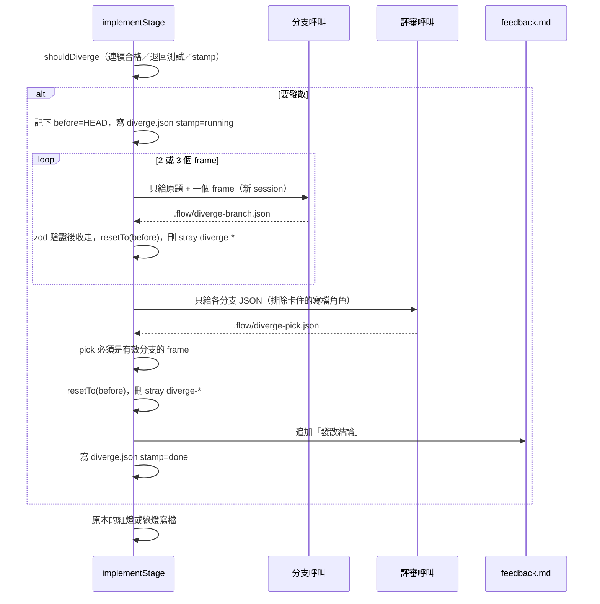

# 重試前短發散

同一個任務連續因「測試／實作關卡」失敗時，在下一次寫檔之前先做一次便宜的隔離發散，再把程式驗證過的結論寫進 `.flow/feedback.md`。目的是打斷過早收斂，避免像 T-1 那樣用同一條路燒掉大量 token。

這不是把 [ADHD / Tree-of-Thought skill](https://eastondev.com/blog/zh/posts/ai/20260608-adhd-tree-of-thought-coding-agents/) 裝進每個 agent。ADHD 預設約 10 次呼叫、成本是單發的 5 到 10 倍，而且每個隔離分支都會重載專案上下文。agentflowctl 只借它的三個結構：分支互不可見、用認知框架重問整題、generator 與 critic 拆成不同呼叫。

## 目標

- 只在已經浪費重試時才觸發，第一次失敗仍直接重試。
- 一次最多 3 個分支 + 1 個評審，預設用 low 強度模型。
- 評審結論只寫進 feedback，給下一次寫測試或實作的 agent 看。程式不依評審改 `taskPhase`、不自動 `replan`、不暫停。
- 關卡是否通過仍只看檔案、diff、測試結果。發散失敗不能讓 run 失敗。

## 不在範圍

- 不安裝、不載入第三方 ADHD skill。
- 不在 spec、plan、plan_review、verify、fix、最終 review 觸發。
- 不在內層寫檔迴圈（每一次紅燈／綠燈）觸發。
- 不在 adapter 層關掉工具（各家 CLI 旗標不一致）。改用「每次呼叫後 `resetTo(呼叫前的 HEAD)`」加上「產物寫在 worktree 外」。
- 不放寬「審查者不能是最後作者」。
- 不在 `tests_not_red` 觸發。第二次紅燈未失敗時，引擎已改接受特徵化測試並刪掉含 `TESTS_NOT_RED_MARK` 的 feedback；再發散只會把結論寫進隨即被刪的檔。

## 何時觸發

只在 `implement` 的 `tests` 或 `code` 階段、呼叫寫檔 agent **之前**。設定在 `flow.config.json` 的 `diverge`：

| 欄位 | 預設 | 意義 |
|---|---|---|
| `enabled` | `true` | 關閉後行為與現在完全相同 |
| `after` | `2` | 同一 key 最近連續幾筆合格重試時觸發（只在剛好等於這個數的那一次，之後更多次不再發散） |
| `branches` | `3` | 分支數，只能是 2 或 3 |

合格重試分類只看 `tests_not_green`、`tests_invalid`、`tests_not_written`。`tests_not_red`、`agent_error`、`handoff_invalid`、`plan_tampered` 不觸發。

數的是 `retries.jsonl` 裡**同一個 key**、從最新往回數的連續合格筆數（其他 key 略過、不合格分類中斷），而且只算「上一次發散之後新增」的筆數：`diverge.json` 記下發散當下的 retries 筆數 `retriesSeen`，之後從那個位置起算。不是 `attempts[key] === after`：attempts 會把不合格重試也算進去，剛好卡在門檻那次若是 `agent_error`，之後就永遠不會發散。

兩種觸發：

1. **同一 key 連續合格失敗：** `${taskId}:${phase}` 最近連續合格筆數剛好等於 `after`。
2. **綠燈退回測試（TDD 預設主路徑）：** 目前是 `tests`、`attempts["${taskId}:tests"]` 為 0、`testsRedos > 0`，且 `${taskId}:code` 最近一筆是 `tests_invalid`。

TDD 綠燈的真實狀態機（`TESTS_REDO_AFTER_FAILURES = 2`）：第一次 `tests_not_green` 仍留在 `code`；第二次綠燈失敗改走 `redoTests()`，刪掉 `attempts["${taskId}:code"]`、`taskPhase` 回到 `tests`、記一筆 `tests_invalid`。因此預設 `after: 2` **不會**在 `code` 階段看到 `attempts["T-1:code"] === 2` 的 `tests_not_green`。像 T-1 那種「綠燈反覆不過 → 退回重寫測試」要靠第 2 條觸發。同一 key 連續合格（第 1 條）留給紅燈 `tests_not_written`／`tests_invalid`，以及不走 TDD、綠燈只會 `retry(tests_not_green)` 的任務。

`retriesSeen` 是必要的：綠燈失敗一次（`tests_not_green`）再退回測試（`tests_invalid`，key 同樣是 `${taskId}:code`）時，`T-1:code` 的連續合格筆數已是 2。退回測試後的發散（觸發 2）做完，測試重寫通過、回到 `code` 階段時 `attempts` 已被 `redoTests` 清掉、retries 卻沒清，若不從 `retriesSeen` 起算，觸發 1 會再發散一次（stamp 是 `${taskId}:code:0:${testsRedos}`，擋不住）。`running` 的紀錄保留上一次的 `retriesSeen`，resume 重跑時 since 不變。

同一輪用 stamp `${taskId}:${phase}:${attempts}:${testsRedos}` 去重。`diverge.json` 已有相同 stamp 且狀態是 `done` 或 `skipped` 就不再跑，所以 resume 不會重複付錢。狀態是 `running`（中斷，或評審額度用完暫停）時 resume 會重跑這一輪。`testsRedos` 每加一次 stamp 不同，退回兩次就發散兩次。

只看 `retries.jsonl` 與 `attempts`，不看 agent 回覆。所有會走到 `implement` 的測試 helper（`implementRun`、`greenRun`、`laneFlowRun`，以及同檔其他直接寫 `flow.config.json` 的實作測試）預設寫 `diverge.enabled = false`，既有測試才不會多出 4 次呼叫。

## 怎麼跑



三個固定 frame，用 `${run.id}:${taskId}:${phase}:${attempts}:${testsRedos}` 做種子洗牌後取前 `branches` 個（退回兩次不要抽到同一組順序）：

| frame | 重問方式 |
|---|---|
| `acceptance` | 假設實作方向對，但測試／斷言沒對上驗收條件 |
| `split` | 假設任務切太大，下一動應縮小範圍而不是繼續加碼 |
| `invert` | 假設 `feedback.md` 裡的失敗才是根因，只回答下一動是什麼 |

每個分支是獨立的 `agentStep`（`kind: "write"`，額度用完可代打）。Prompt 禁止評估其他方案、禁止改程式。Engine 收走 JSON 後必須 `resetTo(repo, before)`，**不能**只 `discardChanges`：那是 `resetTo(HEAD)`，分支若 `git commit` 新的 HEAD 就還原不了，下一支也看得到。`.flow/` 在 `info/exclude` 裡，`git clean -fd` 清不掉，所以還要刪 `diverge-branch.json`、`diverge-pick.json` 與本輪新增的 `diverge-*`，並用 `snapshotPlan`／`restorePlan` 還原鎖定的計畫檔、`feedback.md` 與 `red-output.txt`（分支改了它們，寫檔者就會讀到被改過的內容）。分支之間不把彼此 JSON 傳進 prompt。

評審是另一次 `agentStep`（`kind: "review"`，額度用完暫停、不代打）。人選用 `pick`，排除這次卡住的寫檔角色，不能只看 `lastWriter`／`lastTestsAuthor`：綠燈失敗與 `redoTests` 都不會寫入 `lastWriter`，`redoTests` 還會清掉 `lastTestsAuthor`。排除順序：`lastWriter ?? lastTestsAuthor`，都空時用 `taskAgents` 的角色（退回測試或綠燈用 `code`，紅燈連續失敗用 `tests`）。單一 agent 時退回自己。

評審 JSON：

```json
{
  "pick": "acceptance",
  "action": "keep_fixing",
  "rationale": "為什麼選這個分支",
  "nextStep": "下一動的具體指示"
}
```

`pick` 只能是本輪有效分支的 frame。`action` 只能是 `keep_fixing`、`rewrite_tests`、`split_task`。Engine 把 `nextStep` 追加到已存在的 `feedback.md`，不依 `action` 改流程。既有 implement prompt 已會讀 feedback。

## 失敗怎麼辦

發散是建議，不是關卡。任一分支格式錯、執行失敗、評審不合格：略過該呼叫，能用的分支繼續。有效分支少於 2 個就略過評審。分支與評審不走交接帳本（prompt 只要求寫空陣列；`prepareHandoff` 仍會清掉上一份 `handoff-response.json`，但 `finishHandoff` 不套用）。有效分支不足、評審不合格都寫 `skipped` 與 stamp，避免同一輪重跑。worktree 變更一律 `resetTo(before)`。不呼叫 `retry()`，不增加 `${taskId}:tests`／`${taskId}:code` 的 `attempts`。

一次 `implementStage` 內的 3 到 4 次發散呼叫不會在中途被 `maxAgentRuns` 打斷（`advance()` 只在每一步開始檢查）。這 3 到 4 次會計入上限，緊預算時可能反而先碰到 `agent_budget`。

## 設定與選模

新增 LLM 階段 `diverge`，adaptive 預設 `low`。步驟名 `T-1-diverge-acceptance`、`T-1-diverge-critic` 對應到這個階段。可用 `config selection stage diverge medium` 調高。任務 `complexity` 不提高這個階段（`diverge` 不是 `task*`）。

產物放在 worktree 外：`.agentflowctl/runs/<id>/diverge.json`（車道放在該車道自己的 run 目錄）。`dump` 的 `RUN_ENTRIES` 收所屬 run 的這個檔，不收車道的（除錯時直接看車道目錄）。不新增 `FlowRun` 欄位。

## 驗收

- 第一次 `tests_not_green` 不發散。
- TDD 預設：綠燈第一次 `tests_not_green` 不發散；第二次綠燈失敗走 `redoTests` 後，下一次寫**測試**前才發散，feedback 出現「發散結論」，然後才寫檔。stamp 是 `${taskId}:tests:0:${testsRedos}`。
- 同一 key 最近連續合格剛好 `after` 筆（例如紅燈連續 `tests_not_written`）時，下一次寫檔前會發散。中間插入不合格分類會重算連續，不會卡死以後都不發散。
- `tests_not_red` 不發散；第二次紅燈未失敗仍走既有特徵化測試，不依賴發散結論。
- 已有相同 stamp 且 `done`／`skipped` 的 `diverge.json` 時 resume 不重跑；`running` 時重跑。
- 連續合格超過 `after` 後，同一 streak 不再發散。`testsRedos` 增加算新的一輪。
- 綠燈失敗一次再退回測試（真實的兩筆 retries）：退回測試後發散一次；測試重寫通過、回到 `code` 階段時**不會**再發散，要發散後再新增 `after` 筆合格失敗才會觸發。
- 發散結論只存在到下一次 `retry()` 覆寫 `feedback.md` 之前；寫檔者讀得到即可。
- 車道內的 `diverge.json` 放在該車道自己的 run 目錄（不進 `dump`）。
- `enabled: false` 或不合格分類（例如 `handoff_invalid`）不發散。
- 評審不能選不存在的 frame；選了就略過，不讓 run 失敗。
- 分支若留下 commit、`.flow/diverge-*`，或改了 `.flow/feedback.md`／`red-output.txt`，下一支與後續寫檔都看不到。
- 既有紅燈／綠燈／退回測試測試在 helper 關閉 diverge 後行為不變。
